# 📘 دليل واجهات و REST APIs مستخدم الإدارة الشامل (Complete Admin SaaS Portal API & Screen Map)

> **الهدف:** حصر وتوثيق شامل لجميع شاشات وموديلات ووظائف لوحة تحكم الإدارة العامة (Admin SaaS Dashboard)، بما يشمل كروت الإحصائيات الـ 3D، إدارة الطلاب، إدارة المعلمين، إدارة الفصول والشعب، إدارة المواد، تكليفات المعلمين، والجدول الدراسي الأسبوعي، مع تفصيل كامل لكل حقل ومسار REST API مرتبط.

---

## 🗺️ 1. الهيكل الشجري الشامل لصفحات وموديلات الإدارة (Screens & Modules Tree)

```mermaid
graph TD
    Admin[👔 مستخدم الإدارة / المشرف العام] --> Header[1. الهيدر التنفيذي والبروفايل]
    Admin --> Nav[2. شريط التنقل الأفقي السريع]
    Admin --> KPICards[3. كروت الإحصائيات الـ 3D KPI]
    Admin --> MainModules[4. الوحدات الإدارية الرئيسية]

    %% Main Modules Hierarchy
    MainModules --> ModAnalytics[لوحة التحليلات والرسوم البيانية - Analytics]
    MainModules --> ModStudents[إدارة وسجلات الطلاب - Students Management]
    MainModules --> ModTeachers[إدارة المعلمين والتكليفات - Teachers Management]
    MainModules --> ModClassrooms[إدارة الفصول والشعب والمواد - Classrooms & Subjects]
    MainModules --> ModSchedule[إدارة الجدول الدراسي الأسبوعي - Schedule Management]
    MainModules --> ModSettings[الإعدادات والهيكل التعليمي - Settings]

    %% Students Modals
    ModStudents --> StCreateModal[مودل تسجيل طالب جديد]
    ModStudents --> StEditModal[مودل تعديل بيانات طالب]
    ModStudents --> StDeleteModal[مودل حذف سجل طالب]

    %% Teachers Modals
    ModTeachers --> TchCreateModal[مودل إضافة حساب معلم جديد]
    ModTeachers --> TchDeleteModal[مودل حذف حساب معلم]
    ModTeachers --> TchAssignModal[مودل إسناد تكليف تدريسي لمعلم]
    ModTeachers --> TchUnassignModal[مودل إلغاء تكليف معلم]

    %% Structure Modals
    ModClassrooms --> GradeCreateModal[مودل إضافة صف/سنة دراسية]
    ModClassrooms --> SecCreateModal[مودل إضافة شعبة جديدة]
    ModClassrooms --> SecDeleteModal[مودل حذف شعبة]
    ModClassrooms --> SubjCreateModal[مودل إضافة مادة دراسية]
    ModClassrooms --> SubjDeleteModal[مودل حذف مادة]

    %% Schedule Modals
    ModSchedule --> SlotUpsertModal[مودل تخصيص/تعديل حصة دراسية بالجدول]
    ModSchedule --> SlotDeleteModal[مودل تفريغ/حذف حصة من الجدول]
```



---

## 📌 2. الهيدر وكروت الإحصائيات الـ 3D (Executive Header & 3D KPI Cards)

### 1.1 المكونات البصرية والبيانات المعروضة:

#### أ. الهيدر التنفيذي (Executive Top Header):
* **شعار وهوية المنظومة:** اسم المدرسة ولوحة التحكم الإدارية.
* **شريط البحث السريع:** فلترة فورية عن طالب، معلم، أو مادة.
* **زر جرس التنبيهات:** شارة التنبيهات الجديدة.
* **قائمة البروفايل العائمة (macOS Style Floating Dropdown):**
  * ملخص المدير (الاسم، البريد الإلكتروني، الرتبة).
  * اختصارات لوحة المفاتيح للتنقل السريع.
  * زر **تحديث البيانات الحية (⌘R)**.
  * زر **تسجيل الخروج (⌥⌘Q)**.

#### ب. شبكة كروت الإحصائيات الـ 3D KPI (Top 4 3D Metric Cards):
1. **كارد إجمالي الطلاب المسجلين:** يظهر عداد `{{ stats.totalStudents }}` طالب + مؤشر نسبة الحضور (96%).
2. **كارد كادر التدريس والمعلمين:** يظهر عداد `{{ stats.totalTeachers }}` معلم + شارة اكتمال التكليفات.
3. **كارد الشعب والقاعات الدراسية:** يظهر عداد `{{ stats.totalSections }}` شعبة دراسية موزعة على كافة المراحل.
4. **كارد المهام والامتحانات النشطة:** يظهر عداد `{{ stats.totalTasks }}` واجب وامتحان نشط بالمنظومة.

---

### 1.2 مسارات الـ REST APIs لتغذية الهيدر والإحصائيات:

#### 1. استرجاع إحصائيات لوحة التحكم المركزية (Get System 3D KPI Stats)
* **المسار (Endpoint):** `GET /api/admin/stats`
* **الصلاحية (Auth):** `Bearer Token (Role: ADMIN)`
* **هيكل الاستجابة (Response JSON):**
```json
{
  "success": true,
  "stats": {
    "totalStudents": 350,
    "totalTeachers": 18,
    "totalSections": 12,
    "totalTasks": 24
  }
}
```

---

## 👥 3. وحدة إدارة وسجلات الطلاب (`Students Management Module`)

### 2.1 المكونات البصرية والبيانات المعروضة:

* **شريط أدوات الطلاب (Toolbar):**
  * فلتر التصفية حسب الصف الدراسي (`Grade`).
  * فلتر التصفية حسب الشعبة (`Section`).
  * مربع البحث بالاسم أو رقم الجلوس.
  * زر إجراء `➕ تسجيل طالب جديد`.
* **جدول بيانات الطلاب التفاعلي (Data Table):**
  * رقم الجلوس (`roll_number`).
  * كود الطالب (`student_code`).
  * اسم الطالب الكامل (`full_name`).
  * الصف والشعبة (`grade_name` و `section_name`).
  * تاريخ التسجيل.
  * أزرار الإجراءات: ✏️ **تعديل** | 🗑️ **حذف**.

### 2.2 النوافذ المنبثقة التابعة لإدارة الطلاب:
1. **مودل تسجيل طالب جديد (`Create Student Modal`):** إدخال (رقم الجلوس، كود الطالب، الاسم، تحديد الصف، وتحديد الشعبة).
2. **مودل تعديل بيانات طالب (`Edit Student Modal`):** تعديل بيانات الطالب الحالية وتحديث فصله أو شعبته.
3. **مودل تأكيد الحذف (`Delete Student Dialog`):** نافذة تأكيد لحذف سجل الطالب نهائياً من قاعدة البيانات.

---

### 2.3 مسارات الـ REST APIs لإدارة الطلاب:

#### 1. استرجاع قائمة الطلاب مع الفلترة (Get Students List)
* **المسار (Endpoint):** `GET /api/admin/students`
* **المعاملات الاختيارية (Query Params):** `?grade_id=2&section_id=3`
* **الصلاحية (Auth):** `Bearer Token (Role: ADMIN)`
* **هيكل الاستجابة (Response JSON):**
```json
{
  "success": true,
  "count": 2,
  "data": [
    {
      "id": 1,
      "roll_number": "1001",
      "student_code": "STU-1001",
      "full_name": "تامر المصراتي",
      "grade_id": 2,
      "grade_name": "الصف الثامن",
      "section_id": 3,
      "section_name": "8أ",
      "created_at": "2026-08-01 10:00:00"
    }
  ]
}
```

#### 2. تسجيل طالب جديد (Create Student)
* **المسار (Endpoint):** `POST /api/admin/students`
* **حقول الطلب (Payload):**
```json
{
  "roll_number": "1002",
  "student_code": "STU-1002",
  "full_name": "علي محمد الفرجاني",
  "grade_id": 2,
  "section_id": 3
}
```
* **هيكل الاستجابة (Response JSON):**
```json
{
  "success": true,
  "message": "تم تسجيل الطالب بنجاح.",
  "studentId": 2
}
```

#### 3. تعديل بيانات طالب (Update Student)
* **المسار (Endpoint):** `PUT /api/admin/students/:id`
* **حقول الطلب (Payload):**
```json
{
  "roll_number": "1002",
  "student_code": "STU-1002",
  "full_name": "علي محمد الفرجاني المحدث",
  "grade_id": 2,
  "section_id": 4
}
```
* **هيكل الاستجابة (Response JSON):**
```json
{
  "success": true,
  "message": "تم تحديث بيانات الطالب بنجاح."
}
```

#### 4. حذف سجل طالب (Delete Student)
* **المسار (Endpoint):** `DELETE /api/admin/students/:id`
* **الصلاحية (Auth):** `Bearer Token (Role: ADMIN)`
* **هيكل الاستجابة (Response JSON):**
```json
{
  "success": true,
  "message": "تم حذف الطالب بنجاح."
}
```

---

## 👨‍🏫 4. وحدة إدارة المعلمين والتكليفات (`Teachers & Assignments Module`)

### 3.1 المكونات البصرية والبيانات المعروضة:

* **تبويب قائمة المعلمين:**
  * جدول المعلمين: الاسم الكامل، اسم المستخدم (`username`)، عدد الشعب المكلف بها، وتاريخ الإنشاء.
  * زر إجراء: `➕ إضافة حساب معلم جديد`.
* **تبويب تكليفات المواد والشعب (Teaching Assignments):**
  * جدول التكليفات الأكاديمية: اسم المعلم، المادة المقررة، الصف، والشعبة.
  * زر إجراء: `➕ إسناد تكليف تدريسي جديد`.
  * زر إلغاء التكليف: 🗑️ **إزالة التكليف**.

---

### 3.2 مسارات الـ REST APIs لإدارة المعلمين والتكليفات:

#### 1. استرجاع قائمة المعلمين (Get Teachers List)
* **المسار (Endpoint):** `GET /api/admin/teachers`
* **الصلاحية (Auth):** `Bearer Token (Role: ADMIN)`
* **هيكل الاستجابة (Response JSON):**
```json
{
  "success": true,
  "data": [
    {
      "id": 2,
      "username": "omar_shareef",
      "full_name": "أ. عمر الشريف",
      "created_at": "2026-08-01 09:00:00"
    }
  ]
}
```

#### 2. إنشاء حساب معلم جديد (Create Teacher Account)
* **المسار (Endpoint):** `POST /api/admin/teachers`
* **حقول الطلب (Payload):**
```json
{
  "full_name": "أ. نادية خالد",
  "username": "nadia_khaled",
  "password": "Password123@"
}
```
* **هيكل الاستجابة (Response JSON):**
```json
{
  "success": true,
  "message": "تم إضافة حساب المعلم بنجاح.",
  "teacherId": 3
}
```

#### 3. حذف حساب معلم (Delete Teacher Account)
* **المسار (Endpoint):** `DELETE /api/admin/teachers/:id`
* **الصلاحية (Auth):** `Bearer Token (Role: ADMIN)`

#### 4. استرجاع قائمة التكليفات التدريسية (Get Teacher Assignments)
* **المسار (Endpoint):** `GET /api/admin/assignments`
* **هيكل الاستجابة (Response JSON):**
```json
{
  "success": true,
  "data": [
    {
      "id": 1,
      "teacher_id": 2,
      "teacher_name": "أ. عمر الشريف",
      "subject_id": 4,
      "subject_name": "اللغة العربية",
      "section_id": 1,
      "section_name": "أ5",
      "grade_name": "الصف الخامس"
    }
  ]
}
```

#### 5. إسناد تكليف تدريسي جديد (Create Assignment)
* **المسار (Endpoint):** `POST /api/admin/assignments`
* **حقول الطلب (Payload):**
```json
{
  "teacher_id": 2,
  "subject_id": 2,
  "section_id": 3
}
```

#### 6. إلغاء تكليف تدريسي (Delete Assignment)
* **المسار (Endpoint):** `DELETE /api/admin/assignments/:id`

---

## 🏫 5. وحدة الفصول والشعب والمواد المقررة (`Classrooms, Structure & Subjects`)

### 4.1 المكونات البصرية والبيانات المعروضة:

* **عرض الهيكل التعليمي المدمج (Grades Hierarchy Tree):**
  * بطاقات الصفوف الدراسية (المستوى 1 إلى 9).
  * داخل كل صف: قائمة الشعب التابعة (مثل: `أ5`، `ب5`) وقائمة المواد المقررة.
  * أزرار إضافة: `➕ إضافة صف` | `➕ إضافة شعبة` | `➕ إضافة مادة`.
  * أزرار الحذف للشعب والمواد الدراسية.

---

### 4.2 مسارات الـ REST APIs لإدارة الهيكل والفصول والمواد:

#### 1. استرجاع الهيكل الأكاديمي الكامل (Get Grades, Sections & Subjects Hierarchy)
* **المسار (Endpoint):** `GET /api/admin/grades`
* **الصلاحية (Auth):** `Bearer Token (Role: ADMIN)`
* **هيكل الاستجابة (Response JSON):**
```json
{
  "success": true,
  "data": [
    {
      "id": 1,
      "name": "الصف الخامس",
      "level": 5,
      "sections": [
        { "id": 1, "grade_id": 1, "name": "أ5" },
        { "id": 2, "grade_id": 1, "name": "ب5" }
      ],
      "subjects": [
        { "id": 1, "grade_id": 1, "name": "التربية الإسلامية" },
        { "id": 2, "grade_id": 1, "name": "الرياضيات" }
      ]
    }
  ]
}
```

#### 2. إضافة صف دراسي (Create Grade)
* **المسار (Endpoint):** `POST /api/admin/grades`
* **حقول الطلب (Payload):** `{ "name": "الصف العاشر", "level": 10 }`

#### 3. إضافة شعبة جديدة (Create Section)
* **المسار (Endpoint):** `POST /api/admin/sections`
* **حقول الطلب (Payload):** `{ "grade_id": 1, "name": "ج5" }`

#### 4. حذف شعبة (Delete Section)
* **المسار (Endpoint):** `DELETE /api/admin/sections/:id`

#### 5. استرجاع المواد الدراسية المقررة (Get Subjects List)
* **المسار (Endpoint):** `GET /api/admin/subjects?grade_id=1`

#### 6. إضافة مادة دراسية جديدة (Create Subject)
* **المسار (Endpoint):** `POST /api/admin/subjects`
* **حقول الطلب (Payload):** `{ "grade_id": 1, "name": "الحاسوب وتقنية المعلومات" }`

#### 7. حذف مادة دراسية (Delete Subject)
* **المسار (Endpoint):** `DELETE /api/admin/subjects/:id`

---

## 📅 6. وحدة إدارة الجدول الدراسي الأسبوعي (`Weekly Timetable Management`)

### 5.1 المكونات البصرية والبيانات المعروضة:

* **محدد الشعبة (Section Selector):** لاختيار الشعبة المراد إدارة وتوزيع جدول حصصها.
* **مصفوفة الجدول الأسبوعي (5 Days × 6 Slots Matrix):**
  * الأعمدة: الأيام الـ 5 (الأحد إلى الخميس).
  * الصفوف: الحصص الـ 6 اليومية (من الحصة 1 إلى الحصة 6).
  * داخل كل خلية/حصة:
    * اسم المادة الدراسية + أيقونة المادة.
    * اسم المعلم المسند للحصة.
    * زر تعديل/تخصيص الحصة.
    * زر تفريغ الحصة من الجدول.
* **مودل تخصيص الحصة (`Upsert Schedule Slot Modal`):**
  * اختيار المادة الدراسية.
  * اختيار المعلم المسند.

---

### 5.2 مسارات الـ REST APIs لإدارة الجدول الدراسي:

#### 1. استرجاع جدول حصص الشعبة (Get Section Schedule)
* **المسار (Endpoint):** `GET /api/admin/schedule?section_id=1`
* **الصلاحية (Auth):** `Bearer Token (Role: ADMIN)`
* **هيكل الاستجابة (Response JSON):**
```json
{
  "success": true,
  "data": [
    {
      "id": 1,
      "section_id": 1,
      "section_name": "أ5",
      "day_of_week": 1,
      "slot_number": 1,
      "subject_id": 2,
      "subject_name": "الرياضيات",
      "teacher_id": 2,
      "teacher_name": "أ. عمر الشريف",
      "grade_name": "الصف الخامس"
    }
  ]
}
```

#### 2. تخصيص أو تعديل حصة بالجدول (Upsert Schedule Slot)
* **المسار (Endpoint):** `POST /api/admin/schedule`
* **حقول الطلب (Payload):**
```json
{
  "section_id": 1,
  "day_of_week": 1,
  "slot_number": 2,
  "subject_id": 3,
  "teacher_id": 3
}
```
* **هيكل الاستجابة (Response JSON):**
```json
{
  "success": true,
  "message": "تم تخصيص الحصة بالجدول بنجاح."
}
```

#### 3. تفريغ/حذف حصة من الجدول الأسبوعي (Delete Schedule Slot)
* **المسار (Endpoint):** `DELETE /api/admin/schedule/:id`
* **الصلاحية (Auth):** `Bearer Token (Role: ADMIN)`
* **هيكل الاستجابة (Response JSON):**
```json
{
  "success": true,
  "message": "تم تفريغ الحصة من الجدول بنجاح."
}
```

---

## 📊 7. المصفوفة الشاملة للـ REST APIs الخاصة بمستخدم الإدارة (Master Admin API Matrix)

| # | الوحدة الإدارية | الوظيفة البرمجية | HTTP Method | مسار الـ API الكامل | أهم معاملات الطلب (Parameters / Payload) | كود النجاح |
| :-: | :--- | :--- | :---: | :--- | :--- | :-: |
| **1** | **اللوحة المركزية** | إحصائيات النظام الـ 3D KPI | `GET` | `/api/admin/stats` | `Authorization: Bearer <Admin_Token>` | `200 OK` |
| **2** | **الهيكل والفصول** | استرجاع الهيكل الكامل (صفوف/شعب/مواد) | `GET` | `/api/admin/grades` | `Authorization: Bearer <Admin_Token>` | `200 OK` |
| **3** | **الهيكل والفصول** | إضافة صف دراسي جديد | `POST` | `/api/admin/grades` | `name`, `level` | `201 Created` |
| **4** | **الهيكل والفصول** | إضافة شعبة دراسية جديدة | `POST` | `/api/admin/sections` | `grade_id`, `name` | `201 Created` |
| **5** | **الهيكل والفصول** | حذف شعبة دراسية | `DELETE` | `/api/admin/sections/:id` | `sectionId` في المسار | `200 OK` |
| **6** | **المواد الدراسية** | استرجاع المواد المقررة | `GET` | `/api/admin/subjects` | `grade_id` (اختياري) | `200 OK` |
| **7** | **المواد الدراسية** | إضافة مادة دراسية جديدة | `POST` | `/api/admin/subjects` | `grade_id`, `name` | `201 Created` |
| **8** | **المواد الدراسية** | حذف مادة دراسية | `DELETE` | `/api/admin/subjects/:id` | `subjectId` في المسار | `200 OK` |
| **9** | **إدارة الطلاب** | استرجاع وسجلات الطلاب مع الفلترة | `GET` | `/api/admin/students` | `grade_id`, `section_id` (اختياري) | `200 OK` |
| **10** | **إدارة الطلاب** | تسجيل طالب جديد | `POST` | `/api/admin/students` | `roll_number`, `student_code`, `full_name`, `grade_id`, `section_id` | `201 Created` |
| **11** | **إدارة الطلاب** | تعديل بيانات طالب مسجل | `PUT` | `/api/admin/students/:id` | `roll_number`, `student_code`, `full_name`, `grade_id`, `section_id` | `200 OK` |
| **12** | **إدارة الطلاب** | حذف سجل طالب | `DELETE` | `/api/admin/students/:id` | `studentId` في المسار | `200 OK` |
| **13** | **إدارة المعلمين** | استرجاع قائمة حسابات المعلمين | `GET` | `/api/admin/teachers` | `Authorization: Bearer <Admin_Token>` | `200 OK` |
| **14** | **إدارة المعلمين** | إنشاء حساب معلم جديد | `POST` | `/api/admin/teachers` | `full_name`, `username`, `password` | `201 Created` |
| **15** | **إدارة المعلمين** | حذف حساب معلم | `DELETE` | `/api/admin/teachers/:id` | `teacherId` في المسار | `200 OK` |
| **16** | **التكليفات التدريسية** | استرجاع تكليفات المعلمين | `GET` | `/api/admin/assignments` | `Authorization: Bearer <Admin_Token>` | `200 OK` |
| **17** | **التكليفات التدريسية** | إسناد تكليف مادة وشعبة لمعلم | `POST` | `/api/admin/assignments` | `teacher_id`, `subject_id`, `section_id` | `201 Created` |
| **18** | **التكليفات التدريسية** | إلغاء تكليف تدريسي | `DELETE` | `/api/admin/assignments/:id` | `assignmentId` في المسار | `200 OK` |
| **19** | **الجدول الدراسي** | استرجاع مصفوفة الحصص لشعبة | `GET` | `/api/admin/schedule` | `section_id` (إلزامي للفلترة) | `200 OK` |
| **20** | **الجدول الدراسي** | تخصيص أو تعديل حصة بالجدول | `POST` | `/api/admin/schedule` | `section_id`, `day_of_week`, `slot_number`, `subject_id`, `teacher_id` | `200 OK` |
| **21** | **الجدول الدراسي** | تفريغ/حذف حصة من الجدول | `DELETE` | `/api/admin/schedule/:id` | `slotId` في المسار | `200 OK` |
