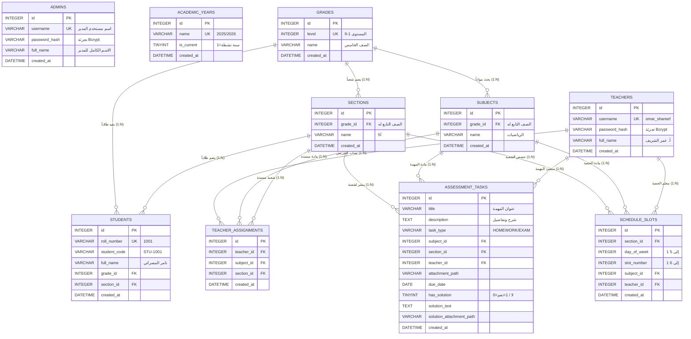

# 🗄️ دليل إنشاء وهيكلية قاعدة بيانات المنظومة الشامل (Complete Database Schema & Setup Guide)

> **الهدف:** توثيق هندسي متكامل وشامل لقاعدة بيانات المنظومة التعليمية، يشمل مخطط العلاقات بين الجداول (ERD)، أكواد الـ SQL لإنشاء الجداول الـ 10 (DDL) مع التوافقية الكاملة لـ `SQLite` و `MySQL`، المعجم البياني (Data Dictionary)، الفهارس، سياسات الأمان والحذف التتابعي (`CASCADE`)، والبيانات الأولية (Seed Data).

---

## 🗺️ 1. مخطط الكيانات والعلاقات المتكامل (Entity-Relationship Diagram - ERD)



---

## 📜 2. أوامر الـ SQL الكاملة لإنشاء الجداول الـ 10 (DDL Scripts)

> **ملاحظة معمارية:** السكريبتات أدناه متوافقة مع محول قاعدة البيانات الهجين (`SQLite` في بيئة التطوير، و `MySQL 8+` في بيئة الإنتاج).

```sql
-- =========================================================================
-- 1. جدول مدراء ومسؤولي المنظومة (Admins)
-- =========================================================================
CREATE TABLE IF NOT EXISTS admins (
  id INTEGER PRIMARY KEY AUTOINCREMENT,
  username VARCHAR(50) NOT NULL UNIQUE,
  password_hash VARCHAR(255) NOT NULL,
  full_name VARCHAR(150) NOT NULL,
  created_at DATETIME DEFAULT CURRENT_TIMESTAMP
);

-- =========================================================================
-- 2. جدول السنوات الأكاديمية (Academic Years)
-- =========================================================================
CREATE TABLE IF NOT EXISTS academic_years (
  id INTEGER PRIMARY KEY AUTOINCREMENT,
  name VARCHAR(50) NOT NULL UNIQUE,
  is_current TINYINT(1) DEFAULT 1,
  created_at DATETIME DEFAULT CURRENT_TIMESTAMP
);

-- =========================================================================
-- 3. جدول الصفوف والمستويات الأساسية (Grades: الصف 1 إلى 9)
-- =========================================================================
CREATE TABLE IF NOT EXISTS grades (
  id INTEGER PRIMARY KEY AUTOINCREMENT,
  level INT NOT NULL UNIQUE,
  name VARCHAR(50) NOT NULL,
  created_at DATETIME DEFAULT CURRENT_TIMESTAMP
);

-- =========================================================================
-- 4. جدول الشعب والقاعات الدراسية التابعة لكل صف (Sections)
-- =========================================================================
CREATE TABLE IF NOT EXISTS sections (
  id INTEGER PRIMARY KEY AUTOINCREMENT,
  grade_id INT NOT NULL,
  name VARCHAR(50) NOT NULL,
  created_at DATETIME DEFAULT CURRENT_TIMESTAMP,
  FOREIGN KEY (grade_id) REFERENCES grades(id) ON DELETE CASCADE,
  UNIQUE (grade_id, name)
);

-- =========================================================================
-- 5. جدول المواد والمناهج المقررة لكل صف (Subjects)
-- =========================================================================
CREATE TABLE IF NOT EXISTS subjects (
  id INTEGER PRIMARY KEY AUTOINCREMENT,
  grade_id INT NOT NULL,
  name VARCHAR(100) NOT NULL,
  created_at DATETIME DEFAULT CURRENT_TIMESTAMP,
  FOREIGN KEY (grade_id) REFERENCES grades(id) ON DELETE CASCADE,
  UNIQUE (grade_id, name)
);

-- =========================================================================
-- 6. جدول سجلات وبيانات الطلاب (Students)
-- =========================================================================
CREATE TABLE IF NOT EXISTS students (
  id INTEGER PRIMARY KEY AUTOINCREMENT,
  roll_number VARCHAR(50) NOT NULL UNIQUE,
  student_code VARCHAR(50) NOT NULL,
  full_name VARCHAR(150) NOT NULL,
  grade_id INT NOT NULL,
  section_id INT NOT NULL,
  created_at DATETIME DEFAULT CURRENT_TIMESTAMP,
  FOREIGN KEY (grade_id) REFERENCES grades(id),
  FOREIGN KEY (section_id) REFERENCES sections(id)
);

-- =========================================================================
-- 7. جدول المعلمين والكادر التدريسي (Teachers)
-- =========================================================================
CREATE TABLE IF NOT EXISTS teachers (
  id INTEGER PRIMARY KEY AUTOINCREMENT,
  username VARCHAR(50) NOT NULL UNIQUE,
  password_hash VARCHAR(255) NOT NULL,
  full_name VARCHAR(150) NOT NULL,
  created_at DATETIME DEFAULT CURRENT_TIMESTAMP
);

-- =========================================================================
-- 8. جدول نصاب وتكليفات المعلمين بالمواد والشعب (Teacher Assignments)
-- =========================================================================
CREATE TABLE IF NOT EXISTS teacher_assignments (
  id INTEGER PRIMARY KEY AUTOINCREMENT,
  teacher_id INT NOT NULL,
  subject_id INT NOT NULL,
  section_id INT NOT NULL,
  created_at DATETIME DEFAULT CURRENT_TIMESTAMP,
  FOREIGN KEY (teacher_id) REFERENCES teachers(id) ON DELETE CASCADE,
  FOREIGN KEY (subject_id) REFERENCES subjects(id) ON DELETE CASCADE,
  FOREIGN KEY (section_id) REFERENCES sections(id) ON DELETE CASCADE,
  UNIQUE (teacher_id, subject_id, section_id)
);

-- =========================================================================
-- 9. جدول الواجبات والامتحانات والحلول النموذجية (Assessment Tasks)
-- =========================================================================
CREATE TABLE IF NOT EXISTS assessment_tasks (
  id INTEGER PRIMARY KEY AUTOINCREMENT,
  title VARCHAR(255) NOT NULL,
  description TEXT,
  task_type VARCHAR(20) NOT NULL, -- 'HOMEWORK' أو 'EXAM'
  subject_id INT NOT NULL,
  section_id INT NOT NULL,
  teacher_id INT NOT NULL,
  attachment_path VARCHAR(255) NULL,
  due_date DATE NULL,
  has_solution TINYINT(1) DEFAULT 0,
  solution_text TEXT NULL,
  solution_attachment_path VARCHAR(255) NULL,
  created_at DATETIME DEFAULT CURRENT_TIMESTAMP,
  FOREIGN KEY (subject_id) REFERENCES subjects(id) ON DELETE CASCADE,
  FOREIGN KEY (section_id) REFERENCES sections(id) ON DELETE CASCADE,
  FOREIGN KEY (teacher_id) REFERENCES teachers(id) ON DELETE CASCADE
);

-- =========================================================================
-- 10. جدول الحصص والجدول الأسبوعي الموزع (Schedule Slots)
-- =========================================================================
CREATE TABLE IF NOT EXISTS schedule_slots (
  id INTEGER PRIMARY KEY AUTOINCREMENT,
  section_id INT NOT NULL,
  day_of_week INT NOT NULL,  -- من 1 (الأحد) إلى 5 (الخميس)
  slot_number INT NOT NULL,  -- من 1 (الحصة الأولى) إلى 6 (الحصة السادسة)
  subject_id INT NOT NULL,
  teacher_id INT NOT NULL,
  created_at DATETIME DEFAULT CURRENT_TIMESTAMP,
  FOREIGN KEY (section_id) REFERENCES sections(id) ON DELETE CASCADE,
  FOREIGN KEY (subject_id) REFERENCES subjects(id) ON DELETE CASCADE,
  FOREIGN KEY (teacher_id) REFERENCES teachers(id) ON DELETE CASCADE,
  UNIQUE (section_id, day_of_week, slot_number)
);
```

---

## 📊 3. المعجم البياني المفصل للجداول الـ 10 (Data Dictionary)

### 1. جدول `admins` (مسؤولو النظام)
| الحقل | النوع | Null؟ | الافتراضي | القيد | الوصف |
| :--- | :--- | :---: | :---: | :---: | :--- |
| `id` | `INTEGER` | ❌ | Auto Inc | `PK` | المعرف الفريد لحساب المدير |
| `username` | `VARCHAR(50)` | ❌ | - | `UNIQUE` | اسم المستخدم لتسجيل الدخول |
| `password_hash`| `VARCHAR(255)` | ❌ | - | - | كلمة المرور المشفرة بتجزئة `Bcrypt` |
| `full_name` | `VARCHAR(150)` | ❌ | - | - | الاسم الثلاثي/الرباعي لمدير المنظومة |
| `created_at` | `DATETIME` | ✔️ | `CURRENT_TIMESTAMP` | - | تاريخ ووقت تسجيل الحساب |

---

### 2. جدول `academic_years` (السنوات الأكاديمية)
| الحقل | النوع | Null؟ | الافتراضي | القيد | الوصف |
| :--- | :--- | :---: | :---: | :---: | :--- |
| `id` | `INTEGER` | ❌ | Auto Inc | `PK` | المعرف الفريد للعام الدراسي |
| `name` | `VARCHAR(50)` | ❌ | - | `UNIQUE` | مسمى العام (مثال: `2025/2026`) |
| `is_current` | `TINYINT(1)` | ✔️ | `1` | - | `1` للعام الحالي النشط، و `0` للمؤرشف |
| `created_at` | `DATETIME` | ✔️ | `CURRENT_TIMESTAMP` | - | تاريخ تسجيل العام الدراسي |

---

### 3. جدول `grades` (المراحل والصفوف الدراسية)
| الحقل | النوع | Null؟ | الافتراضي | القيد | الوصف |
| :--- | :--- | :---: | :---: | :---: | :--- |
| `id` | `INTEGER` | ❌ | Auto Inc | `PK` | المعرف الفريد للصف |
| `level` | `INT` | ❌ | - | `UNIQUE` | الترتيب والمستوى الرقمي (من 1 إلى 9) |
| `name` | `VARCHAR(50)` | ❌ | - | - | الاسم الرسمي (مثل "الصف الخامس") |
| `created_at` | `DATETIME` | ✔️ | `CURRENT_TIMESTAMP` | - | تاريخ الإنشاء |

---

### 4. جدول `sections` (الشعب والقاعات)
| الحقل | النوع | Null؟ | الافتراضي | القيد | الوصف |
| :--- | :--- | :---: | :---: | :---: | :--- |
| `id` | `INTEGER` | ❌ | Auto Inc | `PK` | المعرف الفريد للشعبة |
| `grade_id` | `INT` | ❌ | - | `FK -> grades(id)` | الصف الذي تتبع له الشعبة |
| `name` | `VARCHAR(50)` | ❌ | - | `UNIQUE (grade_id, name)` | اسم الشعبة (مثل: `أ5` أو `ب5`) |
| `created_at` | `DATETIME` | ✔️ | `CURRENT_TIMESTAMP` | - | تاريخ الإنشاء |

---

### 5. جدول `subjects` (المواد والمناهج الدراسية)
| الحقل | النوع | Null؟ | الافتراضي | القيد | الوصف |
| :--- | :--- | :---: | :---: | :---: | :--- |
| `id` | `INTEGER` | ❌ | Auto Inc | `PK` | المعرف الفريد للمادة |
| `grade_id` | `INT` | ❌ | - | `FK -> grades(id)` | الصف المقرر عليه المادة |
| `name` | `VARCHAR(100)` | ❌ | - | `UNIQUE (grade_id, name)` | اسم المادة (رياضيات، علوم، لغة عربية..) |
| `created_at` | `DATETIME` | ✔️ | `CURRENT_TIMESTAMP` | - | تاريخ الإنشاء |

---

### 6. جدول `students` (سجلات وبيانات الطلاب)
| الحقل | النوع | Null؟ | الافتراضي | القيد | الوصف |
| :--- | :--- | :---: | :---: | :---: | :--- |
| `id` | `INTEGER` | ❌ | Auto Inc | `PK` | المعرف الفريد للطالب |
| `roll_number` | `VARCHAR(50)` | ❌ | - | `UNIQUE` | رقم الجلوس المستخدم للدخول |
| `student_code`| `VARCHAR(50)` | ❌ | - | - | الكود التعريفي الأكاديمي للطالب |
| `full_name` | `VARCHAR(150)` | ❌ | - | - | اسم الطالب الكامل |
| `grade_id` | `INT` | ❌ | - | `FK -> grades(id)` | الصف المقيد به الطالب |
| `section_id` | `INT` | ❌ | - | `FK -> sections(id)` | الشعبة المعزول إليها أمنياً |
| `created_at` | `DATETIME` | ✔️ | `CURRENT_TIMESTAMP` | - | تاريخ تسجيل الطالب |

---

### 7. جدول `teachers` (المعلمون والكادر التدريسي)
| الحقل | النوع | Null؟ | الافتراضي | القيد | الوصف |
| :--- | :--- | :---: | :---: | :---: | :--- |
| `id` | `INTEGER` | ❌ | Auto Inc | `PK` | المعرف الفريد للمعلم |
| `username` | `VARCHAR(50)` | ❌ | - | `UNIQUE` | اسم المستخدم لتسجيل الدخول |
| `password_hash`| `VARCHAR(255)` | ❌ | - | - | كلمة المرور المشفرة بـ `Bcrypt` |
| `full_name` | `VARCHAR(150)` | ❌ | - | - | الاسم الكامل للمعلم مع اللقب |
| `created_at` | `DATETIME` | ✔️ | `CURRENT_TIMESTAMP` | - | تاريخ إضافة المعلم |

---

### 8. جدول `teacher_assignments` (نصاب وتكليفات المعلمين)
| الحقل | النوع | Null؟ | الافتراضي | القيد | الوصف |
| :--- | :--- | :---: | :---: | :---: | :--- |
| `id` | `INTEGER` | ❌ | Auto Inc | `PK` | معرف التكليف |
| `teacher_id` | `INT` | ❌ | - | `FK -> teachers(id)` | المعلم المكلف |
| `subject_id` | `INT` | ❌ | - | `FK -> subjects(id)` | المادة المكلف بتدريسها |
| `section_id` | `INT` | ❌ | - | `FK -> sections(id)` | الشعبة المسندة له |
| `created_at` | `DATETIME` | ✔️ | `CURRENT_TIMESTAMP` | `UNIQUE (teacher, subj, sec)` | تاريخ التكليف |

---

### 9. جدول `assessment_tasks` (المهام والواجبات والامتحانات)
| الحقل | النوع | Null؟ | الافتراضي | القيد | الوصف |
| :--- | :--- | :---: | :---: | :---: | :--- |
| `id` | `INTEGER` | ❌ | Auto Inc | `PK` | معرف المهمة/الواجب |
| `title` | `VARCHAR(255)`| ❌ | - | - | عنوان الواجب أو الامتحان |
| `description` | `TEXT` | ✔️ | - | - | الشرح والتعليمات التفصيلية |
| `task_type` | `VARCHAR(20)` | ❌ | - | `'HOMEWORK'` / `'EXAM'` | نوع المهمة التقييمية |
| `subject_id` | `INT` | ❌ | - | `FK -> subjects(id)` | المادة التابعة لها المهمة |
| `section_id` | `INT` | ❌ | - | `FK -> sections(id)` | الشعبة المستهدفة بالنشر |
| `teacher_id` | `INT` | ❌ | - | `FK -> teachers(id)` | المعلم صاحب المهمة |
| `attachment_path`| `VARCHAR(255)`| ✔️| - | - | مسار ملف ورقة العمل المرفوعة |
| `due_date` | `DATE` | ✔️ | - | - | تاريخ الاستحقاق / موعد الامتحان |
| `has_solution`| `TINYINT(1)` | ✔️ | `0` | - | `1` في حال توفر حل نموذجي |
| `solution_text`| `TEXT` | ✔️ | - | - | نص الحل النموذجي |
| `solution_attachment_path`| `VARCHAR(255)`| ✔️| - | - | ملف PDF للحل النموذجي |
| `created_at` | `DATETIME` | ✔️ | `CURRENT_TIMESTAMP` | - | تاريخ النشر |

---

### 10. جدول `schedule_slots` (الحصص والجدول الأسبوعي)
| الحقل | النوع | Null؟ | الافتراضي | القيد | الوصف |
| :--- | :--- | :---: | :---: | :---: | :--- |
| `id` | `INTEGER` | ❌ | Auto Inc | `PK` | معرف الحصة المجدولة |
| `section_id` | `INT` | ❌ | - | `FK -> sections(id)` | الشعبة الدراسية |
| `day_of_week` | `INT` | ❌ | - | `1=الأحد ... 5=الخميس` | يوم الحصة بالأسبوع |
| `slot_number` | `INT` | ❌ | - | `1 إلى 6` | رقم الحصة اليومية |
| `subject_id` | `INT` | ❌ | - | `FK -> subjects(id)` | المادة المقررة للحصة |
| `teacher_id` | `INT` | ❌ | - | `FK -> teachers(id)` | المعلم المسند للحصة |
| `created_at` | `DATETIME` | ✔️ | `CURRENT_TIMESTAMP` | `UNIQUE(sec, day, slot)` | تاريخ إنشاء الحصة |

---

## ⚡ 4. الفهارس وتحسين الأداء (Indexes & Performance Optimization)

```sql
-- 1. فهرسة استعلامات عزل مهام الطلاب اليومية والأسبوعية
CREATE INDEX IF NOT EXISTS idx_tasks_section_type_due 
ON assessment_tasks (section_id, task_type, due_date);

-- 2. فهرسة الحصص للجدول الأسبوعي للشعبة
CREATE INDEX IF NOT EXISTS idx_schedule_section_day_slot 
ON schedule_slots (section_id, day_of_week, slot_number);

-- 3. فهرسة تكليفات المعلمين لسرعة التحقق
CREATE INDEX IF NOT EXISTS idx_assignments_teacher 
ON teacher_assignments (teacher_id, section_id, subject_id);

-- 4. فهرسة سرعة استعلام الطلاب لكل صف وشعبة
CREATE INDEX IF NOT EXISTS idx_students_grade_section 
ON students (grade_id, section_id);
```

---

## 💾 5. البيانات الأولية التجريبية (Initial Seed Data)

```sql
-- إضافة مدير النظام الافتراضي (كلمة المرور المشفرة: Admin123@)
INSERT INTO admins (username, password_hash, full_name) 
VALUES ('admin', '$2b$10$vI8aWBnW3fID.ZQ4/zo1G.qH0vJ2U2vVqM5W2Lq2T0Ym5o0y1x5eS', 'أ. عبد الرحمن الزاوي');

-- إضافة العام الدراسي الحالي
INSERT INTO academic_years (name, is_current) VALUES ('2025/2026', 1);

-- إضافة الصفوف الدراسية الأساسية من 1 إلى 9
INSERT INTO grades (level, name) VALUES 
(1, 'الصف الأول'), (2, 'الصف الثاني'), (3, 'الصف الثالث'),
(4, 'الصف الرابع'), (5, 'الصف الخامس'), (6, 'الصف السادس'),
(7, 'الصف السابع'), (8, 'الصف الثامن'), (9, 'الصف التاسع');

-- إضافة الشعب المدرسية للصف الخامس
INSERT INTO sections (grade_id, name) VALUES 
(5, 'أ5'), (5, 'ب5'), (5, 'ج5');

-- إضافة المواد الـ 7 المقررة للصف الخامس
INSERT INTO subjects (grade_id, name) VALUES 
(5, 'التربية الإسلامية'),
(5, 'الرياضيات'),
(5, 'العلوم العامة'),
(5, 'اللغة العربية'),
(5, 'اللغة الإنجليزية'),
(5, 'الحاسوب وتقنية المعلومات'),
(5, 'الدراسات الاجتماعية');

-- إضافة معلمين تجريبيين (كلمة المرور المشفرة: Teacher123@)
INSERT INTO teachers (username, password_hash, full_name) VALUES 
('omar_shareef', '$2b$10$vI8aWBnW3fID.ZQ4/zo1G.qH0vJ2U2vVqM5W2Lq2T0Ym5o0y1x5eS', 'أ. عمر الشريف'),
('fatima_obeidi', '$2b$10$vI8aWBnW3fID.ZQ4/zo1G.qH0vJ2U2vVqM5W2Lq2T0Ym5o0y1x5eS', 'أ. فاطمة العبيدي'),
('ahmed_salem', '$2b$10$vI8aWBnW3fID.ZQ4/zo1G.qH0vJ2U2vVqM5W2Lq2T0Ym5o0y1x5eS', 'أ. أحمد سالم');

-- تكليف المعلمين بالمواد والشعب
INSERT INTO teacher_assignments (teacher_id, subject_id, section_id) VALUES 
(1, 4, 1), -- أ. عمر الشريف مكلف باللغة العربية لشعبة أ5
(2, 3, 1), -- أ. فاطمة العبيدي مكلفة بالعلوم لشعبة أ5
(3, 2, 1); -- أ. أحمد سالم مكلف بالرياضيات لشعبة أ5

-- إضافة طالب تجريبي (رقم الجلوس: 1001)
INSERT INTO students (roll_number, student_code, full_name, grade_id, section_id) VALUES 
('1001', 'STU-1001', 'تامر المصراتي', 5, 1),
('1002', 'STU-1002', 'محمد الصادق', 5, 1);
```

---

## 🛠️ 6. سكريبتات وأوامر التشغيل السريع (CLI Commands)

لتنفيذ ترحيل الجداول وملء البيانات المبدئية مباشرة في الخادم، قم بتشغيل الأوامر التالية من مجلد `backend`:

```bash
# 1. ترحيل وإنشاء كافة الجداول الـ 10
node database/migrations/migrate.js

# 2. ملء قاعدة البيانات بالبيانات النموذجية التجريبية
node database/seeds/seed.js
```
