# 📘 دليل واجهات و REST APIs مستخدم الطالب الشامل (Complete Student Portal API & Screen Map)

> **الهدف:** حصر وتوثيق شامل لجميع شاشات ومكونات مستخدم الطالب (الواجهة الرئيسية، صفحة الواجبات، صفحة الامتحانات، صفحة الجدول الدراسي، وصفحة المواد المنهجية وتفاصيلها)، مع جميع المودلز والأدراج التابعة لها، وتحليل دقيق لكل حقل بيانات ومسار الـ REST API المرتبط بها.
>
> 🔒 **قاعدة العزل الأمني الصارم (Zero-Trust Student Isolation):**
> يُستخرج `section_id` و `grade_id` للطالب حصراً من التوكن المفكك (`req.user.sectionId` / `req.user.gradeId`) في الخادم (Backend)، ولا يُطلب أو يُقبل أي معرّف شعبة عبر الـ Query أو Params أو Body.

---

## 🗺️ 1. الهيكل الشجري الشامل لصفحات ومكونات الطالب (Screens & Modals Tree)

```mermaid
graph TD
    Student[🎓 مستخدم الطالب] --> Dash[1. الواجهة الرئيسية - /student]
    Student --> HW[2. صفحة الواجبات - /student/homeworks]
    Student --> Exams[3. صفحة الامتحانات - /student/exams]
    Student --> Sched[4. صفحة الجدول الدراسي - /student/schedule]
    Student --> Subj[5. صفحة المواد الدراسية - /student/subjects]

    %% 1. Dashboard Sub-components
    Dash --> DashHero[كارد الهيرو والبروفايل: اسم الطالب / الصف والشعبة / المواد والتقييم]
    Dash --> DashCalendar[شريط الأيام الأسبوعي وتحديد اليوم النشط]
    Dash --> DashCards[شبكة الكروت الأربعة السريعة للتوجيه]
    Dash --> DashNav[شريط التنقل السفلي - MobileNav]

    %% 2. Homeworks Sub-components
    HW --> HWTabs[تبويبات: الواجبات الحالية / الأرشيف]
    HW --> HWFilter[شريط كبسولات فلترة المواد بالأيقونات ثلاثية الأبعاد]
    HW --> HWGridCurrent[شبكة كروت الواجبات الحالية مجمعة بأيام التسليم]
    HW --> HWGridArchive[شبكة كروت أرشيف الواجبات المكتملة]
    HW --> HWDrawer[دراوير تفاصيل الواجب - ShadcnDrawer]
    HW --> HWSolutionModal[مودل عرض الحل النموذجي المعتمد - ShadcnDialog]

    %% 3. Exams Sub-components
    Exams --> ExamTabs[تبويبات: الامتحانات القادمة / النتائج والأرشيف]
    Exams --> ExamFilter[شريط كبسولات فلترة المواد بالأيقونات ثلاثية الأبعاد]
    Exams --> ExamGridUpcoming[شبكة كروت الامتحانات القادمة مجمعة بالتواريخ]
    Exams --> ExamGridResults[شبكة كروت نتائج واعتماد الامتحانات السابقة]
    Exams --> ExamDrawer[دراوير تفاصيل الامتحان ومفردات المنهج - ShadcnDrawer]
    Exams --> ExamSolutionModal[مودل عرض النموذج الاسترشادي والحل - ShadcnDialog]

    %% 4. Schedule Sub-components
    Sched --> SchedCards[كروت أيام الأسبوع الـ 5: الأحد إلى الخميس]
    Sched --> SchedSlots[شبكة الحصص اليومية: رقم الحصة، المادة، وأستاذ المادة]

    %% 5. Subjects Sub-components
    Subj --> SubjGrid[شبكة كروت المواد الدراسية المقررة]
    Subj --> SubjDetail[شاشة تفاصيل المادة المستقلة: تبويب الواجبات + تبويب الامتحانات]
    Subj --> SubjSolutionModal[مودل استعراض الحل النموذجي الخاص بالمادة - ShadcnDialog]
```



---

## 📌 2. الواجهة الرئيسية للطالب (`/student` - `StudentDashboardView`)

### 1.1 المكونات البصرية والبيانات المعروضة على الشاشة:

#### أ. كارد الهيرو والبروفايل العلوي (Floating Hero Card):
* **بيانات الطالب:**
  * اسم الطالب الكامل (`fullName`).
  * المرحلة الدراسية والشعبة (`الصف الثامن الإعدادي - الشعبة (8أ)`).
  * القسم والمدرسة (`قسم المرحلة الإعدادية والنموذجية`).
* **العدادات الإحصائية الثلاثة (3 Key Hero Stats):**
  * `{{ subjectsCount }}` **المواد الدراسية:** عدد المواد المقررة لفصل الطالب (مستمدة حياً من `GET /api/student/subjects`).
  * `{{ newHomeworksCount }}` **الواجبات المعلقة:** عدد الواجبات المدرسية المطلوب تسليمها (مستمدة حياً من `GET /api/student/tasks?task_type=HOMEWORK`).
  * `{{ newExamsCount }}` **الامتحانات القادمة:** عدد الامتحانات المجدولة القادمة (مستمدة حياً من `GET /api/student/tasks?task_type=EXAM`).

#### ب. شريط الأيام الأسبوعي (Weekly Attendance/Days Calendar Strip):
* مصفوفة 5 أيام دراسية تفاعلية (الأحد إلى الخميس) مع التاريخ الفعلي وتحديد اليوم الحالي تلقائياً.

#### ج. شبكة الكروت الأربعة السريعة (4 Quick Navigation Cards):
* **كارد الواجبات:** يظهر شارة بعدد الواجبات المعلقة (`{{ newHomeworksCount }} معلق`) + توجيه إلى `/student/homeworks`.
* **كارد الامتحانات:** يظهر شارة بعدد الامتحانات القادمة (`{{ newExamsCount }} قادمة`) + توجيه إلى `/student/exams`.
* **كارد المواد الدراسية:** يظهر شارة بعدد المواد (`8 مواد`) + توجيه إلى `/student/subjects`.
* **كارد الجدول الأسبوعي:** يظهر شارة باسم اليوم الحالي (`اليوم: {{ currentDayName }}`) + توجيه إلى `/student/schedule`.

#### د. شريط التنقل السفلي (Bottom Navigation Dock):
* شريط iOS تفاعلي للتنقل السريع بين الرئيسية وباقي صفحات المنظومة.

---

### 1.2 مسارات الـ REST APIs لتغذية الواجهة الرئيسية:

#### 1. استرجاع بيانات الملف الشخصي للطالب (Student Profile)
* **المسار (Endpoint):** `GET /api/student/profile` (أو `GET /api/auth/me`)
* **الصلاحية (Auth):** `Bearer Token (Role: STUDENT)`
* **هيكل الاستجابة (Response JSON):**
```json
{
  "success": true,
  "data": {
    "id": 1,
    "roll_number": "2026-0801",
    "student_code": "STU-801",
    "full_name": "تامر المصراتي",
    "grade_id": 2,
    "grade_name": "الصف الثامن",
    "level": "MIDDLE",
    "section_id": 3,
    "section_name": "8أ"
  }
}
```

#### 2. استرجاع مهام شعبة الطالب لحساب العدادات (Student Tasks for Badges)
* **المسار (Endpoint):** `GET /api/student/tasks`
* **الصلاحية (Auth):** `Bearer Token (Role: STUDENT)`
* **الغرض:** حساب عدد الواجبات المعلقة وشارة الامتحانات القادمة بالكروت السريعة.
* **هيكل الاستجابة (Response JSON):**
```json
{
  "success": true,
  "count": 4,
  "data": [
    {
      "id": 1,
      "title": "تمارين ص 45 - معادلات الجبر",
      "description": "حل التمارين الفردية ص 45",
      "task_type": "HOMEWORK",
      "due_date": "2026-08-25",
      "subject_id": 2,
      "subject_name": "الرياضيات",
      "teacher_name": "أ. عمر الشريف"
    },
    {
      "id": 2,
      "title": "امتحان العلوم النصفي",
      "description": "فصول الفيزياء والكيمياء",
      "task_type": "EXAM",
      "due_date": "2026-08-28",
      "subject_id": 3,
      "subject_name": "العلوم العامة",
      "teacher_name": "أ. نادية خالد"
    }
  ]
}
```

---

## 📚 3. صفحة الواجبات المدرسية للطالب (`/student/homeworks` - `HomeworksView`)

### 2.1 المكونات البصرية والبيانات المعروضة على الشاشة:

#### أ. شريط التحكم والتبويبات العلوي:
* **تبويب "الواجبات الحالية":** يعرض عداد الواجبات المفتوحة والمطلوبة (`{{ currentHomeworks.length }}`).
* **تبويب "الأرشيف":** يعرض الواجبات السابقة المكتملة.

#### ب. شريط كبسولات المواد ثلاثية الأبعاد (3D Subject Filter Pills):
* كبسولة `الكل` 🌟 مع كبسولات كافة المواد بأيقوناتها المجسمة الـ 3D:
  * 📐 **الرياضيات** (`/images/math_3d.jpg`)
  * 🔬 **العلوم العامة** (`/images/science_3d.jpg`)
  * 🕌 **التربية الإسلامية** (`/images/islamic_3d.jpg`)
  * 🔤 **اللغة الإنجليزية** (`/images/english_3d.jpg`)
  * 📖 **اللغة العربية**
  * 💻 **الحاسوب وتقنية المعلومات**
  * 🌍 **الدراسات الاجتماعية**

#### ج. قائمة كروت الواجبات المنشورة:
* تجميع الواجبات في كروت أسبوعية وفقاً لتاريخ التسليم (`Due Date Groups`).
* **بيانات كارد الواجب (Squircle Card):** أيقونة المادة 3D، شارة الحالة (`معلق` / `تم الإرسال`)، اسم المادة، اسم أستاذ المادة، وتاريخ التسليم النهائي.

#### د. النوافذ المنبثقة والمودلز التابعة لصفحة الواجبات:
1. **دراوير تفاصيل الواجب (`ShadcnDrawer`):**
   * ينزلق من اليمين عند النقر على كارد الواجب.
   * يعرض: تاريخ التسليم، اسم المادة، أستاذ المادة، اسم الملف المرفق، ونصوص التعليمات.
   * كارد الحل النموذجي مع زر **عرض الحل النموذجي ➔**.
2. **مودل عرض الحل النموذجي المعتمد (`ShadcnDialog`):**
   * يعرض خطوات الإجابة النموذجية المعتمدة ونتائج التمارين المقررة من المعلم.

---

### 2.2 مسارات الـ REST APIs لتغذية صفحة الواجبات:

#### 1. استرجاع واجبات شعبة الطالب (Get Student Homeworks)
* **المسار (Endpoint):** `GET /api/student/tasks?task_type=HOMEWORK`
* **المعاملات الاختيارية (Query Params):** `?subject_id=2`
* **الصلاحية (Auth):** `Bearer Token (Role: STUDENT)`
* **هيكل الاستجابة (Response JSON):**
```json
{
  "success": true,
  "count": 1,
  "data": [
    {
      "id": 1,
      "title": "حل تمارين درس الفاعل والمفعول به ص 35",
      "description": "حل التمارين من رقم 1 إلى 5 في كراسة الواجبات المنزلية والضبط بالشكل.",
      "task_type": "HOMEWORK",
      "attachment_path": "/uploads/arabic_hw1.pdf",
      "due_date": "2026-08-25",
      "has_solution": 1,
      "solution_text": "1. قرأ الطالبُ الكتابَ: الطالب فاعل مرفوع بالضمة، الكتاب مفعول به منصوب بالفتحة.\n2. كتب محمدٌ الدرسَ.",
      "solution_attachment_path": "/uploads/solution_arabic1.pdf",
      "subject_id": 4,
      "subject_name": "اللغة العربية",
      "teacher_name": "أ. عمر الشريف"
    }
  ]
}
```

---

## 📝 4. صفحة الامتحانات والاختبارات للطالب (`/student/exams` - `ExamsView`)

### 3.1 المكونات البصرية والبيانات المعروضة على الشاشة:

#### أ. شريط التحكم والتبويبات العلوي:
* **تبويب "الامتحانات القادمة":** يعرض عداد الامتحانات المجدولة القادمة (`{{ upcomingExams.length }}`).
* **تبويب "النتائج والأرشيف":** يعرض الامتحانات السابقة ودرجات التقييم.

#### ب. شريط كبسولات المواد ثلاثية الأبعاد (3D Subject Filter Pills):
* فلترة جدول الامتحانات بحسب المادة المختارة أو خيار `الكل`.

#### ج. قائمة كروت الامتحانات المنشورة:
* تجميع الامتحانات بحسب مواعيد وتواريخ الاختبارات (`Exam Date Groups`).
* **بيانات كارد الامتحان (Squircle Card):** أيقونة المادة 3D، شارة الحالة (`محدد` / `تم الحل`)، عنوان الامتحان، اسم المادة، اسم أستاذ المادة، وتاريخ اليوم الاختباري.

#### د. النوافذ المنبثقة والمودلز التابعة لصفحة الامتحانات:
1. **دراوير تفاصيل الامتحان (`ShadcnDrawer`):**
   * يعرض: تاريخ الامتحان، التوقيت والزمن، اسم المادة، أستاذ المادة، ومفردات المنهج المقررة للاختبار.
   * زر استعراض النموذج الاسترشادي والحل الرسمي.
2. **مودل النموذج الاسترشادي والحل المعتمد (`ShadcnDialog`):**
   * استعراض سلم الإجابة النموذجية المعتمدة وتوزيع الدرجات.

---

### 3.2 مسارات الـ REST APIs لتغذية صفحة الامتحانات:

#### 1. استرجاع امتحانات شعبة الطالب (Get Student Exams)
* **المسار (Endpoint):** `GET /api/student/tasks?task_type=EXAM`
* **المعاملات الاختيارية (Query Params):** `?subject_id=2`
* **الصلاحية (Auth):** `Bearer Token (Role: STUDENT)`
* **هيكل الاستجابة (Response JSON):**
```json
{
  "success": true,
  "count": 1,
  "data": [
    {
      "id": 10,
      "title": "امتحان الرياضيات الشهري الأول",
      "description": "اختبار في مفاهيم الجبر والمعادلات الخطية ورسم المنحنيات البيانية.",
      "task_type": "EXAM",
      "attachment_path": "/uploads/math_exam1.pdf",
      "due_date": "2026-08-30",
      "has_solution": 1,
      "solution_text": "النموذج الاسترشادي المعتمد لاختبار الجبر:\nحل المعادلة: س = 5، ص = -2.",
      "solution_attachment_path": "/uploads/math_solution1.pdf",
      "subject_id": 2,
      "subject_name": "الرياضيات",
      "teacher_name": "أ. عمر الشريف"
    }
  ]
}
```

---

## 📅 5. صفحة الجدول الدراسي الأسبوعي للطالب (`/student/schedule` - `ScheduleView`)

### 4.1 المكونات البصرية والبيانات المعروضة على الشاشة:

#### أ. كروت الأيام الأسبوعية (5 Days Schedule Cards):
* عرض بطاقة مستقلة لكل يوم دراسي من الأيام الـ 5 (الأحد، الإثنين، الثلاثاء، الأربعاء، الخميس).
* **في رأس كل كارد:** رقم اليوم بالنتوء العلوي، واسم اليوم (مثل: `يوم الأحد`).
* **في شبكة الحصص اليومية (Daily Slots Grid):**
  * أيقونة المادة الـ 3D واللون المخصص لها.
  * شارة رقم الحصة: `الحصة 1`، `الحصة 2`، `الحصة 3` ... حتى `الحصة 6`.
  * اسم المادة الدراسية (`subject_name`).
  * اسم أستاذ المادة المسند للحصة (`teacher_name`).
* **في تذييل الكارد:** تاريخ اليوم الدراسي الأسبوعي المعتمد.

---

### 4.2 مسارات الـ REST APIs لتغذية صفحة الجدول الدراسي:

#### 1. استرجاع جدول حصص شعبة الطالب (Get Student Weekly Schedule)
* **المسار (Endpoint):** `GET /api/student/schedule`
* **الصلاحية (Auth):** `Bearer Token (Role: STUDENT)`
* **هيكل الاستجابة (Response JSON):**
```json
{
  "success": true,
  "data": [
    {
      "id": 1,
      "day_of_week": 1,
      "slot_number": 1,
      "subject_name": "الرياضيات",
      "teacher_name": "أ. عمر الشريف"
    },
    {
      "id": 2,
      "day_of_week": 1,
      "slot_number": 2,
      "subject_name": "العلوم العامة",
      "teacher_name": "أ. نادية خالد"
    },
    {
      "id": 3,
      "day_of_week": 1,
      "slot_number": 3,
      "subject_name": "اللغة العربية",
      "teacher_name": "أ. عمر الشريف"
    }
  ]
}
```

---

## 📖 6. صفحة المواد الدراسية وتفاصيل المادة للطالب (`/student/subjects` - `SubjectsView`)

### 5.1 المكونات البصرية والبيانات المعروضة على الشاشة:

#### أ. العرض الرئيسي: شبكة كروت المواد المنهجية (Subjects Grid View):
* كروت المواد المقررة للسنة الدراسية للطالب:
  * أيقونة المادة 3D في النتوء العلوي.
  * اسم المادة (`مادة الرياضيات` / `مادة العلوم العامة` / `مادة اللغة العربية`).
  * بطاقتا الإجراء السريع (Action Squircles):
    * 📑 **بطاقة الواجبات:** للانتقال المباشر لواجبات المادة.
    * 📝 **بطاقة الامتحانات:** للانتقال المباشر لامتحانات المادة.
  * تذييل الكارد: اسم أستاذ المادة المعتمد لفصل الطالب (`أستاذ المادة: أ. عمر الشريف`).

#### ب. العرض الفرعي: شاشة تفاصيل المادة المستقلة (Subject Detail View):
* شريط علوي مع زر `⬅️ العودة لقائمة المواد` واسم وأيقونة المادة المحددة.
* شريط تبويبات ثنائي:
  * **تبويب "جميع الواجبات المدرسية" (`homeworks`):** قائمة بجميع واجبات هذه المادة مع زر "عرض الحل النموذجي".
  * **تبويب "جميع الامتحانات والتقييمات" (`exams`):** قائمة بجميع امتحانات المادة مع النماذج الاسترشادية.
* **مودل استعراض الحل النموذجي (`ShadcnDialog`):** نافذة منبثقة تفاعلية تعرض نص الحل والملف المرفق.

---

### 5.2 مسارات الـ REST APIs لتغذية صفحة المواد وتفاصيلها:

#### 1. استرجاع قائمة المواد الدراسية المقررة للطالب (Get Student Subjects)
* **المسار (Endpoint):** `GET /api/student/subjects`
* **الصلاحية (Auth):** `Bearer Token (Role: STUDENT)`
* **هيكل الاستجابة (Response JSON):**
```json
{
  "success": true,
  "data": [
    {
      "id": 1,
      "name": "التربية الإسلامية",
      "teacher_name": "أ. أحمد عبد الله"
    },
    {
      "id": 2,
      "name": "الرياضيات",
      "teacher_name": "أ. عمر الشريف"
    },
    {
      "id": 3,
      "name": "العلوم العامة",
      "teacher_name": "أ. نادية خالد"
    },
    {
      "id": 4,
      "name": "اللغة العربية",
      "teacher_name": "أ. عمر الشريف"
    },
    {
      "id": 5,
      "name": "اللغة الإنجليزية",
      "teacher_name": "أ. سارة المنصوري"
    }
  ]
}
```

#### 2. استرجاع واجبات وامتحانات مادة محددة (Get Specific Subject Tasks)
* **المسار (Endpoint):** `GET /api/student/tasks?subject_id=2`
* **المعاملات (Query Params):** `?subject_id=2&task_type=HOMEWORK` أو `?subject_id=2&task_type=EXAM`
* **الصلاحية (Auth):** `Bearer Token (Role: STUDENT)`
* **الغرض:** تغذية تبويبي الواجبات والامتحانات داخل صفحة تفاصيل المادة المستقلة.

---

## 📊 7. المصفوفة الشاملة للـ REST APIs الخاصة بمستخدم الطالب (Master Student API Matrix)

| # | الواجهة / المكون المرتبط | الوظيفة البرمجية | HTTP Method | مسار الـ API الكامل | المعاملات والمدخلات (Parameters) | كود الاستجابة الناجحة |
| :-: | :--- | :--- | :---: | :--- | :--- | :-: |
| **1** | **الرئيسية + جميع الصفحات** | الملف الشخصي للطالب | `GET` | `/api/student/profile` | `Authorization: Bearer <Student_Token>` | `200 OK` |
| **2** | **الرئيسية + صفحة المواد** | قائمة المواد المقررة مع المعلمين | `GET` | `/api/student/subjects` | `Authorization: Bearer <Student_Token>` | `200 OK` |
| **3** | **الرئيسية + صفحة الواجبات + تفاصيل المادة** | استرجاع الواجبات المدرسية لشعبة الطالب | `GET` | `/api/student/tasks?task_type=HOMEWORK` | `subject_id` (اختياري) | `200 OK` |
| **4** | **الرئيسية + صفحة الامتحانات + تفاصيل المادة** | استرجاع الامتحانات المجدولة لشعبة الطالب | `GET` | `/api/student/tasks?task_type=EXAM` | `subject_id` (اختياري) | `200 OK` |
| **5** | **صفحة الجدول الأسبوعي** | جدول الحصص الأسبوعي لشعبة الطالب | `GET` | `/api/student/schedule` | `Authorization: Bearer <Student_Token>` | `200 OK` |
| **6** | **دراوير الواجبات / الامتحانات** | استعراض الحل النموذجي المعتمد | `GET` | مدمج بحقل `solution_text` و `solution_attachment_path` في كائن المهمة | `Authorization: Bearer <Student_Token>` | `200 OK` |
