# 📘 دليل واجهات و REST APIs مستخدم المعلم الشامل (Complete Teacher Portal API & Screen Map)

> **الهدف:** حصر وتوثيق شامل لجميع شاشات ومكونات مستخدم المعلم (الواجهة الرئيسية، صفحة الواجبات، صفحة الامتحانات، صفحة الجدول الدراسي، وصفحة الفصول والمواد)، مع جميع المودلز والأدراج التابعة لها، وتحليل دقيق لكل حقل بيانات ومسار الـ REST API المرتبط بها.

---

## 🗺️ 1. الهيكل الشجري الشامل لصفحات ومكونات المعلم (Screens & Modals Tree)

```mermaid
graph TD
    Teacher[👨‍🏫 مستخدم المعلم] --> Dash[1. الواجهة الرئيسية - /teacher]
    Teacher --> HW[2. صفحة الواجبات - /teacher/homeworks]
    Teacher --> Exams[3. صفحة الامتحانات - /teacher/exams]
    Teacher --> Sched[4. صفحة الجدول الدراسي - /teacher/schedule]
    Teacher --> Subj[5. صفحة الفصول والمواد - /teacher/subjects]

    %% 1. Dashboard Sub-components
    Dash --> DashHero[كارد الهيرو والبروفايل والإحصائيات الثلاثة]
    Dash --> DashCalendar[شريط الأيام الأسبوعي]
    Dash --> DashCards[شبكة الكروت الأربعة السريعة للتوجيه]
    Dash --> DashNav[شريط التنقل السفلي - MobileNav]

    %% 2. Homeworks Sub-components
    HW --> HWHeader[هيدر الصفحة والبروفايل]
    HW --> HWTabs[تبويبات: الواجبات الحالية / الأرشيف]
    HW --> HWFilter[شريط كبسولات الفصول والشعب المسندة]
    HW --> HWGridCurrent[شبكة كروت الواجبات الحالية مجمعة بالأيام]
    HW --> HWGridArchive[شبكة كروت واجبات الأرشيف]
    HW --> HWDrawer[دراوير تفاصيل الواجب - ShadcnDrawer]
    HW --> HWCreateModal[مودل إضافة واجب مدرسي جديد - ShadcnDialog]
    HW --> HWSolutionModal[مودل معاينة الحل النموذجي - ShadcnDialog]
    HW --> HWDelete[إجراء حذف الواجب]

    %% 3. Exams Sub-components
    Exams --> ExamHeader[هيدر الصفحة والبروفايل]
    Exams --> ExamTabs[تبويبات: الامتحانات القادمة / النتائج والأرشيف]
    Exams --> ExamFilter[شريط كبسولات الفصول والشعب المسندة]
    Exams --> ExamGridUpcoming[شبكة كروت الامتحانات القادمة مجمعة بالتواريخ]
    Exams --> ExamGridResults[شبكة كروت نتائج الامتحانات السابقة]
    Exams --> ExamDrawer[دراوير تفاصيل الامتحان - ShadcnDrawer]
    Exams --> ExamCreateModal[مودل إضافة امتحان جديد - ShadcnDialog]
    Exams --> ExamSolutionModal[مودل معاينة النموذج الاسترشادي والحل - ShadcnDialog]
    Exams --> ExamDelete[إجراء حذف الامتحان]

    %% 4. Schedule Sub-components
    Sched --> SchedHeader[هيدر الصفحة والبروفايل]
    Sched --> SchedCards[كروت أيام الأسبوع الـ 5 الأحد - الخميس]
    Sched --> SchedSlots[شبكة الحصص اليومية: رقم الحصة، المادة، والفصل]

    %% 5. Subjects Sub-components
    Subj --> SubjHeader[هيدر الصفحة والبروفايل]
    Subj --> SubjGrades[كروت السنوات الدراسية: الخامس، الثامن، التاسع...]
    Subj --> SubjSquircles[شبكة كروت المواد والشعب الموكل بتدريسها]
    Subj --> SubjDrawer[دراوير تفاصيل الفصل والخطة الدراسية - ShadcnDrawer]
    Subj --> SubjLinks[روابط التوجيه السريع لواجبات وامتحانات الشعبة]
```



---

## 📌 2. الواجهة الرئيسية للمعلم (`/teacher` - `TeacherDashboardView`)

### 1.1 المكونات البصرية والبيانات المعروضة على الشاشة:

#### أ. كارد الهيرو العلوي (Hero Profile & Stats Card):
* **بيانات المعلم والتعريف:**
  * اسم المعلم الكامل (`fullName`).
  * المرحلة الدراسية الموكل بها (`gradeName`).
  * القسم (`المرحلة الإعدادية والنموذجية`).
* **العدادات الإحصائية الثلاثة (3 Key Counters):**
  * `+{{ subjectsCount }}`: عدد المواد الدراسية الفريدة التي يدرسها.
  * `+{{ studentsCount }}`: إجمالي عدد الطلاب في الشعب الموكل بها.
  * `{{ sectionsCount }}`: عدد الفصول والشعب الدراسية المسندة له.

#### ب. شريط الأيام الأسبوعي (Weekly Days Calendar Strip):
* مصفوفة 5 أيام دراسية من الأحد إلى الخميس مع تواريخها وتظليل اليوم الفعلي النشط.

#### ج. شبكة الكروت الأربعة السريعة (4 Quick Navigation Cards):
* **كارد الواجبات:** يظهر شارة بعدد الواجبات المعلقة/المنشورة (`{{ homeworkTasksCount }} معلق`) + توجيه إلى `/teacher/homeworks`.
* **كارد الامتحانات:** يظهر شارة بعدد الامتحانات المجدولة (`{{ examTasksCount }} قادمة`) + توجيه إلى `/teacher/exams`.
* **كارد المواد الدراسية:** يظهر شارة بعدد التكليفات والشعب (`{{ assignmentsCount }} مواد`) + توجيه إلى `/teacher/subjects`.
* **كارد الجدول الأسبوعي:** يظهر شارة باسم اليوم الحالي (`اليوم: {{ currentDayName }}`) + توجيه إلى `/teacher/schedule`.

#### د. شريط التنقل السفلي (Bottom Navigation Dock):
* شريط iOS عائم للتنقل السريع بين الرئيسية وباقي أقسام المنظومة.

---

### 1.2 مسارات الـ REST APIs لتغذية الواجهة الرئيسية:

| العملية البرمجية | Method | المسار (Endpoint) | الغرض وحقول الاستجابة المستفيدة |
| :--- | :---: | :--- | :--- |
| **الملف الشخصي** | `GET` | `/api/auth/me` | استرجاع اسم المعلم، رقم الهاتف، والدور |
| **تكليفات المعلم** | `GET` | `/api/teacher/assignments` | حساب عدادات الهيرو (المواد والفصول)، وشارة كارد المواد الدراسية |
| **المهام والواجبات** | `GET` | `/api/teacher/tasks` | حساب شارة عدد الواجبات المعلقة وشارة الامتحانات القادمة بالكروت السريعة |

---

## 📚 3. صفحة الواجبات المدرسية للمعلم (`/teacher/homeworks` - `TeacherHomeworksView`)

### 2.1 المكونات البصرية والبيانات المعروضة على الشاشة:

#### أ. شريط التحكم والتبويبات العلوي:
* **تبويب "الواجبات الحالية":** يعرض عداد الواجبات المفتوحة والنشطة (`{{ currentHomeworks.length }}`).
* **تبويب "الأرشيف":** يعرض عداد الواجبات السابقة المنتهية موعدها (`{{ archiveHomeworks.length }}`).
* **زر "إضافة واجب جديد":** يفتح مودل إضافة واجب مدرسي فوري للشعبة.

#### ب. شريط كبسولات الفصول والشعب (Class Filter Pills Bar):
* كبسولة `الكل` لعرض واجبات كافة الشعب.
* كبسولات الشعب المسندة للمعلم: مثل `🏫 الصف 5 (أ5)` و `🏫 الصف 5 (ب5)`.

#### ج. قائمة كروت الواجبات المنشورة:
* تجميع الواجبات في كروت أسبوعية وفقاً لتاريخ التسليم (`Due Date Groups`).
* **بيانات كارد الواجب (Squircle Card):** أيقونة المادة (3D/رمز)، شارة الحل (`تم الحل` / `منشور`)، عنوان الواجب، اسم المادة والشعبة، وتاريخ التسليم النهائي.

#### د. النوافذ المنبثقة والمودلز التابعة لصفحة الواجبات:
1. **دراوير تفاصيل الواجب (`ShadcnDrawer`):** ينزلق من اليمين لعرض التفاصيل الكاملة، زر معاينة الحل النموذجي، وزر 🗑️ **حذف الواجب**.
2. **مودل إضافة واجب مدرسي جديد (`ShadcnDialog`):** لإدخال بيانات الواجب، تحديد الشعبة، وتفعيل الحل المسبق.
3. **مودل معاينة الحل النموذجي المعتمد (`ShadcnDialog`):** يعرض خطوات الحل والإجابة النموذجية المعتمدة.

---

### 2.2 مسارات الـ REST APIs لتغذية صفحة الواجبات:

| العملية البرمجية | Method | المسار (Endpoint) | معطيات الطلب (Request Data) |
| :--- | :---: | :--- | :--- |
| **استرجاع فصول المعلم للفلترة** | `GET` | `/api/teacher/assignments` | `Auth Token` |
| **استرجاع قائمة الواجبات** | `GET` | `/api/teacher/tasks?task_type=HOMEWORK` | `section_id`, `subject_id` (اختياري) |
| **نشر واجب جديد** | `POST` | `/api/teacher/tasks` | `title`, `description`, `task_type='HOMEWORK'`, `subject_id`, `section_id`, `due_date`, `has_solution`, `solution_text`, `files` |
| **حذف واجب مدرسي** | `DELETE` | `/api/teacher/tasks/:id` | `taskId` في المسار |

---

## 📝 4. صفحة الامتحانات والاختبارات للمعلم (`/teacher/exams` - `TeacherExamsView`)

### 3.1 المكونات البصرية والبيانات المعروضة على الشاشة:

#### أ. شريط التحكم والتبويبات العلوي:
* **تبويب "الامتحانات القادمة":** يعرض عداد الامتحانات المجدولة القادمة (`{{ upcomingExams.length }}`).
* **تبويب "النتائج والأرشيف":** يعرض عداد الامتحانات المعتمدة السابقة (`{{ resultsExams.length }}`).
* **زر "إضافة امتحان جديد":** يفتح مودل جدولة امتحان جديد للشعبة.

#### ب. شريط كبسولات الفصول والشعب:
* فلترة الامتحانات بحسب الشعبة المختارة أو خيار `الكل`.

#### ج. قائمة كروت الامتحانات المنشورة:
* تجميع الامتحانات بحسب مواعيد وتواريخ الاختبارات (`Exam Date Groups`).
* **بيانات كارد الامتحان (Squircle Card):** أيقونة المادة، شارة الاعتماد (`تم الحل` / `محدد` / `تم الاعتماد`)، عنوان الامتحان، اسم المادة والشعبة، وتاريخ اليوم الاختباري.

#### د. النوافذ المنبثقة والمودلز التابعة لصفحة الامتحانات:
1. **دراوير تفاصيل الامتحان (`ShadcnDrawer`):**
   * ينزلق من اليمين عند النقر على كارد الامتحان.
   * يعرض: تاريخ الامتحان، التوقيت والزمن المخصص (مثل: 09:00 ص ساعة ونصف)، المادة، الصف والشعبة، ومفردات المنهج المقررة.
   * يحتوي على كارد النموذج الاسترشادي، زر معاينة الحل، وزر 🗑️ **حذف الامتحان نهائياً**.
2. **مودل إضافة امتحان جديد (`ShadcnDialog`):**
   * إدخال: عنوان الامتحان، تحديد المادة والشعبة، تاريخ الامتحان، مدة الاختبار، التعليمات، وإرفاق ورقة الاختبار (PDF) والنموذج الاسترشادي.
3. **مودل معاينة النموذج الاسترشادي والحل (`ShadcnDialog`):**
   * معاينة نموذج الإجابة وسلم توزيع الدرجات المعتمد.

---

### 3.2 مسارات الـ REST APIs لتغذية صفحة الامتحانات:

#### 1. استرجاع فصول وتكليفات المعلم للفلترة (Teacher Assignments)
* **المسار (Endpoint):** `GET /api/teacher/assignments`
* **الصلاحية (Auth):** `Bearer Token (Role: TEACHER)`
* **الغرض:** بناء خيارات شريط الفصول `teacherClassOptions` والقائمة المنسدلة في مودل الإضافة.

#### 2. استرجاع قائمة الامتحانات (Get Teacher Exams)
* **المسار (Endpoint):** `GET /api/teacher/tasks?task_type=EXAM`
* **المعاملات (Query Params):** `?section_id=1&subject_id=4`
* **الصلاحية (Auth):** `Bearer Token (Role: TEACHER)`
* **هيكل الاستجابة (Response):**
```json
{
  "success": true,
  "count": 1,
  "data": [
    {
      "id": 301,
      "title": "امتحان العلوم العامة النصفي",
      "description": "اختبار تحصيلي يشمل فصول الفيزياء، الكيمياء، والمفاهيم الأساسية.",
      "task_type": "EXAM",
      "due_date": "2026-08-30",
      "attachment_path": "/uploads/science_exam1.pdf",
      "has_solution": 1,
      "solution_text": "النموذج الاسترشادي:\nالسؤال الأول: (أ) تعريف الخلية، (ب) علل لما يأتي.\nتوزيع الدرجات: 20 درجة.",
      "solution_attachment_path": "/uploads/science_solution1.pdf",
      "subject_id": 2,
      "subject_name": "العلوم العامة",
      "section_id": 1,
      "section_name": "أ5",
      "grade_name": "الصف الخامس"
    }
  ]
}
```

#### 3. جدولة امتحان جديد (Create Exam Task)
* **المسار (Endpoint):** `POST /api/teacher/tasks`
* **النوع (Content-Type):** `multipart/form-data` أو `application/json`
* **حقول الطلب (Payload):**
```json
{
  "title": "امتحان الرياضيات الشهري",
  "description": "يشمل وحدات الجبر والمعادلات الخطية.",
  "task_type": "EXAM",
  "subject_id": 2,
  "section_id": 1,
  "due_date": "2026-09-02",
  "has_solution": 1,
  "solution_text": "خطة الإجابة النموذجية المعتمدة للامتحان."
}
```
* **هيكل الاستجابة (Response):**
```json
{
  "success": true,
  "message": "تم إنشاء المهمة بنجاح.",
  "taskId": 302
}
```

#### 4. حذف امتحان نهائياً (Delete Exam Task)
* **المسار (Endpoint):** `DELETE /api/teacher/tasks/:id`
* **الصلاحية (Auth):** `Bearer Token (Role: TEACHER)`
* **هيكل الاستجابة (Response):**
```json
{
  "success": true,
  "message": "تم حذف المهمة بنجاح."
}
```

---

## 📅 5. صفحة الجدول الدراسي الأسبوعي للمعلم (`/teacher/schedule` - `TeacherScheduleView`)

### 4.1 المكونات البصرية والبيانات المعروضة على الشاشة:

#### أ. كروت الأيام الأسبوعية (5 Days Schedule Cards):
* عرض بطاقة مستقلة لكل يوم دراسي من الأيام الـ 5 (الأحد، الإثنين، الثلاثاء، الأربعاء، الخميس).
* **في رأس كل كارد:** رقم اليوم بالنتوء العلوي، واسم اليوم (مثل: `يوم الأحد`).
* **في شبكة الحصص اليومية (Daily Slots Grid):**
  * أيقونة المادة واللون المخصص لها.
  * شارة رقم الحصة: `الحصة 1`، `الحصة 2`، `الحصة 3` ... حتى `الحصة 6`.
  * اسم المادة الدراسية (`subject_name`).
  * الفصل والشعبة المستهدفة (`grade_name` و `section_name`، مثل: `الصف الثامن (8أ)`).
* **في تذييل الكارد:** تاريخ اليوم الأسبوعي المعتمد.

---

### 4.2 مسارات الـ REST APIs لتغذية صفحة الجدول الدراسي:

#### 1. استرجاع جدول حصص المعلم الكامل (Get Teacher Weekly Schedule)
* **المسار (Endpoint):** `GET /api/teacher/schedule`
* **الصلاحية (Auth):** `Bearer Token (Role: TEACHER)`
* **هيكل الاستجابة (Response JSON):**
```json
{
  "success": true,
  "data": [
    {
      "id": 1,
      "day_of_week": 1,
      "slot_number": 1,
      "subject_name": "الرياضيات",
      "section_name": "8أ",
      "grade_name": "الصف الثامن"
    },
    {
      "id": 2,
      "day_of_week": 1,
      "slot_number": 2,
      "subject_name": "العلوم العامة",
      "section_name": "8أ",
      "grade_name": "الصف الثامن"
    },
    {
      "id": 3,
      "day_of_week": 2,
      "slot_number": 1,
      "subject_name": "اللغة العربية",
      "section_name": "9ب",
      "grade_name": "الصف التاسع"
    }
  ]
}
```

---

## 🏫 6. صفحة الفصول والمواد الدراسية للمعلم (`/teacher/subjects` - `TeacherSubjectsView`)

### 5.1 المكونات البصرية والبيانات المعروضة على الشاشة:

#### أ. قائمة كروت السنوات الدراسية (Grouped Grades & Classes Cards):
* تجميع الشعب والمواد المسندة للمعلم بحسب السنة الدراسية (`Grade Groups`):
  * **الصف الخامس الإعدادي**
  * **الصف الثامن الإعدادي**
  * **الصف التاسع الإعدادي**
* **داخل كل كارد سنة دراسية (Exam Ref Grid):**
  * كروت سكويركل للمواد والفصول المسندة له في هذه السنة:
    * أيقونة المادة (3D/رمز).
    * شارة الحالة: `مكلف بتدريسه`.
    * اسم المادة والشعبة (`الرياضيات (5أ)` أو `العلوم العامة (8أ)`).
    * الفصل الدراسي: `الفصل الدراسي الأول 2026`.

#### ب. دراوير تفاصيل الفصل الدراسي (`ShadcnDrawer`):
* ينزلق من اليمين عند النقر على أي كارد شعبة/مادة.
* **البيانات المعروضة:**
  * السنة الدراسية (`grade_name`).
  * المادة والفصل (`subject_name (section_name)`).
  * اسم المعلم (`teacherName`).
  * عدد الطلاب في الحجرة الدراسية (مثال: `35 طالب وطالبة`).
  * تفاصيل الخطة والمناهج المعتمدة.
* **أزرار التوجيه والإدارة السريعة:**
  * زر **واجبات الفصل ➔**: يوجه مباشرة إلى واجبات هذه الشعبة (`/teacher/homeworks`).
  * زر **امتحانات الفصل ➔**: يوجه مباشرة إلى جدول امتحانات هذه الشعبة (`/teacher/exams`).

---

### 5.2 مسارات الـ REST APIs لتغذية صفحة الفصول والمواد:

#### 1. استرجاع فصول وتكليفات المعلم ومواده (Get Teacher Classes & Subjects)
* **المسار (Endpoint):** `GET /api/teacher/assignments`
* **الصلاحية (Auth):** `Bearer Token (Role: TEACHER)`
* **هيكل الاستجابة (Response JSON):**
```json
{
  "success": true,
  "data": [
    {
      "assignment_id": 1,
      "grade_id": 1,
      "grade_name": "الصف الخامس",
      "section_id": 1,
      "section_name": "5أ",
      "subject_id": 2,
      "subject_name": "الرياضيات"
    },
    {
      "assignment_id": 2,
      "grade_id": 1,
      "grade_name": "الصف الخامس",
      "section_id": 2,
      "section_name": "5ب",
      "subject_id": 7,
      "subject_name": "الإحصاء"
    },
    {
      "assignment_id": 3,
      "grade_id": 2,
      "grade_name": "الصف الثامن",
      "section_id": 3,
      "section_name": "8أ",
      "subject_id": 2,
      "subject_name": "الرياضيات"
    }
  ]
}
```

---

## 📊 7. المصفوفة الشاملة للـ REST APIs الخاصة بمستخدم المعلم (Master Teacher API Matrix)

| # | الواجهة / المكون المرتبط | الوظيفة البرمجية | HTTP Method | مسار الـ API الكامل | المعاملات والمدخلات (Parameters / Body) | كود الاستجابة الناجحة |
| :-: | :--- | :--- | :---: | :--- | :--- | :-: |
| **1** | **جميع الصفحات** | الملف الشخصي والبروفايل | `GET` | `/api/auth/me` | `Authorization: Bearer <Token>` | `200 OK` |
| **2** | **الرئيسية + الفصول + فلتر الواجبات + فلتر الامتحانات** | استرجاع تكليفات المعلم وشعبه | `GET` | `/api/teacher/assignments` | `Authorization: Bearer <Token>` | `200 OK` |
| **3** | **الرئيسية + صفحة الواجبات** | استرجاع الواجبات المنشورة | `GET` | `/api/teacher/tasks?task_type=HOMEWORK` | `section_id` (اختياري), `subject_id` (اختياري) | `200 OK` |
| **4** | **الرئيسية + صفحة الامتحانات** | استرجاع الامتحانات المجدولة | `GET` | `/api/teacher/tasks?task_type=EXAM` | `section_id` (اختياري), `subject_id` (اختياري) | `200 OK` |
| **5** | **صفحة الواجبات + صفحة الامتحانات** | نشر واجب أو امتحان جديد | `POST` | `/api/teacher/tasks` | `title`, `description`, `task_type`, `subject_id`, `section_id`, `due_date`, `has_solution`, `solution_text`, `attachment`, `solution_attachment` | `201 Created` |
| **6** | **دراوير الواجبات + دراوير الامتحانات** | تعديل مهمة منشورة | `PUT` | `/api/teacher/tasks/:id` | `title`, `description`, `due_date`, `has_solution`, `solution_text`, `files` | `200 OK` |
| **7** | **دراوير الواجبات + دراوير الامتحانات** | حذف واجب أو امتحان نهائياً | `DELETE` | `/api/teacher/tasks/:id` | `id` في المسار (Path Parameter) | `200 OK` |
| **8** | **صفحة الجدول الأسبوعي** | استرجاع الحصص الأسبوعية | `GET` | `/api/teacher/schedule` | `Authorization: Bearer <Token>` | `200 OK` |
