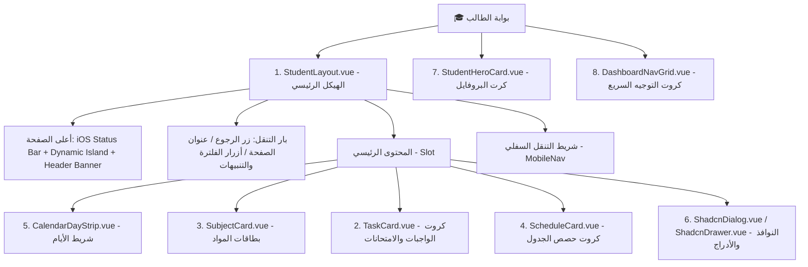

# 📘 دليل وموثق مكونات واجهة الطالب الشامل (Student UI Components Specification)

> **المكان المرجعي:** [`Views-api/student-components/`](file:///c:/Users/alhareth/Desktop/work/school-system/Views-api/student-components/)
> **الهدف:** توثيق شامل ودقيق بنسبة 100% لكل مكونات واجهة الطالب في نظام المدرسة (Student Portal Components). يُمكّن هذا المجلد أي مصمم UI/UX أو مطور من إعادة بناء الشاشات والمكونات بنفس المظهر البصري المتألق بنمط iOS وتجربة المستخدم المعتمدة دون أي اختلاف.

---

## 🗺️ 1. خريطة المكونات الشجرية (Student Component Hierarchy)

---

## 📂 2. دليل الملفات والمواصفات داخل هذا المجلد

| رقم الملف | اسم الملف | الوصف ومحتوى المواصفات الفنية |
| :---: | :--- | :--- |
| **`00`** | [`00_DESIGN_SYSTEM_TOKENS.md`](file:///c:/Users/alhareth/Desktop/work/school-system/Views-api/student-components/00_DESIGN_SYSTEM_TOKENS.md) | **نظام التصميم الرقمي:** متغيرات CSS، الألوان، التدرجات الزجاجية (iOS Gradients)، الخطوط SF Arabic، الظلال، أبعاد Dynamic Island، والتأثيرات التفاعلية. |
| **`01`** | [`01_STUDENT_LAYOUT_SPEC.md`](file:///c:/Users/alhareth/Desktop/work/school-system/Views-api/student-components/01_STUDENT_LAYOUT_SPEC.md) | **الهيكل الرئيسي (`StudentLayout.vue`):** هيكل HTML، الـ Props، الـ Slots، البار العلوي، التنبيهات، والشريط السفلي المحمول. |
| **`02`** | [`02_TASK_CARD_SPEC.md`](file:///c:/Users/alhareth/Desktop/work/school-system/Views-api/student-components/02_TASK_CARD_SPEC.md) | **بطاقات المهام (`TaskCard.vue`):** تصميم كروت الواجبات الزرقاء والامتحانات الحمراء، زر الحل النموذجي، وزر تنزيل المرفقات. |
| **`03`** | [`03_SUBJECT_CARD_SPEC.md`](file:///c:/Users/alhareth/Desktop/work/school-system/Views-api/student-components/03_SUBJECT_CARD_SPEC.md) | **بطاقات المواد (`SubjectCard.vue`):** الأيقونات 3D لكل مادة دراسية، عدادات الواجبات، وتنسيق Grid الكروت. |
| **`04`** | [`04_SCHEDULE_CARD_SPEC.md`](file:///c:/Users/alhareth/Desktop/work/school-system/Views-api/student-components/04_SCHEDULE_CARD_SPEC.md) | **حصص الجدول (`ScheduleCard.vue`):** شارات أرقام الحصص، أسماء المواد، معلمين المواد، وحالة الحصة الحالية. |
| **`05`** | [`05_CALENDAR_STRIP_SPEC.md`](file:///c:/Users/alhareth/Desktop/work/school-system/Views-api/student-components/05_CALENDAR_STRIP_SPEC.md) | **شريط التقويم (`CalendarDayStrip.vue`):** كبسولات الأيام الأسبوعية الـ 5 (الأحد-الخميس)، تحديد اليوم النشط ومؤشرات الأحداث. |
| **`06`** | [`06_MODALS_AND_DRAWERS_SPEC.md`](file:///c:/Users/alhareth/Desktop/work/school-system/Views-api/student-components/06_MODALS_AND_DRAWERS_SPEC.md) | **النوافذ والأدراج:** `ShadcnDialog` و `ShadcnDrawer` لاستعراض تفاصيل الواجب/الامتحان والحل المعتمد. |
| **`07`** | [`07_STUDENT_HERO_CARD_SPEC.md`](file:///c:/Users/alhareth/Desktop/work/school-system/Views-api/student-components/07_STUDENT_HERO_CARD_SPEC.md) | **كارت البروفايل (`StudentHeroCard.vue`):** كارت الهيرو العلوي المنزلق، صورة البروفايل، الصف والشعبة، والعدادات الثلاثة. |
| **`08`** | [`08_DASHBOARD_NAV_GRID_SPEC.md`](file:///c:/Users/alhareth/Desktop/work/school-system/Views-api/student-components/08_DASHBOARD_NAV_GRID_SPEC.md) | **كروت التوجيه السريع (`DashboardNavGrid.vue`):** شبكة الكروت الأربعة المتميزة للواجبات، الامتحانات، المواد، والجدول. |

---

## 🎨 3. كيفية استخدام المجلد من قبل المصمم أو المطور

1. **للمصمم (UI/UX Designer):**
   - ابدأ بملف [`00_DESIGN_SYSTEM_TOKENS.md`](file:///c:/Users/alhareth/Desktop/work/school-system/Views-api/student-components/00_DESIGN_SYSTEM_TOKENS.md) لضبط شبكة الألوان (Color Palette)، الظلال، والأخطاط المعتمدة في برنامج التصميم (Figma/Adobe XD).
   - راجع مقاسات وأبعاد iOS Status Bar و Dynamic Island المحددة في كل مكون لضمان التطابق البصري 1:1.

2. **للمطور (Frontend Developer / Agent):**
   - كل مكون موثّق بهيكل الـ HTML / Vue Template، الـ CSS Rules، والـ Props / Events المطلوبة.
   - كود الـ CSS المضمن جاهز للاستخدام الفوري ولا يتطلب مكتبات خارجية سوى أيقونات SVG القياسية والخط `SF Arabic`.
