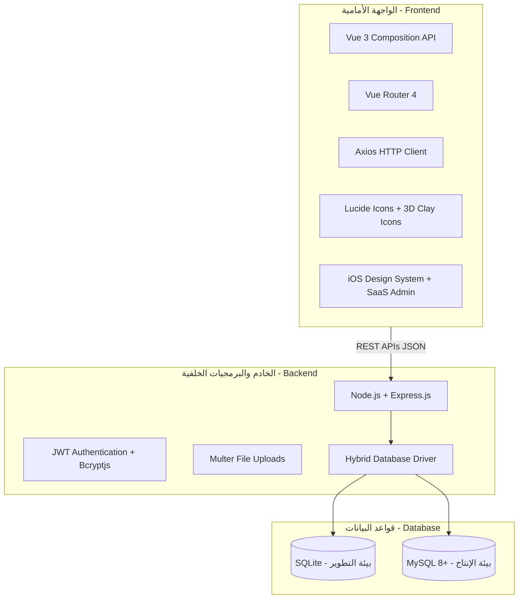

# 🚀 01. النظرة العامة والمواصفات المعمارية للمنظومة (System Overview & Tech Stack)

> **الهدف:** توفير وثيقة مرجعية موحدة ومباشرة توضح رؤية المنظومة المدرسية، أهداف الـ MVP، أدوار المستخدمين الثلاثة، ومكدس التقنيات المستخدمة.

---

## 🎯 1. نطاق وأهداف المنظومة (Core Scope & MVP Boundaries)

المنظومة عبارة عن **نظام مدرسي متكامل وحديث** يخدم 3 فئات رئيسية من المستخدمين بواجهات مصممة وفق أحدث معايير تجربة المستخدم (iOS Style للطلاب والمعلمين، ولوحة SaaS التنفيذية للإدارة):

1. **الطلاب (Students):** متابعة الواجبات المدرسية اليومية، جدول الامتحانات، الحلول النموذجية المعتمدة، والجدول الدراسي الأسبوعي مع عزل أمني صارم لكل شعبة.
2. **المعلمون (Teachers):** إدارة الفصول المسندة، إنشاء ونشر الواجبات والامتحانات، إرفاق أوراق العمل ونماذج الإجابة، ومعاينة جدول الحصص الأسبوعي.
3. **الإدارة العامة (Admins):** التحكم الشامل في الهيكل التعليمي (الصفوف، الشعب، المواد)، إدارة سجلات الطلاب وحسابات المعلمين، إسناد التكليفات التدريسية، وتوزيع الجدول الدراسي الأسبوعي.

---

## ⚙️ 2. المواصفات التقنية الثابتة (Technology Stack)



* **الخادم (Backend):**
  * `Node.js` + `Express.js`.
  * **المحول الهجين لقواعد البيانات (Hybrid DB Driver):** `SQLite` (تطوير محلي سريع بدون خوادم إضافية) و `MySQL` (جاهزية كاملة للإنتاج والسحابة).
  * **الأمان:** `jsonwebtoken` (JWT) + `bcryptjs` للتشفير.
  * **المرفقات:** `Multer` لإدارة رفع وتخزين ملفات الواجبات والامتحانات والحلول في مجلد `uploads/`.

* **الواجهة (Frontend):**
  * `Vue 3` مع `Composition API` و `<script setup>`.
  * `Vue Router` لإدارة التوجيه والتنقل.
  * `Axios` كعميل HTTP مع معالجة التوكنات التلقائية.
  * **الخط والتصميم:** خط `SF Arabic`، مكونات نمط Apple/iOS للطلاب والمعلمين، ولوحة تحكم SaaS تفاعلية للإدارة.

---

## 👥 3. أدوار المستخدمين والصلاحيات (Users & Roles)

| الدور (Role) | طريقة الدخول | الشاشات والوظائف الرئيسية | مرجع الـ APIs التفصيلي |
| :--- | :--- | :--- | :--- |
| 🎓 **الطالب (STUDENT)** | رقم الجلوس (`roll_number`) | الرئيسية، الواجبات والحلول، الامتحانات، الجدول الأسبوعي، والمواد المنهجية. | [`Rest-api/STUDENT_REST_API.md`](../Rest-api/STUDENT_REST_API.md) |
| 👨‍🏫 **المعلم (TEACHER)** | اسم المستخدم + كلمة المرور | الرئيسية، إدارة الواجبات والامتحانات، تفاصيل الحصص، والمواد والشعب المسندة. | [`Rest-api/TEACHER_REST_API.md`](../Rest-api/TEACHER_REST_API.md) |
| 👔 **الإدارة (ADMIN)** | اسم المستخدم + كلمة المرور | لوحة التحكم، الطلاب، المعلمين، الشعب والمواد، التكليفات، والجدول الأسبوعي. | [`Rest-api/ADMIN_REST_API.md`](../Rest-api/ADMIN_REST_API.md) |

---

## 📁 4. خريطة مجلدات المشروع الأساسية

```text
school-system/
├── backend/                  # خادم Express والمتحكمات وقواعد البيانات
│   ├── config/               # إعدادات الاتصال الهجين بقاعدة البيانات
│   ├── controllers/          # منطق العمليات (Auth, Student, Teacher, Admin)
│   ├── middlewares/          # التحقق من الهوية والأدوار (Auth, RBAC, Multer)
│   ├── database/             # ترحيل الجداول والبيانات الأولية (Migrate, Seed)
│   ├── routes/               # مسارات الـ REST APIs
│   └── uploads/              # المرفقات والملفات المرفوعة
│
├── frontend/                 # واجهة المستخدم المبنية بـ Vue 3 + Vite
│   ├── src/
│   │   ├── assets/           # الأيقونات والصور والمجسمات ثلاثية الأبعاد
│   │   ├── components/       # المكونات المشتركة (ShadcnDialog, Drawer, Nav)
│   │   ├── services/         # عميل Axios وإدارة التوكنات
│   │   └── views/            # شاشات المستخدمين (student, teacher, admin, login)
│   └── public/               # الأصول العامة والأيقونات الثابتة
│
├── Rest-api/                 # المرجع الشامل لكافة شاشات وموديلات الـ Frontend والـ APIs
│   ├── STUDENT_REST_API.md   # مرجع الطالب الكامل
│   ├── TEACHER_REST_API.md   # مرجع المعلم الكامل
│   ├── ADMIN_REST_API.md     # مرجع الإدارة الكامل
│   └── DATABASE_SCHEMA.md    # سكريبتات وبنية قاعدة البيانات
│
└── project-documentation-v2/ # المرجع الهندسي والمعماري الموحد للمشروع
```
