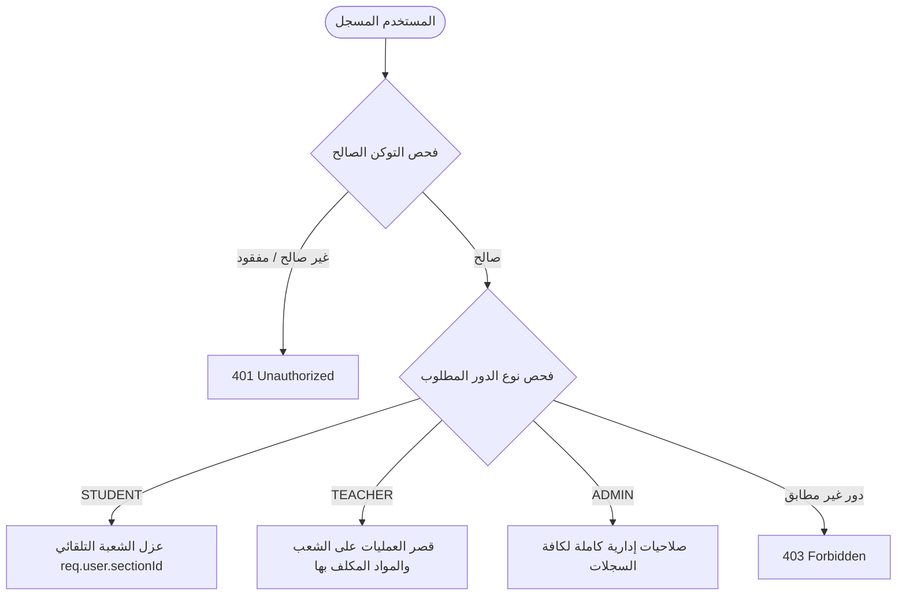

# ⚖️ 02. قواعد العمل الحتمية والسياسات البرمجية (Business Rules & Core Directives)

> **الهدف:** توثيق القواعد الهندسية وقوانين العمل الحتمية (Business Logic) التي تحكم النظام وتضمن الأمان والنزاهة الأكاديمية.

---

## 🛑 1. الخطوط الحمراء والقواعد الإلزامية (Non-Negotiable Directives)

### 1.1 حظر التوسع في النطاق (Zero Scope Creep)
* يقتصر نطاق V1 حصراً على الميزات المحددة (الواجبات والامتحانات والحلول، الجدول الأسبوعي، وإدارة الهيكل المدرسي).
* لا يُسمح بإضافة ميزات مثل (الدفع الإلكتروني، الإشعارات عبر SMS، الحضور البيومتري المعقد) حتى اعتماد النسخة الحالية بالكامل.

### 1.2 قاعدة العزل الأمني الصارم للطلاب (Zero-Trust Student Isolation)
* يُستخرج `section_id` و `grade_id` للطالب حصراً من التوكن المفكك في الـ Backend (`req.user.sectionId` و `req.user.gradeId`).
* **ممنوع منعاً باتاً:** قبول أو طلب `section_id` عبر `req.params` أو `req.query` أو `req.body` في أي مسار مخصص للطالب.
* يضمن هذا المبدأ استحالة قيام أي طالب بقراءة أو تعديل واجبات أو امتحانات أو جداول أي شعبة أخرى مهما حاول التلاعب بروابط الـ API.

---

## 🔐 2. قواعد الصلاحيات والوصول (RBAC Matrix)

---

## 📋 3. قواعد منطق العمل الأكاديمي (Academic Workflow Rules)

### 3.1 قاعدة تكليفات المعلمين (Teacher Assignments Scoping)
1. لا يستطيع المعلم إنشاء واجب أو امتحان إلا للمواد والشعب المسندة إليه رسمياً في جدول `teacher_assignments`.
2. يتم التحقق برمجياً في الـ Backend قبل إجراء أي عملية `INSERT` في جدول `assessment_tasks`:
   $$\text{teacher\_id} + \text{subject\_id} + \text{section\_id} \in \text{teacher\_assignments}$$

### 3.2 قاعدة الجدول الدراسي الأسبوعي (Weekly Timetable Rules)
1. يتكون الأسبوع الدراسي من **5 أيام رسمية** (الأحد إلى الخميس، `day_of_week` من 1 إلى 5).
2. يتكون كل يوم من **6 حصص يومية كحد أقصى** (`slot_number` من 1 إلى 6).
3. **قيد الفرادة للشعبة (Unique Slot Constraint):** لا يمكن أن تتكرر نفس الحصة ونفس اليوم لنفس الشعبة (`UNIQUE (section_id, day_of_week, slot_number)`).
4. عند تخصيص حصة موجودة مسبقاً، يتم إجراء تحديث (`UPSERT: Update on Conflict`) لتغيير المادة أو المعلم المسند.

### 3.3 قاعدة الحلول النموذجية والمرفقات (Task Solutions Rules)
1. يمكن للمعلم نشر الواجب أو الامتحان مع أو بدون حل نموذجي في البداية.
2. يتضمن الحل النموذجي:
   * نص الشرح والخطوات النموذجية (`solution_text`).
   * ملف PDF مرفق للحل إن وجد (`solution_attachment_path`).
3. فور تفعيل `has_solution = 1`، يظهر زر "استعراض الحل النموذجي" فوراً في واجهة الطالب لفتح مودل الحل وقراءته أو تنزيل ملف الـ PDF.

---

## 💾 4. قاعدة التوافقية الهجينة لقواعد البيانات (Cross-Driver Compatibility)

* يجب أن تكون جميع الاستعلامات البرمجية متوافقة بالكامل مع:
  1. `SQLite` لبيئة التطوير والاختبار المحلي الفوري.
  2. `MySQL 8+` لبيئة الإنتاج والتشغيل السحابي.
* تُكتب أسماء الجداول والحقول بـ `snake_case`، وتُستخدم وسائط التمرير المعلمة (`Parameterized Queries: ?`) لمنع هجمات الحقن (SQL Injection).
