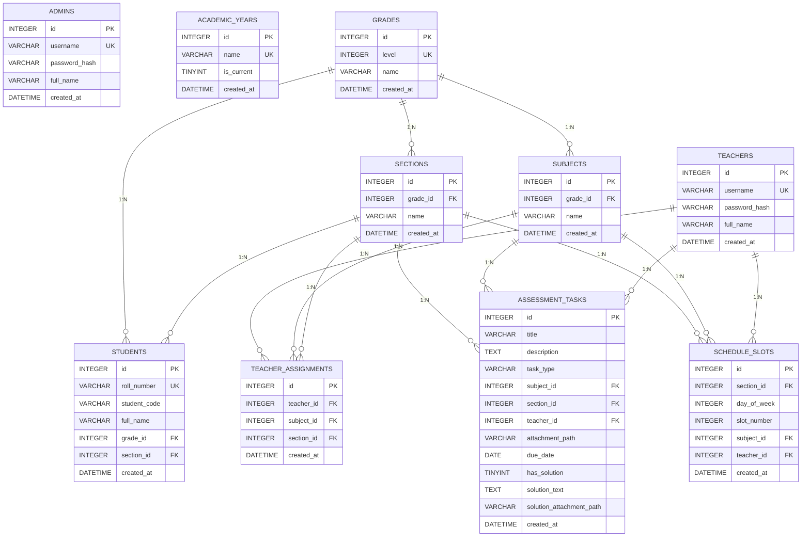

# 🗄️ 03. المخطط الهندسي لقاعدة البيانات (Database Blueprint & Master Schema)

> **الهدف:** توثيق المخطط العلائقي المتكامل (ERD)، المعجم البياني للجداول الـ 10، استراتيجيات الفهرسة، وسياسات الحذف التتابعي.

---

## 🗺️ 1. مخطط الكيانات والعلاقات (ERD)



---

## 📋 2. تفصيل الجداول الـ 10 ومسؤولياتها

| # | اسم الجدول (Table) | الوظيفة والمسؤولية | أهم الحقول والمفاتيح |
| :-: | :--- | :--- | :--- |
| **1** | `admins` | حسابات مدراء ومسؤولي النظام | `id` (PK), `username` (UK), `password_hash`, `full_name` |
| **2** | `academic_years` | السنوات الدراسية وحالة العام النشط | `id` (PK), `name` (UK), `is_current` |
| **3** | `grades` | الصفوف والمراحل الدراسية (1 إلى 9) | `id` (PK), `level` (UK: 1-9), `name` |
| **4** | `sections` | الشعب والقاعات التابعة لكل صف | `id` (PK), `grade_id` (FK), `name`, `UNIQUE(grade_id, name)` |
| **5** | `subjects` | المواد الدراسية المقررة لكل صف | `id` (PK), `grade_id` (FK), `name`, `UNIQUE(grade_id, name)` |
| **6** | `students` | سجلات الطلاب وتعيين الشعب | `id` (PK), `roll_number` (UK), `student_code`, `grade_id` (FK), `section_id` (FK) |
| **7** | `teachers` | حسابات كادر التدريس | `id` (PK), `username` (UK), `password_hash`, `full_name` |
| **8** | `teacher_assignments`| نصاب وتكليفات المعلمين بالمواد والشعب | `id` (PK), `teacher_id` (FK), `subject_id` (FK), `section_id` (FK), `UNIQUE(tch, sub, sec)` |
| **9** | `assessment_tasks` | الواجبات والامتحانات والحلول النموذجية | `id` (PK), `title`, `task_type`, `subject_id` (FK), `section_id` (FK), `teacher_id` (FK), `has_solution` |
| **10**| `schedule_slots` | الحصص الأسبوعية الموزعة (5 أيام × 6 حصص)| `id` (PK), `section_id` (FK), `day_of_week`, `slot_number`, `subject_id` (FK), `teacher_id` (FK) |

---

## ⚡ 3. سياسات الحذف التتابعي والفهارس (Cascades & Indexes)

### 3.1 سياسات الحذف التتابعي (`ON DELETE CASCADE`)
* عند حذف صف دراسي (`Grade`) -> تُحذف تلقائياً كافة الشعب والمواد التابعة له.
* عند حذف شعبة (`Section`) -> تُحذف تلقائياً كافة المهام والحصص والتكليفات التابعة لها.
* عند حذف معلم (`Teacher`) -> تُزال تلقائياً كافة تكليفاته وحصصه في الجدول.

### 3.2 فهارس تسريع الاستعلامات (Performance Indexes)
```sql
-- سرعة استعلام مهام شعبة الطالب
CREATE INDEX idx_tasks_section_type_due ON assessment_tasks (section_id, task_type, due_date);

-- سرعة جلب جدول الحصص الأسبوعي للشعبة
CREATE INDEX idx_schedule_section_day_slot ON schedule_slots (section_id, day_of_week, slot_number);

-- سرعة التحقق من تكليفات المعلم
CREATE INDEX idx_assignments_teacher ON teacher_assignments (teacher_id, section_id, subject_id);
```

---

## 🚀 4. أوامر التشغيل والترحيل السريع

```bash
# من داخل مجلد backend
node database/migrations/migrate.js  # إنشاء الجداول الـ 10
node database/seeds/seed.js          # ملء البيانات الأولية التجريبية
```
