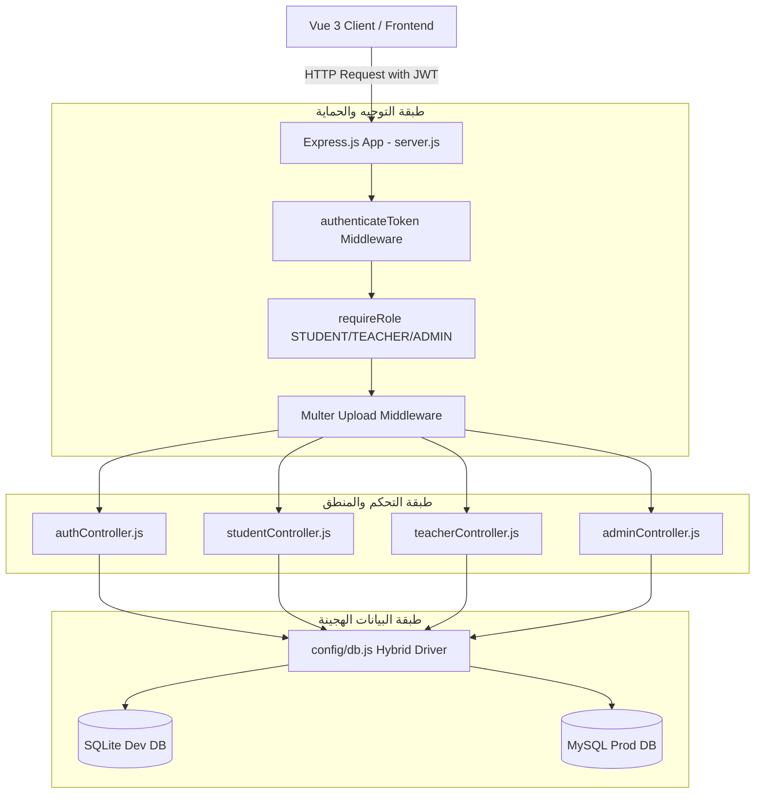

# ⚙️ 04. معمارية الخادم والبرمجيات الخلفية (Backend Architecture & APIs)

> **الهدف:** توثيق البنية المعمارية لطبقات الخادم (Express Layered Architecture)، تدفق المصادقة، وسيط الحماية، وهيكل استجابات الـ REST APIs الموحد والمنضبط.

---

## 🏗️ 1. المعمارية الطبقية للخادم (Layered Architecture)



---

## 🔑 2. تدفق المصادقة وهيكل التوكن (Authentication & JWT Payload)

### 2.1 نقاط دخول المصادقة المعيارية (`/api/auth`)
1. **دخول الطالب:** `POST /api/auth/login/student` (عبر `roll_number` + `student_code`).
2. **دخول المعلم:** `POST /api/auth/login/teacher` (عبر `username` + `password`).
3. **دخول المشرف:** `POST /api/auth/login/admin` (عبر `username` + `password`).
4. **فحص الجلسة:** `GET /api/auth/me` (استرجاع هوية وتوكن المستخدم الحالي).

*(ملاحظة: تدعم المسارات أيضاً أسماء مستعارة `/student-login`, `/teacher-login`, `/admin-login` لضمان التوافقية العكسية).*

### 2.2 محتويات التوكن المفكك (`req.user` JWT Payload):
```json
{
  "id": 1,
  "role": "STUDENT", // أو TEACHER أو ADMIN
  "fullName": "تامر المصراتي",
  "studentCode": "STU-1001",
  "gradeId": 5,
  "sectionId": 1,
  "gradeName": "الصف الخامس",
  "sectionName": "أ5"
}
```

---

## 📦 3. عقود الاستجابة الموحدة (Standardized API Response Contract)

### 3.1 استجابة الكائن الفردي أو الإجراء (Single Object / Action):
```json
{
  "success": true,
  "message": "تمت العملية بنجاح.",
  "data": {
    "id": 1,
    "name": "الصف الخامس"
  }
}
```

### 3.2 استجابة القوائم والمجموعات (Collection / Array):
```json
{
  "success": true,
  "count": 5,
  "data": [
    { "id": 1, "name": "التربية الإسلامية" },
    { "id": 2, "name": "الرياضيات" }
  ]
}
```

### 3.3 استجابة الأخطاء الموحدة (Standard Error Response):
```json
{
  "success": false,
  "message": "سبب الخطأ باللغة العربية الواضحة."
}
```

---

## 📎 4. إدارة رفع المرفقات والملفات (`Multer`)

* تُخزن ملفات الواجبات والامتحانات والحلول في مجلد `backend/uploads/`.
* يتم توليد أسماء عشوائية فريدة للملفات مع الحفاظ على الامتداد الأصلي لمنع التضارب (`filename-${Date.now()}-${uuid}.pdf`).
* يُخدم المجلد ثابتاً عبر الخادم:
  `app.use('/uploads', express.static(path.join(__dirname, 'uploads')));`
