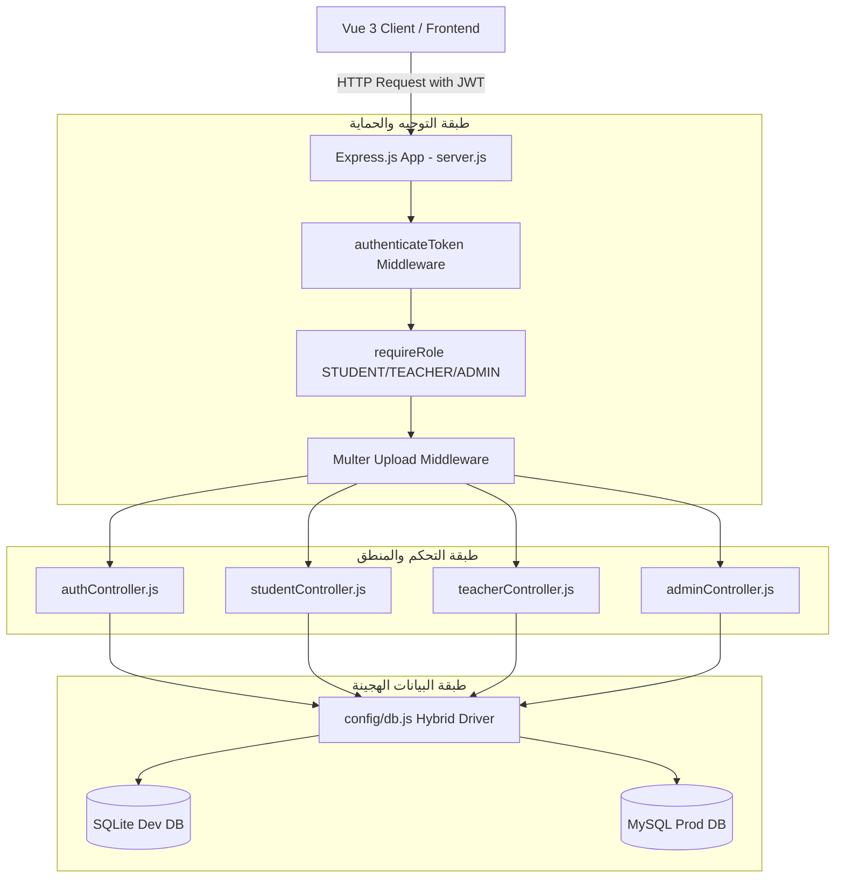

# ⚙️ 04. معمارية الخادم والبرمجيات الخلفية (Backend Architecture & APIs)

> **الهدف:** توثيق البنية المعمارية لطبقات الخادم (Express Layered Architecture)، تدفق المصادقة، وسيط الحماية، وهيكل استجابات الـ REST APIs الموحد.

---

## 🏗️ 1. المعمارية الطبقية للخادم (Layered Architecture)



---

## 🔑 2. تدفق المصادقة وهيكل التوكن (Authentication & JWT Payload)

### 2.1 نقاط دخول المصادقة (`/api/auth`)
1. **دخول الطالب:** `POST /api/auth/student-login` (عبر `roll_number`).
2. **دخول المعلم / الإدارة:** `POST /api/auth/login` (عبر `username` + `password`).
3. **التحقق من الجلسة:** `GET /api/auth/me` (استرجاع بيانات المستخدم الحالي من التوكن).

### 2.2 محتويات التوكن المفكك (`req.user` JWT Payload):
```json
{
  "id": 1,
  "role": "STUDENT", // أو TEACHER أو ADMIN
  "fullName": "تامر المصراتي",
  "studentCode": "STU-1001",
  "gradeId": 5,
  "sectionId": 1,
  "gradeName": "الصف الخامس",
  "sectionName": "أ5"
}
```

---

## 📦 3. عقود الاستجابة الموحدة (Standard API Response Contract)

### 3.1 استجابة النجاح (Success Response):
```json
{
  "success": true,
  "message": "تمت العملية بنجاح.",
  "data": { ... },
  "count": 5
}
```

### 3.2 استجابة الخطأ (Error Response):
```json
{
  "success": false,
  "message": "سبب الخطأ باللغة العربية الواضحة."
}
```

---

## 📎 4. إدارة رفع المرفقات والملفات (`Multer`)

* تُخزن ملفات الواجبات والامتحانات والحلول في مجلد `backend/uploads/`.
* يتم توليد أسماء عشوائية فريدة للملفات مع الحفاظ على الامتداد الأصلي لمنع التضارب (`filename-${Date.now()}-${uuid}.pdf`).
* يُخدم المجلد ثابتاً عبر الخادم:
  `app.use('/uploads', express.static(path.join(__dirname, 'uploads')));`
