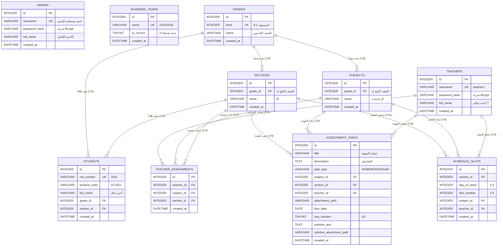

# الدليل الشامل لتصميم وهيكلية قاعدة البيانات (Master Relational Database Specification)

يوفر هذا الدليل المرجع الهندسي المتكامل لقاعدة بيانات المنظومة، موضحاً القواعد العلائقية، مخطط العلاقات بين الكيانات (ERD)، المعجم البياني (Data Dictionary) لكافة الجداول الـ 10، استراتيجيات الفهرسة، وسياسات الحذف التتابعي.

---

## 1. مخطط الكيانات والعلاقات المتكامل (Entity-Relationship Diagram)

---

## 2. المعجم البياني المفصل للجداول الـ 10 (Data Dictionary)

---

### 1. جدول مدراء النظام (`admins`)
| اسم الحقل | نوع البيانات | يقبل NULL؟ | القيمة الافتراضية | نوع المفتاح / القيد | الوصف |
| :--- | :--- | :---: | :---: | :---: | :--- |
| `id` | `INTEGER` / `INT` | ❌ لا | Auto Increment | `PRIMARY KEY` | المعرف الفريد للمدير |
| `username` | `VARCHAR(50)` | ❌ لا | - | `UNIQUE` | اسم المستخدم لتسجيل الدخول |
| `password_hash`| `VARCHAR(255)` | ❌ لا | - | - | كلمة المرور المشفرة بـ `Bcrypt` |
| `full_name` | `VARCHAR(150)` | ❌ لا | - | - | الاسم الكامل لمدير المدرسة |
| `created_at` | `DATETIME` | ✔️ نعم | `CURRENT_TIMESTAMP` | - | تاريخ ووقت الإنشاء |

---

### 2. جدول السنوات الدراسية (`academic_years`)
| اسم الحقل | نوع البيانات | يقبل NULL؟ | القيمة الافتراضية | نوع المفتاح / القيد | الوصف |
| :--- | :--- | :---: | :---: | :---: | :--- |
| `id` | `INTEGER` / `INT` | ❌ لا | Auto Increment | `PRIMARY KEY` | معرف السنة الأكاديمية |
| `name` | `VARCHAR(50)` | ❌ لا | - | `UNIQUE` | مسمى العام (مثل `2025/2026`) |
| `is_current` | `TINYINT(1)` | ✔️ نعم | `1` | - | مؤشر السنة الدراسية النشطة |
| `created_at` | `DATETIME` | ✔️ نعم | `CURRENT_TIMESTAMP` | - | تاريخ الإنشاء |

---

### 3. جدول الصفوف الأساسية (`grades`)
| اسم الحقل | نوع البيانات | يقبل NULL؟ | القيمة الافتراضية | نوع المفتاح / القيد | الوصف |
| :--- | :--- | :---: | :---: | :---: | :--- |
| `id` | `INTEGER` / `INT` | ❌ لا | Auto Increment | `PRIMARY KEY` | معرف الصف الدراسي |
| `level` | `INT` | ❌ لا | - | `UNIQUE` | المستوى الرقمي للصف (1 إلى 9) |
| `name` | `VARCHAR(50)` | ❌ لا | - | - | الاسم الرسمي (مثل "الصف الخامس") |
| `created_at` | `DATETIME` | ✔️ نعم | `CURRENT_TIMESTAMP` | - | تاريخ الإنشاء |

---

### 4. جدول الشعب والفصول (`sections`)
| اسم الحقل | نوع البيانات | يقبل NULL؟ | القيمة الافتراضية | نوع المفتاح / القيد | الوصف |
| :--- | :--- | :---: | :---: | :---: | :--- |
| `id` | `INTEGER` / `INT` | ❌ لا | Auto Increment | `PRIMARY KEY` | معرف الشعبة |
| `grade_id` | `INT` | ❌ لا | - | `FOREIGN KEY` ➔ `grades(id)` | الصف التابعة له الشعبة |
| `name` | `VARCHAR(50)` | ❌ لا | - | `UNIQUE(grade_id, name)` | اسم الشعبة (مثل "5أ") |
| `created_at` | `DATETIME` | ✔️ نعم | `CURRENT_TIMESTAMP` | - | تاريخ الإنشاء |

---

### 5. جدول المواد والمناهج المقررة (`subjects`)
| اسم الحقل | نوع البيانات | يقبل NULL؟ | القيمة الافتراضية | نوع المفتاح / القيد | الوصف |
| :--- | :--- | :---: | :---: | :---: | :--- |
| `id` | `INTEGER` / `INT` | ❌ لا | Auto Increment | `PRIMARY KEY` | معرف المادة |
| `grade_id` | `INT` | ❌ لا | - | `FOREIGN KEY` ➔ `grades(id)` | الصف المقرر له المادة |
| `name` | `VARCHAR(100)`| ❌ لا | - | `UNIQUE(grade_id, name)` | اسم المادة (مثل "الرياضيات") |
| `created_at` | `DATETIME` | ✔️ نعم | `CURRENT_TIMESTAMP` | - | تاريخ الإنشاء |

---

### 6. جدول سجلات الطلاب (`students`)
| اسم الحقل | نوع البيانات | يقبل NULL؟ | القيمة الافتراضية | نوع المفتاح / القيد | الوصف |
| :--- | :--- | :---: | :---: | :---: | :--- |
| `id` | `INTEGER` / `INT` | ❌ لا | Auto Increment | `PRIMARY KEY` | المعرف الداخلي للطالب |
| `roll_number`| `VARCHAR(50)` | ❌ لا | - | `UNIQUE` | رقم الجلوس المستخدم للدخول |
| `student_code`| `VARCHAR(50)`| ❌ لا | - | - | كود الدخول السري للطالب |
| `full_name` | `VARCHAR(150)`| ❌ لا | - | - | الاسم الرباعي للطالب |
| `grade_id` | `INT` | ❌ لا | - | `FOREIGN KEY` ➔ `grades(id)` | الصف المقيد به الطالب |
| `section_id` | `INT` | ❌ لا | - | `FOREIGN KEY` ➔ `sections(id)`| الشعبة المقيد بها الطالب |
| `created_at` | `DATETIME` | ✔️ نعم | `CURRENT_TIMESTAMP` | - | تاريخ تسجيل القيد |

---

### 7. جدول المعلمين (`teachers`)
| اسم الحقل | نوع البيانات | يقبل NULL؟ | القيمة الافتراضية | نوع المفتاح / القيد | الوصف |
| :--- | :--- | :---: | :---: | :---: | :--- |
| `id` | `INTEGER` / `INT` | ❌ لا | Auto Increment | `PRIMARY KEY` | معرف المعلم |
| `username` | `VARCHAR(50)` | ❌ لا | - | `UNIQUE` | اسم المستخدم للدخول |
| `password_hash`| `VARCHAR(255)`| ❌ لا | - | - | كلمة المرور المشفرة بـ `Bcrypt` |
| `full_name` | `VARCHAR(150)`| ❌ لا | - | - | الاسم الكامل للأستاذ/الأستاذة |
| `created_at` | `DATETIME` | ✔️ نعم | `CURRENT_TIMESTAMP` | - | تاريخ الإنشاء |

---

### 8. جدول تكليفات المعلمين بالمواد والشعب (`teacher_assignments`)
| اسم الحقل | نوع البيانات | يقبل NULL؟ | القيمة الافتراضية | نوع المفتاح / القيد | الوصف |
| :--- | :--- | :---: | :---: | :---: | :--- |
| `id` | `INTEGER` / `INT` | ❌ لا | Auto Increment | `PRIMARY KEY` | معرف التكليف الأكاديمي |
| `teacher_id` | `INT` | ❌ لا | - | `FOREIGN KEY` ➔ `teachers(id)` | المعلم المكلف |
| `subject_id` | `INT` | ❌ لا | - | `FOREIGN KEY` ➔ `subjects(id)` | المادة المسندة |
| `section_id` | `INT` | ❌ لا | - | `FOREIGN KEY` ➔ `sections(id)` | الشعبة المسندة |
| `created_at` | `DATETIME` | ✔️ نعم | `CURRENT_TIMESTAMP` | `UNIQUE(teacher_id, subject_id, section_id)` | تاريخ التكليف |

---

### 9. جدول المهام والواجبات والحلول (`assessment_tasks`)
| اسم الحقل | نوع البيانات | يقبل NULL؟ | القيمة الافتراضية | نوع المفتاح / القيد | الوصف |
| :--- | :--- | :---: | :---: | :---: | :--- |
| `id` | `INTEGER` / `INT` | ❌ لا | Auto Increment | `PRIMARY KEY` | معرف المهمة |
| `title` | `VARCHAR(255)`| ❌ لا | - | - | عنوان الواجب أو الامتحان |
| `description`| `TEXT` | ✔️ نعم | `NULL` | - | شرح وتفاصيل المهمة |
| `task_type` | `VARCHAR(20)` | ❌ لا | - | `'HOMEWORK'` أو `'EXAM'` | نوع المهمة التقييمية |
| `subject_id` | `INT` | ❌ لا | - | `FOREIGN KEY` ➔ `subjects(id)` | المادة التابعة لها |
| `section_id` | `INT` | ❌ لا | - | `FOREIGN KEY` ➔ `sections(id)` | الشعبة المستهدفة |
| `teacher_id` | `INT` | ❌ لا | - | `FOREIGN KEY` ➔ `teachers(id)` | المعلم الناشر للمهمة |
| `attachment_path`| `VARCHAR(255)`| ✔️ نعم | `NULL` | - | مسار ملف الواجب الأصلي |
| `due_date` | `DATE` | ✔️ نعم | `NULL` | - | تاريخ التسليم أو موعد الاختبار |
| `has_solution`| `TINYINT(1)` | ✔️ نعم | `0` | `0` أو `1` | مؤشر تفعيل الحل النموذجي |
| `solution_text`| `TEXT` | ✔️ نعم | `NULL` | - | النص التوضيحي للحل النموذجي |
| `solution_attachment_path`| `VARCHAR(255)`| ✔️ نعم | `NULL` | - | مسار ملف الحل النموذجي المعتمد |
| `created_at` | `DATETIME` | ✔️ نعم | `CURRENT_TIMESTAMP` | - | تاريخ نشر المهمة |

---

### 10. جدول الحصص والجدول الأسبوعي (`schedule_slots`)
| اسم الحقل | نوع البيانات | يقبل NULL؟ | القيمة الافتراضية | نوع المفتاح / القيد | الوصف |
| :--- | :--- | :---: | :---: | :---: | :--- |
| `id` | `INTEGER` / `INT` | ❌ لا | Auto Increment | `PRIMARY KEY` | معرف الحصة |
| `section_id` | `INT` | ❌ لا | - | `FOREIGN KEY` ➔ `sections(id)` | الشعبة الدراسية |
| `day_of_week`| `INT` | ❌ لا | - | `1` (الأحد) إلى `5` (الخميس) | يوم الحصة بالأسبوع |
| `slot_number`| `INT` | ❌ لا | - | `1` إلى `6` | رقم الحصة اليومية |
| `subject_id` | `INT` | ❌ لا | - | `FOREIGN KEY` ➔ `subjects(id)` | المادة الدراسية للحصة |
| `teacher_id` | `INT` | ❌ لا | - | `FOREIGN KEY` ➔ `teachers(id)` | المعلم المخصص للحصة |
| `created_at` | `DATETIME` | ✔️ نعم | `CURRENT_TIMESTAMP` | `UNIQUE(section_id, day_of_week, slot_number)` | تاريخ التعيين |

---

## 3. مصفوفة قيود التكامل المرجعي وسياسات الحذف (Cascade Policies)

| الجدول الأب (Parent) | الجدول التابع (Child) | قيد المفتاح الأجنبي (Foreign Key) | سياسة الحذف (On Delete Action) |
| :--- | :--- | :--- | :---: |
| `grades` | `sections` | `FOREIGN KEY (grade_id) REFERENCES grades(id)` | `CASCADE` (حذف الشعب تتابعياً) |
| `grades` | `subjects` | `FOREIGN KEY (grade_id) REFERENCES grades(id)` | `CASCADE` (حذف المواد تتابعياً) |
| `sections` | `teacher_assignments` | `FOREIGN KEY (section_id) REFERENCES sections(id)` | `CASCADE` (حذف التكليفات تتابعياً) |
| `subjects` | `teacher_assignments` | `FOREIGN KEY (subject_id) REFERENCES subjects(id)` | `CASCADE` (حذف التكليفات تتابعياً) |
| `teachers` | `teacher_assignments` | `FOREIGN KEY (teacher_id) REFERENCES teachers(id)` | `CASCADE` (حذف التكليفات تتابعياً) |
| `sections` | `assessment_tasks` | `FOREIGN KEY (section_id) REFERENCES sections(id)` | `CASCADE` (حذف المهام المنشورة) |
| `teachers` | `assessment_tasks` | `FOREIGN KEY (teacher_id) REFERENCES teachers(id)` | `CASCADE` (حذف مهام المعلم) |
| `sections` | `schedule_slots` | `FOREIGN KEY (section_id) REFERENCES sections(id)` | `CASCADE` (حذف حصص الشعبة) |
| `teachers` | `schedule_slots` | `FOREIGN KEY (teacher_id) REFERENCES teachers(id)` | `CASCADE` (حذف حصص المعلم) |
| `grades` / `sections` | `students` | `FOREIGN KEY (grade_id / section_id)` | `RESTRICT / Protect` (حماية سجلات القيد) |

---

## 4. جدول التوافق بين مشغلات قواعد البيانات (Cross-Driver Types)

| المفهوم / النوع | في مشغل SQLite المحلي (`school.sqlite`) | في مشغل MySQL الإنتاجي |
| :--- | :--- | :--- |
| **المفتاح الأساسي التلقائي** | `INTEGER PRIMARY KEY AUTOINCREMENT` | `INT AUTO_INCREMENT PRIMARY KEY` |
| **القيم المنطقية (Boolean)** | `TINYINT(1)` (0 أو 1) | `TINYINT(1)` أو `BOOLEAN` |
| **التواريخ والأوقات** | `DATETIME DEFAULT CURRENT_TIMESTAMP` | `DATETIME DEFAULT CURRENT_TIMESTAMP` |
| **تفعيل المفاتيح الأجنبية** | `PRAGMA foreign_keys = ON;` (إجباري في الاتصال) | مفعل افتراضياً في محرك `InnoDB` |
| **استبدال الحصص (Upsert)** | `INSERT OR REPLACE INTO schedule_slots` | `INSERT INTO ... ON DUPLICATE KEY UPDATE` |
