# خريطة الطريق وخطة بناء المشروع الشاملة من الصفر (Master Project Development Roadmap)

يوفر هذا الدليل الخطة الزمنية والهندسية المتسلسلة لبناء وتطوير منظومة إدارة المدرسة من الصفر (Greenfield Development) وصولاً إلى التشغيل الكامل، مقسمة إلى 9 مراحل تنفيذية محكمة مع شروط البدء والتسليم لكل مرحلة.

---

## 🗺️ المخطط الزمني للمراحل التسع (Gantt & Execution Flow)

```mermaid
gantt
    title خطة مراحل بناء وتطوير المنظومة من الصفر
    dateFormat  X
    axisFormat %d

    section 1. التأسيس والبيئة
    تهيئة الخادم والواجهة وتثبيت الحزم :p1, 0, 1
    
    section 2. طبقة البيانات
    بناء محول db.js وترحيل الجداول الـ 10 :p2, 1, 2
    تعبئة شحنة البيانات التجريبية seed.js :p2b, 2, 3

    section 3. المصادقة والأمان
    توليد وفحص JWT وبناء وسائط RBAC :p3, 3, 4
    برمجة مسارات الدخول /api/auth/* :p3b, 4, 5

    section 4. مسارات الأعمال
    بناء مسارات الإدارة الـ 20 :p4a, 5, 6
    بناء مسارات المعلم والرفع المزدوج :p4b, 6, 7
    بناء مسارات الطالب المعزولة :p4c, 7, 8

    section 5. تأسيس الواجهة
    نظام التصميم وخط SF Arabic و Axios :p5, 8, 9
    المكونات المشتركة وحراس التوجيه :p5b, 9, 10

    section 6. واجهات الطالب
    بناء إطار iOS وكروت الواجبات والحلول :p6, 10, 11
    شاشات الامتحانات والجدول والمواد :p6b, 11, 12

    section 7. واجهات المعلم
    لوحة تحكم المعلم وإدارة الواجبات والحلول :p7, 12, 13
    نوافذ الإدراج وجدول المعلم وفصوله :p7b, 13, 14

    section 8. لوحة الإدارة
    بطاقات 3D KPI والهيكل المتدرج :p8, 14, 15
    سجلات الطلاب وملف الطالب والمعلمين :p8b, 15, 16
    شبكة الجدول الأسبوعي التفاعلية (5x6) :p8c, 16, 17

    section 9. التكامل والاختبار
    اختبار دورات العمل الكاملة والإنتاجية :p9, 17, 18
```

---

## 1. تفاصيل المراحل التنفيذية التسع (Detailed Phase Specifications)

---

### 🔹 المرحلة 1: تهيئة البيئة والأساسات (Setup & Infrastructure)
* **الهدف:** إعداد بيئة العمل وهيكل المجلدات للخادم والواجهة الأمامية وتثبيت الاعتماديات.
* **شروط البدء (Entry Criteria):** وجود Node.js v18+ و NPM مثبتين على النظام.
* **المهام التنفيذية:**
  1. إنشاء مجلدي `backend/` و `frontend/`.
  2. تهيئة `backend/package.json` وتثبيت: `express`, `cors`, `dotenv`, `jsonwebtoken`, `bcryptjs`, `multer`, `sqlite3`, `mysql2`.
  3. تهيئة `frontend/package.json` عبر Vite وتثبيت: `vue`, `vue-router`, `axios`, `lucide-vue-next`.
  4. إعداد ملفات البيئة `.env` و `.gitignore`.
* **المخرجات القابلة للتسليم (Deliverables):** هيكل مجلدات نظيف يعمل به خادم Express على منفذ 5000 وخادم Vite على منفذ 5173.
* **شرط الاعتماد (Exit Criteria):** نجاح تشغيل `npm run dev` في المجلدين وظهور رسالة الترحيب.

---

### 🔹 المرحلة 2: تصميم البيانات والترحيل (Database & Migrations)
* **الهدف:** بناء محول البيانات الهجين وترحيل الجداول الـ 10 وتعبئة البيانات الأولية.
* **شروط البدء:** اكتمال المرحلة 1.
* **المهام التنفيذية:**
  1. كتابة محول `backend/config/db.js` لدعم التبديل بين SQLite و MySQL مع تفعيل `PRAGMA foreign_keys = ON;`.
  2. كتابة سكريبت الترحيل `backend/database/migrations/migrate.js` لإنشاء الجداول بالتسلسل المرجعي:
     (`admins`, `academic_years`, `grades`, `sections`, `subjects`, `students`, `teachers`, `teacher_assignments`, `assessment_tasks`, `schedule_slots`).
  3. كتابة سكريبت التعبئة `backend/database/seeds/seed.js` لزرع الصفوف الـ 9، وحساب `admin`، و 5 معلمين، وفصول الصف 5 و 8، والطالب التجريبي أحمد خالد (`1001` / `ST1001`)، والمهام والجدول الكامل.
* **المخرجات:** توليد ملف `school.sqlite` واكتمال شحنة البيانات.
* **شرط الاعتماد:** تنفيذ `npm run db:migrate` ثم `npm run db:seed` بنجاح دون أي استثناءات.

---

### 🔹 المرحلة 3: خادم الـ API ونظام المصادقة (Backend Core & Auth API)
* **الهدف:** تأمين النظام وتوفير نقاط دخول موثوقة للأدوار الثلاثة وتوليد وفحص توكنات JWT.
* **شروط البدء:** اكتمال ترحيل قاعدة البيانات (المرحلة 2).
* **المهام التنفيذية:**
  1. كتابة أدوات التوكن `backend/utils/jwt.js` (توليد وفحص التوكن المشفر).
  2. كتابة وسائط الأمان `backend/middlewares/authMiddleware.js` (`authenticateToken` و `requireRole`).
  3. بناء معالج ومسارات المصادقة `authController.js` و `authRoutes.js`:
     * `POST /api/auth/login/admin`
     * `POST /api/auth/login/teacher`
     * `POST /api/auth/login/student`
     * `GET /api/auth/me`
* **المخرجات:** مسارات مصادقة قوية تشفر كلمات المرور وتحقن معرفات الشعب في توكن الطالب.
* **شرط الاعتماد:** نجاح استلام التوكنات للأدوار الثلاثة عبر طلبات cURL وفحص صحة كائن `req.user`.

---

### 🔹 المرحلة 4: واجهات برمجة الأعمال (Domain REST APIs)
* **الهدف:** توفير كافة مسارات إدارة البيانات للمسؤول، المعلم، والطالب.
* **شروط البدء:** اكتمال طبقة المصادقة (المرحلة 3).
* **المهام التنفيذية:**
  1. **مسارات الطالب (`studentController.js`):** استرجاع الملف الشخصي، المهام مع الحلول، الجدول، والمواد المعزولة بـ `req.user.sectionId`.
  2. **مسارات المعلم (`teacherController.js`):** جلب التكليفات، وإدارة المهام (CRUD) مع رفع الملفات والحلول والتحقق من ملكية المهام.
  3. **مسارات الإدارة (`adminController.js`):** الإحصائيات، الهيكل، الطلاب ونقلهم، المعلمين، التكليفات، وجدول الحصص بنمط `Upsert`.
  4. **وسيط رفع الملفات (`utils/upload.js`):** ضبط Multer وحدود 10MB والقائمة البيضاء للامتدادات.
* **المخرجات:** 34 مساراً برمجياً متكاملاً موثقاً ومحمياً بالكامل.
* **شرط الاعتماد:** اجتياز كافة اختبارات المسارات والتأكد من تطبيق الحذف التتابعي وحجب فصول الطلاب الآخرين.

---

### 🔹 المرحلة 5: تأسيس الواجهة الأمامية ونظام التصميم (Frontend Core & Design System)
* **الهدف:** تهيئة الخطوط، الألوان، المكونات المشتركة، وإعدادات التوجيه والاتصال.
* **شروط البدء:** اكتمال المرحلة 1 و 4.
* **المهام التنفيذية:**
  1. تثبيت وربط خط **SF Arabic** الرسمي في مجلد `frontend/src/assets/fonts/`.
  2. كتابة ملفات التنسيق الأساسية `main.css` و `student-design.css` مع تعريف كافة متغيرات الألوان والظلال والزجاج الضبابي (Design Tokens).
  3. إعداد عميل Axios المركزي `services/api.js` لحقن التوكن ومعالجة أخطاء 401 تلقائياً.
  4. بناء المكونات الأساسية المشتركة: `BaseButton.vue`, `BaseBadge.vue`, `CustomSelect.vue`, `ShadcnDrawer.vue`, `ShadcnDialog.vue`, `MobileNav.vue`.
  5. إعداد حراس المسارات `router/index.js` لمنع الدخول غير المصرح وتوجيه المستخدمين حسب أدوارهم.
* **المخرجات:** نظام تصميم موحد يعمل بكفاءة وشاشة دخول موحدة `/login`.
* **شرط الاعتماد:** قدرة المستخدم على تسجيل الدخول بالصفات الثلاث والتوجيه التلقائي للوحة الصحيحة.

---

### 🔹 المرحلة 6: بناء واجهات الطالب بنمط iOS (Student Native iOS Experience)
* **الهدف:** تنفيذ تجربة الطالب الفاخرة المعتمدة في `design/student design/`.
* **شروط البدء:** اكتمال المرحلة 5.
* **المهام التنفيذية:**
  1. بناء إطار `StudentLayout.vue` مع شريط الحالة، الجزيرة التفاعلية (Dynamic Island)، بطاقة الهيرو المتراكبة (-50px) وشريط الإحصائيات الثلاثي.
  2. بناء `StudentDashboardView.vue` بشريط تقويم الأيام وشبكة الكروت الـ 4 الكبرى (240px).
  3. بناء `HomeworksView.vue` و `ExamsView.vue` بنظام كروت الأيام المجمعة (`sched-ref-card`) ودرج تفاصيل الواجب مع صندوق الحل النموذجي المعتمد (`has_solution = 1`).
  4. بناء `ScheduleView.vue` (جدول الحصص الـ 30) و `SubjectsView.vue` (المواد والمعلمون).
* **المخرجات:** 5 شاشات تفاعلية للطالب فائقة السلاسة والجمال البصري.
* **شرط الاعتماد:** تصفح الطالب لكافة أقسام حسابه واستعراض الحل النموذجي وتنزيل المرفقات بدون أخطاء.

---

### 🔹 المرحلة 7: بناء واجهات المعلم والمهام (Teacher Task Management Portal)
* **الهدف:** تمكين الكادر التدريسي من إدارة الفصول ونشر وتعديل الواجبات والحلول النموذجية.
* **شروط البدء:** اكتمال المرحلة 5 و 6.
* **المهام التنفيذية:**
  1. بناء إطار `TeacherLayout.vue` وبطاقة الهيرو الخاصة بالمعلم مع إحصائيات نصاب التدريس.
  2. بناء `TeacherDashboardView.vue` و `TeacherSubjectsView.vue` و `TeacherScheduleView.vue`.
  3. بناء `TeacherHomeworksView.vue` و `TeacherExamsView.vue`:
     * صندوق التبويبات المبوب (الحالية / الأرشيف) مع زر الإجراء البارز `+ إضافة واجب جديد`.
     * شريط كبسولات تصفية الفصول والشعب المسندة.
     * نافذة الإدراج المنبثقة مع تفعيل الحل النموذجي ورفع المرفقات.
     * الدرج الجانبي (`ShadcnDrawer`) لاستعراض التفاصيل ومعاينة الحل وزر الحذف النهائي.
* **المخرجات:** بوابة متكاملة للمعلم لإدارة الواجبات والامتحانات والحلول.
* **شرط الاعتماد:** نشر المعلم لواجب وملاحظة ظهوره اللحظي في حساب الطالب المقيد بنفس الفصل.

---

### 🔹 المرحلة 8: بناء لوحة التحكم الإدارية المفككة (Admin SaaS Dashboard)
* **الهدف:** توفير لوحة قيادة مكتبية شاملة لمدير المدرسة بمكونات معيارية نظيفة.
* **شروط البدء:** اكتمال المرحلة 4 و 5.
* **المهام التنفيذية:**
  1. بناء الهيدر التنفيذي وقائمة macOS المنسدلة وشبكة بطاقات الـ 3D KPI مع مجسماتها.
  2. بناء موديول الهيكل التعليمي المتدرج (`GradesOverview.vue` ➔ `GradeDetailsPanel.vue` ➔ `ClassDetailsPanel.vue`).
  3. بناء موديول الطلاب: جدول السجلات وشاشة **الملف التفصيلي للطالب (`StudentProfile.vue`)**.
  4. بناء موديول المعلمين: جدول السجلات وشاشة **الملف الأكاديمي للمعلم (`TeacherProfile.vue`)**.
  5. بناء شبكة الجدول الأسبوعي التفاعلية (5×6) مع نافذة التخصيص والاستبدال المباشر (`AssignSlotModal.vue`).
* **المخرجات:** لوحة تحكم مكتبية متكاملة ومقسمة إلى مكونات مستقلة في `components/admin/`.
* **شرط الاعتماد:** قدرة المدير على إدارة المدرسة بالكامل، تسجيل طالب، تكليف معلم، وبناء الجدول بسلاسة.

---

### 🔹 المرحلة 9: التكامل الشامل، اختبارات الجودة، والتشغيل الميداني (Testing & Handover)
* **الهدف:** التحقق من خلو النظام من الثغرات، استقرار الأداء، والجاهزية الإنتاجية.
* **المهام التنفيذية:**
  1. اختبار دورة العمل الأكاديمية الكاملة عبر الأدوار الثلاثة (End-to-End User Journeys).
  2. فحص استجابة الواجهات على كافة أحجام الشاشات (الهواتف، الأجهزة اللوحية، والشاشات المكتبية الواسعة).
  3. فحص أمان رفع الملفات وحماية الروابط ومنع تسريب بيانات الفصول الأخرى.
  4. مراجعة وثائق المشروع في `project-documentation/` للتأكد من مطابقتها التامة للواقع البرمجي.
* **المخرجات النهائية:** نظام متكامل، مستقر، ومختبر بنسبة 100% جاهز للتسليم والتشغيل الفعلي.

---

## 2. جدول ربط المراحل الـ9 بالخطوات الـ12 (Phase ↔ Step Mapping — Single Source of Order)

> **ملاحظة للـ AI وللمطوّر:** التنفيذ يسير دائماً بهذا الترتيب. لا تُنفّذ Step قبل اكتمال Phase التابعة لها.  
> التفاصيل الكاملة لكل Step موجودة في [`IMPLEMENTATION_STEPS.md`](./IMPLEMENTATION_STEPS.md).

| المرحلة (Phase) | عنوان المرحلة | الخطوات المقابلة (Steps) | Gate الاجتياز |
| :---: | :--- | :--- | :--- |
| **Phase 1** | تهيئة البيئة والأساسات | **Step 1** — Backend Workspace Setup | خادم يعمل على منفذ 5000 |
| **Phase 2** | طبقة البيانات والترحيل | **Step 2** — DB Adapter & Migrations **Step 3** — Database Seeding | `school.sqlite` + بيانات ليبيا التجريبية |
| **Phase 3** | المصادقة والأمان | **Step 4** — JWT & RBAC Middleware **Step 5** — Auth Controller & Routes | دخول الأدوار الثلاثة + Payload صحيح |
| **Phase 4** | مسارات الأعمال | **Step 6** — Domain Controllers & Uploads **Step 7** — Server Assembly | 34 مساراً يعملون + رفع الملفات |
| **Phase 5** | تأسيس الواجهة الأمامية | **Step 8** — Frontend Core & Tokens **Step 9** — Common UI & Guards | شاشة الدخول + حراس المسارات |
| **Phase 6** | واجهات الطالب | **Step 10** — Student iOS Views | الطالب يرى واجباته وحلوله وجدوله |
| **Phase 7** | واجهات المعلم | **Step 11** — Teacher Publishing Portal | المعلم ينشر → الطالب يرى فوراً |
| **Phase 8** | لوحة الإدارة | **Step 12** — Admin SaaS Dashboard | الإدارة تبني الهيكل والجدول كاملاً |
| **Phase 9** | التكامل والاختبار | **15 سيناريو E2E** في `DEFINITION_OF_DONE.md §7` | اجتياز 15/15 سيناريو |

