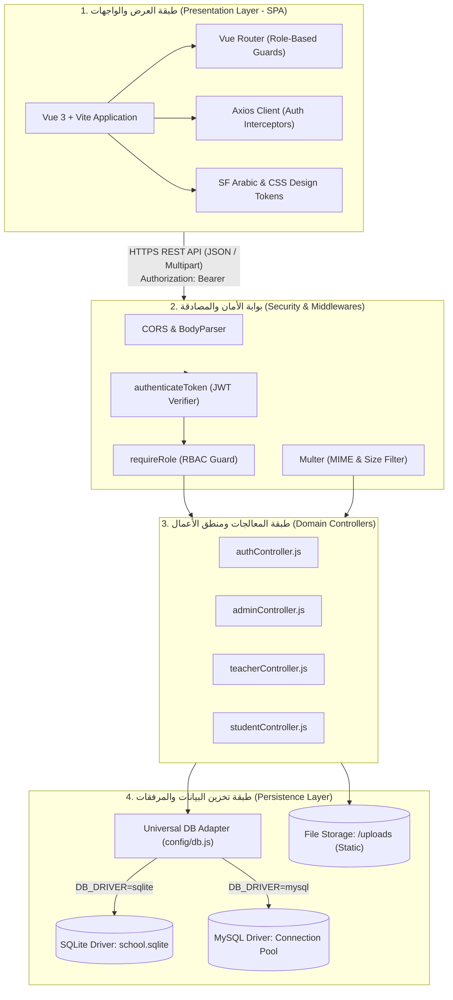
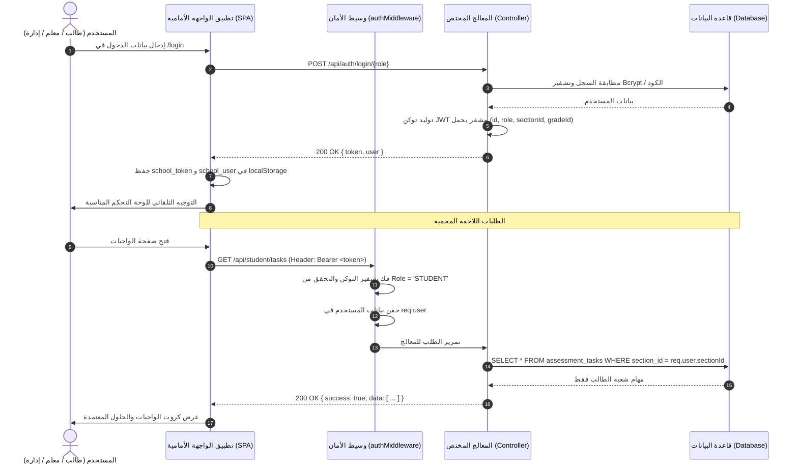

# الدليل المعماري الشامل للنظام والأمان (Master System Architecture & Security Blueprint)

يوفر هذا الدليل المرجع الهندسي المتكامل لمعمارية المنظومة، موضحاً النمط المعماري للخدمات المفصولة (Decoupled Client-Server Architecture)، طبقات النظام، استراتيجيات الأمان الصارمة، إدارة الجلسات، وتكامل قواعد البيانات والملفات.

---

## 1. المخطط المعماري العام للنظام (High-Level System Topology)

---

## 2. معمارية الواجهة الأمامية (Frontend Architecture)

* **بيئة البناء والتشغيل:** `Vite` مع `Vue 3` بالاعتماد الحصري على **Composition API** بنمط `<script setup>`.
* **نظام التوجيه وحماية المسارات (Routing & Navigation Guards):**
  * استخدام `Vue Router 4` مع اعتراض شامل للمسارات (`router.beforeEach`).
  * فحص وجود التوكن المشفر `school_token` وصلاحية الدور `school_user.role`.
  * حظر وصول الطلاب إلى مسارات المعلمين أو الإدارة (`/teacher`, `/admin`) وإعادة توجيههم تلقائياً إلى واجهتهم الرئيسية `/student`.
* **نظام التنسيق والهوية البصرية (Design System):**
  * خط **SF Arabic** الرسمي بجميع أوزانه.
  * نظام الرموز البصرية (`main.css`) مع دعم الزجاج الضبابي والتدرجات البنفسجية (`student-design.css`).
  * تنسيق معزول وآمن داخل كل مكون عبر `<style scoped>`.
* **إدارة الاتصال والشبكة (Networking Layer):**
  * عميل `Axios` مركزي مزود بـ `Request Interceptor` لحقن التوكن في ترويسة `Authorization: Bearer <token>`.
  * تزويد العميل بـ `Response Interceptor` لاعتراض أخطاء `401 Unauthorized` ومسح التوكن من التخزين المحلي والتحويل الفوري لصفحة الدخول `/login`.

---

## 3. معمارية الخادم الخلفي (Backend Layered Architecture)

* **محرك الخادم:** Node.js (v18+ LTS) مع Express.js.
* **تقسيم الطبقات والمسؤوليات (Separation of Concerns):**
  1. **طبقة التوجيه (`routes/`):** حصر وتسمية المسارات بنمط REST وتطبيق وسائط الحماية.
  2. **طبقة المعالجات (`controllers/`):** استخراج المدخلات، التحقق من الصحة، وتطبيق قواعد الأعمال وعزل المستأجر.
  3. **طبقة الوسائط والأمان (`middlewares/`):** التحقق من التوكن، حراسة الصلاحيات، وفحص المرفقات.
  4. **طبقة تجريد البيانات (`config/db.js`):** محول متعدد المشغلات يتيح استعلامات موحدة `query(sql, params)` لمنع حقن الـ SQL.
  5. **طبقة التخزين المادي (`uploads/`):** حفظ ملفات الواجبات والحلول النموذجية وإتاحتها كملفات ثابتة عامة.

---

## 4. مخطط المصادقة والتفويض الكامل (End-to-End Auth & Data Flow)

---

## 5. الركائز الأمنية الشاملة للمنظومة (Security Architecture)

### 1. عزل المستأجر الصارم (Zero-Trust Tenant Isolation):
* في مسارات الطالب، **يُحظر تماماً** قبول أي معرف شعبة ممرر من العميل (`req.query.section_id` أو `req.body.section_id`).
* يقوم الخادم باستخراج `req.user.sectionId` المشفر والموقع رقمياً في توكن JWT. هذا يضمن حماية تامة من محاولات التجسس أو التلاعب بالـ URL لاستعراض واجبات أو امتحانات فصول أخرى.

### 2. تفويض المعلم والتحقق من التكليف (Teacher Authorization):
* عند قيام المعلم بنشر أي واجب أو امتحان، يقوم الخادم بفحص جدول `teacher_assignments` للتأكد من أن المعلم مكلف رسمياً بتدريس هذه المادة والشعبة.
* في حال عدم وجود التكليف، يُرفض الطلب فورياً بكود `403 Forbidden`.

### 3. تأمين كلمات المرور والجلسات:
* تشفير كلمات مرور المشرفين والمعلمين عبر `bcryptjs` مع 10 جولات تمليح (Salt Rounds).
* توقيع توكنات JWT بمفتاح سري مشفر قوي (`JWT_SECRET`) مع ضبط مدة الصلاحية على 7 أيام.

### 4. الوقاية من هجمات حقن الـ SQL (SQL Injection Prevention):
* استخدام الاستعلامات المعلمة (Parameterized Queries) باستخدام `?` في كافة استعلامات `db.query(sql, params)`.

### 5. حماية وتأمين المرفقات (File Upload Security):
* فحص الامتدادات وأنواع الـ MIME حصراً في القائمة البيضاء: `.pdf`, `.png`, `.jpg`, `.jpeg`, `.webp`.
* منع رفع أي ملفات برمجية أو تنفيذية (`.exe`, `.php`, `.js`, `.sh`, `.bat`).
* تحديد الحد الأقصى لحجم الملف بـ 10 ميجابايت (10MB).
* توليد أسماء ملفات عشوائية فريدة ومضادة للتصادم (`Collision-Proof Naming`).

---

## 6. استراتيجية قواعد البيانات وقابلية التوسع (Multi-Driver Scalability)

* **بيئة التطوير والتشغيل المحلي:** تعمل المنظومة بملف `SQLite` محلي خفيف داخل مجلد `database/` لا يتطلب أي تنصيب لخوادم إضافية.
* **بيئة الإنتاج والتشغيل السحابي:** يمكن تحويل المنظومة فورياً للعمل على `MySQL 8.0+` أو `MariaDB` عبر تعديل `DB_DRIVER=mysql` في ملف `.env`، حيث يتولى محول `config/db.js` إنشاء تجمع اتصالات عالي الأداء (`Connection Pool`) يدعم آلاف المستخدمين المتزامنين دون أي تعديل في كود الـ Controllers.
