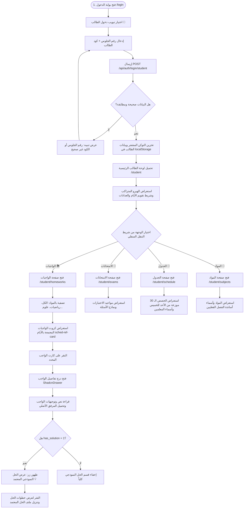
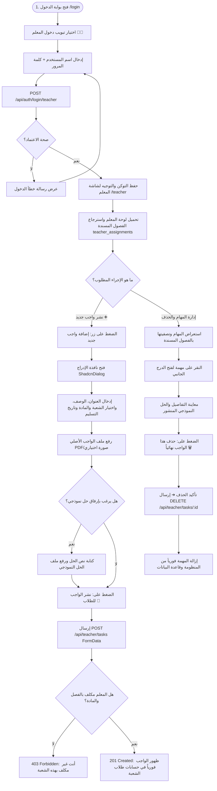
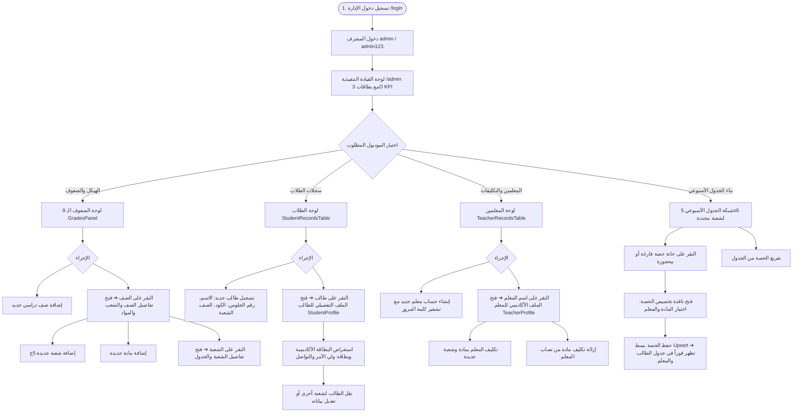

# الدليل الشامل لمسارات وتدفقات المستخدمين (Master User Workflows & Journey Diagrams)

يوفر هذا الدليل المخططات التفاعلية والمسارات الإجرائية الكاملة للعمليات التشغيلية في المنظومة من منظور الأدوار الثلاثة (الطالب، المعلم، والإدارة)، متضمناً معالجة الحالات الاستثنائية ونقاط اتخاذ القرار.

---

## 1. مسار رحلة الطالب الكاملة (Student User Journey)

---

## 2. مسار رحلة المعلم الأكاديمية (Teacher User Journey)

---

## 3. مسارات لوحة تحكم الإدارة (Admin Executive Workflows)

---

## 4. مصفوفة معالجة الحالات الخاصة والتعافي من الأخطاء (Edge Cases & Error Handling)

| السيناريو والحالة الاستثنائية | السلوك البرمجي والإجراء المتبع في المنظومة |
| :--- | :--- |
| **محاولة الدخول برقم جلوس غير مسجل أو كود خاطئ** | إرجاع `401 Unauthorized` وعرض شريط تنبيه أحمر ناعم أسفل النموذج دون إفراغ الحقول لمساعدة المستخدم على التصحيح. |
| **انتهاء صلاحية التوكن (Token Expired) أثناء التصفح** | يقوم `Axios Response Interceptor` باعتراض استجابة `401` فورياً، وتفريغ التخزين المحلي `localStorage`، وتحويل المتصفح لصفحة `/login`. |
| **محاولة طالب فتح رابط إداري (`/admin`) أو صفحة معلم** | يتدخل حارس المسارات (`router.beforeEach`) فورياً ويعيد توجيه الطالب إلى واجهته الرئيسية `/student` دون السماح بعرض أي مكوّن. |
| **محاولة معلم نشر واجب لشعبة غير مكلف بها** | يعترض الـ Backend الطلب عبر فحص جدول `teacher_assignments` ويرجع كود `403 Forbidden` برسالة واضحة تلغي العملية. |
| **تخصيص حصة في الجدول لخانة مشغولة مسبقاً** | تطبيق استراتيجية `Upsert / Overwrite` فيتم استبدال المادة والمعلم وتحديث الخانة مباشرة دون تعارض. |
| **حذف صف أو شعبة أو معلم مسند له جداول ومهام** | تفعيل الحذف التتابعي (`ON DELETE CASCADE`) لحذف كافة الارتباطات التابعة تلقائياً ومنع السجلات اليتيمة. |
| **رفع ملف بحجم أكبر من 10MB أو بامتداد غير مسموح** | اعتراض الطلب في وسيط Multer وإرجاع خطأ `400 Bad Request` باللغة العربية: *"يرجى رفع ملف PDF أو صورة فقط وبحد أقصى 10MB"*. |
