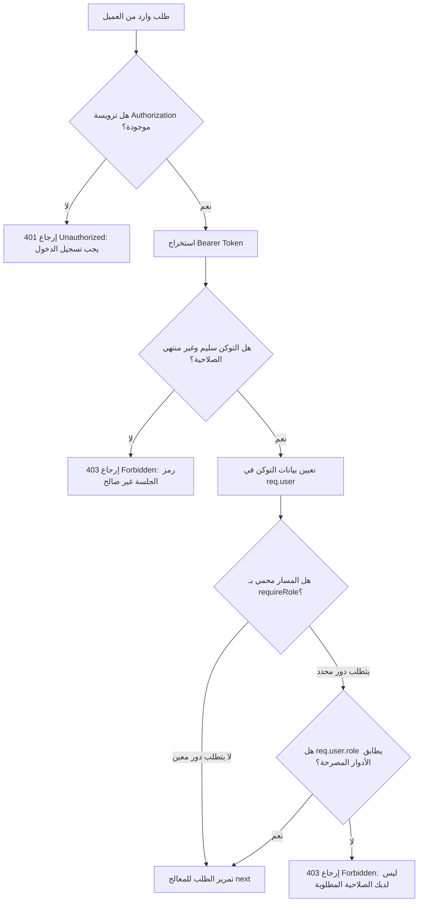

# دليل نظام المصادقة، التحكم بالوصول، والوسائط (Authentication, RBAC & Middlewares Guide)

يوفر هذا الدليل المرجع الهندسي المتكامل لآليات حماية وتوثيق الطلبات في الخادم الخلفي، موضحاً بنية التوكن المشفر (JWT)، وسائط التحقق من الهوية والصلاحيات القائمة على الأدوار (RBAC)، ومعايير الأمان لرفع وتخزين المرفقات بواسطة Multer.

---

## 1. أداة إدارة وتوقيع توكن JWT (`backend/utils/jwt.js`)

تعتمد المنظومة نظام الجلسات اللامركزية (Stateless JWT Sessions) لتأمين كافة الاتصالات بين الواجهة الأمامية والخادم:
* **المفتاح السري للتوقيع:** يتم قراءته من متغير البيئة `process.env.JWT_SECRET` (مع مفتاح افتراضي قوي لبيئة التطوير).
* **مدة صلاحية التوكن (Expiration):** محددة بـ `process.env.JWT_EXPIRES_IN || '7d'` (7 أيام).
* **خوارزمية التشفير والتوقيع:** `HS256` (HMAC with SHA-256).

### دوال الأداة الأساسية (`jwt.js`):
```javascript
const jwt = require('jsonwebtoken');

const JWT_SECRET = process.env.JWT_SECRET || 'super_secret_school_jwt_key_2026';
const JWT_EXPIRES_IN = process.env.JWT_EXPIRES_IN || '7d';

// 1. توليد التوكن المشفر
exports.generateToken = (payload) => {
  return jwt.sign(payload, JWT_SECRET, { expiresIn: JWT_EXPIRES_IN });
};

// 2. التحقق من صحة التوكن
exports.verifyToken = (token) => {
  return jwt.verify(token, JWT_SECRET);
};
```

---

## 2. بنية الـ Payload المضمنة داخل التوكن لكل دور (Token Payloads)

يتم تخصيص البيانات المشفرة داخل التوكن بحسب دور المستخدم لتمكين الـ Controllers من تنفيذ قواعد الأمان والعزل التلقائي دون استعلامات إضافية:

### أ. المشرف العام للمنظومة (`ADMIN`):
```json
{
  "id": 1,
  "role": "ADMIN",
  "username": "admin",
  "fullName": "مدير المدرسة",
  "iat": 1771390000,
  "exp": 1771994800
}
```

### ب. المعلم (`TEACHER`):
```json
{
  "id": 2,
  "role": "TEACHER",
  "username": "teacher2",
  "fullName": "أ. أحمد سالم",
  "iat": 1771390000,
  "exp": 1771994800
}
```

### ج. الطالب (`STUDENT`):
```json
{
  "id": 1,
  "role": "STUDENT",
  "rollNumber": "1001",
  "fullName": "أحمد خالد المصراتي",
  "gradeId": 5,
  "sectionId": 1,
  "iat": 1771390000,
  "exp": 1771994800
}
```

> [!IMPORTANT]
> **مبدأ العزل الأمني التلقائي (Automatic Tenant Isolation):**  
> تضمين `gradeId` و `sectionId` في توكن الطالب يُمكّن الـ `studentController` من جلب مهام وجدول الطالب حصراً عبر `req.user.sectionId` دون الحاجة لتمرير رقم الشعبة من المتصفح، مما يمنع نهائياً أي محاولة للتجسس على فصول أو طلاب آخرين.

---

## 3. وسيط المصادقة والتحقق من الأدوار (`backend/middlewares/authMiddleware.js`)

يتولى هذا الوسيط فحص كل طلب وارد، استخراج التوكن، والتحقق من الصلاحيات قبل السماح بالمرور إلى الـ Controller:



### الكود البرمجي المعتمد لوسيط الأمان:
```javascript
const { verifyToken } = require('../utils/jwt');

// 1. وسيط التحقق من هوية المستخدم
exports.authenticateToken = (req, res, next) => {
  const authHeader = req.headers['authorization'];
  const token = authHeader && authHeader.split(' ')[1]; // استخراج التوكن بعد 'Bearer'

  if (!token) {
    return res.status(401).json({
      success: false,
      message: 'عذراً، يجب تسجيل الدخول للوصول لهذه الخدمة.'
    });
  }

  try {
    const decoded = verifyToken(token);
    req.user = decoded; // حقن بيانات المستخدم في كائن الطلب
    next();
  } catch (err) {
    return res.status(403).json({
      success: false,
      message: 'رمز الجلسة غير صالح أو منتهي الصلاحية.'
    });
  }
};

// 2. حارس الصلاحيات القائم على الأدوار (RBAC Guard)
exports.requireRole = (...roles) => {
  return (req, res, next) => {
    if (!req.user || !roles.includes(req.user.role)) {
      return res.status(403).json({
        success: false,
        message: 'عذراً، ليس لديك الصلاحية المطلوبة للوصول لهذا الإجراء.'
      });
    }
    next();
  };
};
```

---

## 4. وسيط معالجة ورفع الملفات الآمن (`backend/utils/upload.js`)

يستخدم مكتبة `Multer` للتحكم الصارم في رفع الملفات وتخزينها محلياً داخل مجلد `backend/uploads/`:

### القواعد والمعايير الأمنية المطبقة:
1. **تسمية فريدة للملفات (Collision-Proof Naming):**  
   يتم توليد اسم الملف بالصيغة: `${fieldname}-${Date.now()}-${random}.${ext}` لمنع استبدال الملفات وتفادي مشاكل الأسماء العربية في الخوادم.
2. **القائمة البيضاء للامتدادات والأنواع (Extension & MIME Whitelisting):**  
   * **الامتدادات المسموحة:** `.pdf`, `.png`, `.jpg`, `.jpeg`, `.webp`.
   * **الأنواع المرفوضة قطيعاً:** `.exe`, `.php`, `.js`, `.sh`, `.bat`, `.html`, `.zip`.
   * في حال رفع ملف غير مطابق، يُرفض الطلب فورياً برسالة: *"نوع الملف غير مسموح به. يرجى رفع ملف PDF أو صورة فقط."*
3. **الحد الأقصى لحجم الملف:**  
   `fileSize: 10 * 1024 * 1024` (10 ميجابايت كحد أقصى للملف الواحد).
4. **دعم الرفع المزدوج للمهام والحلول النموذجية (`cpUpload`):**
   * حقل ملف الواجب/الامتحان: `attachment` (ملف واحد كحد أقصى).
   * حقل ملف الحل النموذجي: `solution_attachment` (ملف واحد كحد أقصى).

### الكود البرمجي المعتمد لوسيط الرفع:
```javascript
const multer = require('multer');
const path = require('path');
const fs = require('fs');

// التأكد من وجود مجلد uploads
const uploadDir = path.join(__dirname, '../uploads');
if (!fs.existsSync(uploadDir)) {
  fs.mkdirSync(uploadDir, { recursive: true });
}

const storage = multer.diskStorage({
  destination: (req, file, cb) => cb(null, uploadDir),
  filename: (req, file, cb) => {
    const ext = path.extname(file.originalname).toLowerCase();
    const uniqueName = `${file.fieldname}-${Date.now()}-${Math.round(Math.random() * 1E9)}${ext}`;
    cb(null, uniqueName);
  }
});

const fileFilter = (req, file, cb) => {
  const allowedExts = ['.pdf', '.png', '.jpg', '.jpeg', '.webp'];
  const ext = path.extname(file.originalname).toLowerCase();
  
  if (allowedExts.includes(ext)) {
    cb(null, true);
  } else {
    cb(new Error('نوع الملف غير مسموح به. يرجى رفع ملف PDF أو صورة فقط.'), false);
  }
};

const upload = multer({
  storage,
  fileFilter,
  limits: { fileSize: 10 * 1024 * 1024 } // 10MB
});

// وسيط الرفع المزدوج لمهام المعلم
exports.taskUpload = upload.fields([
  { name: 'attachment', maxCount: 1 },
  { name: 'solution_attachment', maxCount: 1 }
]);
```
