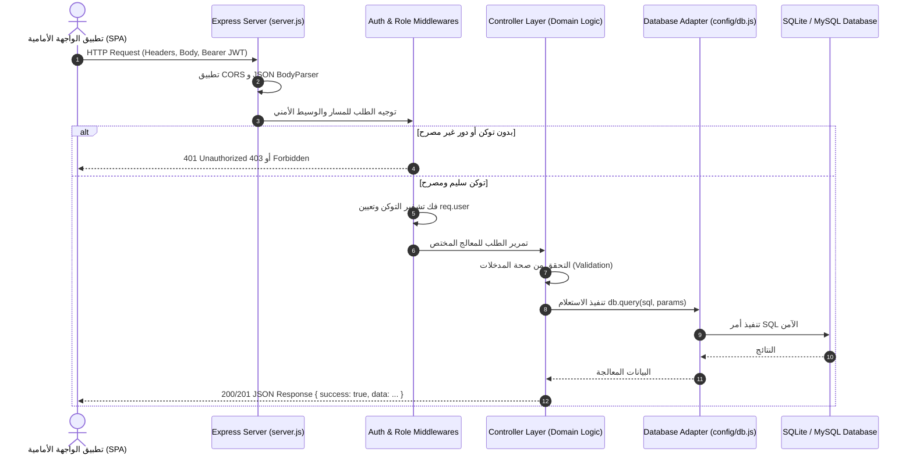

# الدليل المعماري الشامل للخادم الخلفي (Backend Master Architecture & Engineering Guide)

يوفر هذا الدليل المرجع الهندسي والمعماري المتكامل للخادم الخلفي لنظام إدارة المدرسة، موضحاً دورة حياة الطلب، طبقات النظام، استراتيجيات الأمان وقواعد البيانات، ومعايير معالجة الأخطاء.

---

## 1. نظرة عامة والتقنيات الأساسية (Tech Stack & Architecture Foundations)

يعتمد الخادم الخلفي نمط **معمارية الخدمات الموجهة للموارد (Resource-Oriented RESTful Architecture)** المبنية باستخدام:
* **بيئة التشغيل:** Node.js (v18.x+ LTS).
* **إطار عمل الويب:** Express.js (v4.19.2) لتوفير أداء سريع وخفيف.
* **طبقة البيانات:** محول هجين متوافق (Hybrid Database Adapter) يدعم التبديل اللحظي بين `SQLite3` للتطوير السريع و `MySQL2` للإنتاج.
* **الأمان والمصادقة:** توثيق قائم على التوكن (Stateless JWT) مشفر بـ `jsonwebtoken` وتجزئة كلمات المرور عبر `bcryptjs` (10 Salt Rounds).
* **معالجة المرفقات:** `multer` مع تطبيق فلاتر فحص الامتدادات وحجم الملفات محلياً.

---

## 2. الهيكل التنظيمي للمجلدات والمسؤوليات (Directory Structure & Responsibilities)

```
backend/
├── config/
│   └── db.js                 # محول الاتصال متعدد القواعد (SQLite / MySQL Universal Adapter)
├── controllers/
│   ├── authController.js     # منطق تسجيل دخول المشرفين، المعلمين، والطلاب وتوليد الجلسات
│   ├── adminController.js    # إدارة الهيكل والصفوف، الطلاب، المعلمين، والتكليفات، والجدول
│   ├── teacherController.js  # إدارة تكليفات المعلم ونشر وتعديل وحذف المهام والحلول
│   └── studentController.js  # استرجاع ملف الطالب، مهام شعبته، وجدوله ومواده المعزولة
├── database/
│   ├── migrations/
│   │   └── migrate.js        # سكريبت ترحيل وإنشاء الجداول الـ 10 بالتسلسل والتكامل المرجعي
│   ├── seeds/
│   │   └── seed.js           # سكريبت تعبئة البيانات التجريبية الشاملة للمدارس الليبية
│   └── school.sqlite         # ملف قاعدة بيانات SQLite المحلي
├── middlewares/
│   └── authMiddleware.js     # وسيط فحص توكن JWT والتحقق من صلاحيات الأدوار (RBAC)
├── routes/
│   ├── authRoutes.js         # مسارات /api/auth
│   ├── adminRoutes.js        # مسارات /api/admin
│   ├── teacherRoutes.js      # مسارات /api/teacher
│   └── studentRoutes.js      # مسارات /api/student
├── uploads/                  # مجلد التخزين المادي للملفات المرفقة ونماذج الحلول
├── utils/
│   ├── jwt.js                # دوال توقيع وتشفير وفحص توكن JWT
│   └── upload.js             # إعدادات Multer، فلاتر الامتدادات، وحدود الأحجام
├── .env                      # المتغيرات السرية وإعدادات المشغل والمنافذ
├── package.json              # تعريف الحزم، الاعتماديات، وأوامر التشغيل
└── server.js                 # نقطة الدخول، تفعيل الوسائط، توجيه المسارات، ومعالجة الأخطاء
```

---

## 3. دورة حياة الطلب ومعمارية الطبقات (Request Lifecycle & Layered Architecture)



---

## 4. تفصيل مسؤولية طبقات الخادم الخلفي

### 1. طبقة التهيئة والخادم (`server.js`):
* تهيئة تطبيق Express والاستماع على المنفذ المحدد (`PORT=5000`).
* تفعيل وسائط معالجة الـ JSON والـ URL-Encoded.
* إتاحة مجلد المرفقات كملفات ثابتة عامة عبر `app.use('/uploads', express.static(...))`.
* توجيه المسارات الأساسية:
  * `/api/auth` ➔ `authRoutes`
  * `/api/student` ➔ `studentRoutes`
  * `/api/teacher` ➔ `teacherRoutes`
  * `/api/admin` ➔ `adminRoutes`
* **معالجة المسارات غير الموجودة (Global 404 Handler):** إرجاع استجابة JSON موحدة: `{ "success": false, "message": "عذراً، المسار المطلوب غير موجود." }`.
* **الاعتراض المركزي للأخطاء (Global 500 Error Handler):** التقاط الأخطاء غير المعالجة وتسجيلها ومنع انهيار الخادم.

### 2. طبقة الأمان والوسائط (`middlewares/` & `utils/jwt.js`):
* **`authenticateToken`:** التحقق من وجود وصحة توكن JWT وفك تشفيره وحقنه في `req.user`.
* **`requireRole(...roles)`:** التأكد من أن دور المستخدم يطابق الصلاحيات المطلوبة لكل مسار (`ADMIN`, `TEACHER`, `STUDENT`).
* **`upload.js`:** فلترة الملفات المرفوعة وحصرها في صيغ `.pdf`, `.png`, `.jpg`, `.jpeg`, `.webp` بحد أقصى 10 ميجابايت وتوليد أسماء فريدة وآمنة.

### 3. طبقة المعالجات ومنطق الأعمال (`controllers/`):
* **عزل البيانات الصارم (Tenant Isolation):**
  * في معالج الطالب (`studentController.js`): يتم استخراج `req.user.sectionId` تلقائياً لتصفية المهام والجدول وحجب فصول الآخرين.
  * في معالج المعلم (`teacherController.js`): يتم التحقق من جدول التكليفات قبل النشر، وتقييد التعديل والحذف بـ `WHERE teacher_id = req.user.id`.
  * في معالج الإدارة (`adminController.js`): تشفير كلمات المرور وتطبيق سياسات التكامل المرجعي.

### 4. طبقة الاتصال بقاعدة البيانات (`config/db.js`):
* تجريد الاستعلامات عبر دالة موحدة `query(sql, params)`.
* استخدام الاستعلامات المعلمة (Parameterized Queries) باستخدام `?` لمنع هجمات حقن الـ SQL (SQL Injection Prevention).
* تفعيل قيود المفاتيح الأجنبية `PRAGMA foreign_keys = ON;` في مشغل SQLite لضمان سلامة الـ `CASCADE Delete`.

---

## 5. سياسة الاستجابات ورموز الحالة (Standardized Responses & HTTP Codes)

### أ. نموذج الاستجابة الناجحة (Success Pattern):
```json
{
  "success": true,
  "message": "تمت العملية بنجاح (اختياري)",
  "count": 15,
  "data": { ... }
}
```

### ب. نموذج استجابة الخطأ (Error Pattern):
```json
{
  "success": false,
  "message": "رسالة الخطأ التوضيحية باللغة العربية"
}
```

### ج. مصفوفة رموز الحالة المعتمدة (HTTP Status Matrix):
| الرمز (Status) | المعنى | متى يُستخدم؟ |
| :---: | :--- | :--- |
| **`200 OK`** | نجاح الاسترجاع أو التعديل | عند جلب البيانات، أو تعديل سجل قائم، أو حذف ناجح. |
| **`201 Created`** | نجاح الإنشاء | عند تسجيل طالب، إضافة معلم، نشر واجب، أو إضافة صف/شعبة. |
| **`400 Bad Request`** | خطأ في المدخلات | نقص الحقول الإلزامية أو تكرار رقم الجلوس أو اسم الشعبة. |
| **`401 Unauthorized`** | غير موثق | عدم إرسال التوكن أو إرسال بيانات دخول غير صحيحة. |
| **`403 Forbidden`** | غير مصرح | محاولة وصول لدور غير مصرح له أو محاولة معلم النشر لشعبة غير مسندة له. |
| **`404 Not Found`** | غير موجود | طلب مسار غير معرف أو مهمة/طالب غير موجود في قاعدة البيانات. |
| **`500 Server Error`** | خطأ خادم داخلي | استثناء غير متوقع في قاعدة البيانات أو النظام. |

---

## 6. استراتيجيات الأمان والأداء (Security & Performance Best Practices)

1. **حظر الاعتماد على مدخلات العميل في الهوية (Zero-Trust Client Identity):**
   * لا يعتمد الخادم على أي معرّف شعبة أو هوية مرسلة من العميل في طلبات الطالب والمعلم، بل يستخرجها حصراً من التوكن المفكك والموقع رقمياً على الخادم.
2. **تأمين كلمات المرور (Password Hashing):**
   * تشفير كلمات المرور باستخدام خوارزمية التجزئة أحادية الاتجاه `bcryptjs` مع 10 جولات تمليح (Salt Rounds).
3. **تأمين رفع الملفات (File Upload Security):**
   * منع رفع أي ملفات برمجية تنفيذية وحصر الامتدادات بالصيغ الوثائقية والصورية المعتمدة.
4. **التبديل المرن لقواعد البيانات (Multi-Driver Scalability):**
   * إمكانية نقل المنظومة من بيئة التطوير المحلية (SQLite) إلى بيئة الإنتاج السحابية (MySQL / MariaDB) بمجرد تعديل ملف `.env` دون تغيير سطر واحد في كود الـ Controllers.
