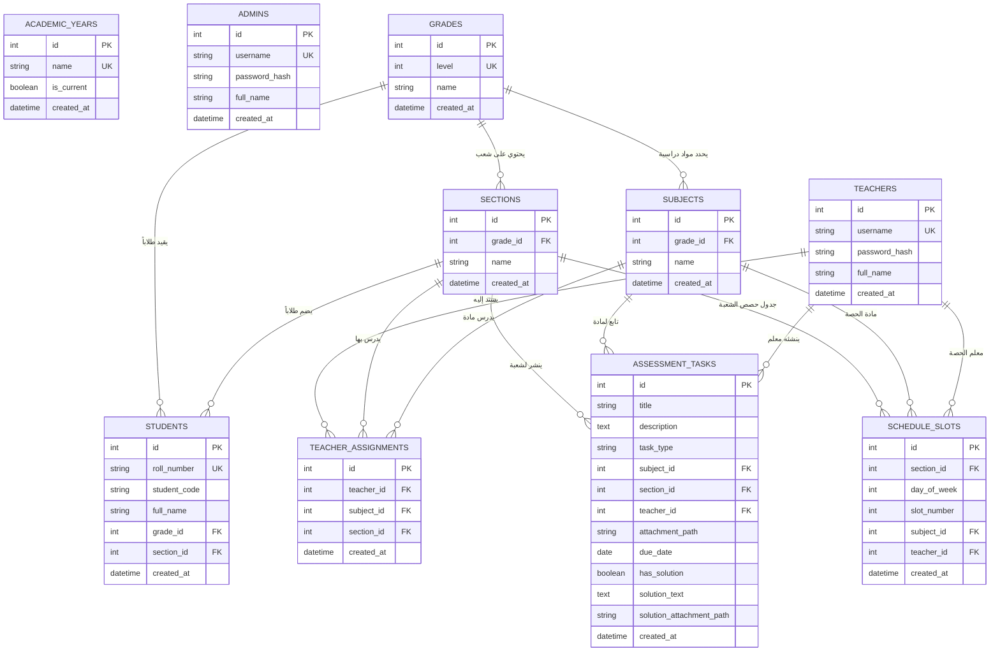

# الدليل الشامل لقاعدة البيانات والترحيل والبيانات الأولية (Database, Migrations & Seeds Guide)

يوفر هذا الدليل المرجع الهندسي المتكامل لقاعدة بيانات المنظومة، موضحاً محول الاتصال متعدد المشغلات، مخطط العلاقات بين الكيانات (ERD)، سكريبتات إنشاء الجداول الـ 10، وشحنة البيانات التجريبية الشاملة للمدارس الليبية.

---

## 1. محول الاتصال الهجين متعدد القواعد (`backend/config/db.js`)

تم تصميم طبقة الاتصال بقاعدة البيانات لتتيح التبديل اللحظي بين محركين دون تغيير سطر واحد في منطق الـ Controllers:
* **`DB_DRIVER=sqlite` (محلياً وللتطوير السريع):** يستخدم مكتبة `sqlite3`، ويقوم بحفظ البيانات في الملف المادي `backend/database/school.sqlite`، مع التفعيل الإجباري لخاصية المفاتيح الأجنبية: `PRAGMA foreign_keys = ON;`.
* **`DB_DRIVER=mysql` (للبيئات الإنتاجية والسحابية):** يستخدم مكتبة `mysql2/promise` مع تجمع اتصالات ذكي (`Connection Pool`) يدعم آلاف الاتصالات المتزامنة.

### الواجهة البرمجية الموحدة (Universal Query Wrapper):
```javascript
// استعلام جلب البيانات (SELECT)
const [rows] = await db.query('SELECT * FROM students WHERE grade_id = ?', [gradeId]);

// استعلام الإدراج أو التحديث (INSERT / UPDATE)
const [result] = await db.query('INSERT INTO students (roll_number, full_name, grade_id, section_id) VALUES (?, ?, ?, ?)', [roll, name, gradeId, sectionId]);
// result.insertId    ➔ يحتوي على المعرف المنشأ حديثاً (ID)
// result.affectedRows ➔ يحتوي على عدد الصفوف المتأثرة
```

---

## 2. مخطط علاقات الكيانات المتكامل (Entity Relationship Diagram - ERD)



---

## 3. استعلامات إنشاء الجداول الـ 10 (`migrate.js`)

يتم تنفيذ استعلامات الـ DDL بالتسلسل المرجعي لضمان إنشاء الجداول الرئيسية قبل الجداول الفرعية:

```sql
-- 1. جدول مدراء ومسؤولي المنظومة
CREATE TABLE IF NOT EXISTS admins (
  id INTEGER PRIMARY KEY AUTOINCREMENT,
  username VARCHAR(50) NOT NULL UNIQUE,
  password_hash VARCHAR(255) NOT NULL,
  full_name VARCHAR(150) NOT NULL,
  created_at DATETIME DEFAULT CURRENT_TIMESTAMP
);

-- 2. جدول السنوات الأكاديمية
CREATE TABLE IF NOT EXISTS academic_years (
  id INTEGER PRIMARY KEY AUTOINCREMENT,
  name VARCHAR(50) NOT NULL UNIQUE,
  is_current TINYINT(1) DEFAULT 1,
  created_at DATETIME DEFAULT CURRENT_TIMESTAMP
);

-- 3. جدول الصفوف والمستويات الأساسية (الصفوف من 1 إلى 9)
CREATE TABLE IF NOT EXISTS grades (
  id INTEGER PRIMARY KEY AUTOINCREMENT,
  level INT NOT NULL UNIQUE,
  name VARCHAR(50) NOT NULL,
  created_at DATETIME DEFAULT CURRENT_TIMESTAMP
);

-- 4. جدول الشعب والقاعات الدراسية التابعة لكل صف
CREATE TABLE IF NOT EXISTS sections (
  id INTEGER PRIMARY KEY AUTOINCREMENT,
  grade_id INT NOT NULL,
  name VARCHAR(50) NOT NULL,
  created_at DATETIME DEFAULT CURRENT_TIMESTAMP,
  FOREIGN KEY (grade_id) REFERENCES grades(id) ON DELETE CASCADE,
  UNIQUE (grade_id, name)
);

-- 5. جدول المواد والمناهج المقررة لكل صف
CREATE TABLE IF NOT EXISTS subjects (
  id INTEGER PRIMARY KEY AUTOINCREMENT,
  grade_id INT NOT NULL,
  name VARCHAR(100) NOT NULL,
  created_at DATETIME DEFAULT CURRENT_TIMESTAMP,
  FOREIGN KEY (grade_id) REFERENCES grades(id) ON DELETE CASCADE,
  UNIQUE (grade_id, name)
);

-- 6. جدول سجلات الطلاب
CREATE TABLE IF NOT EXISTS students (
  id INTEGER PRIMARY KEY AUTOINCREMENT,
  roll_number VARCHAR(50) NOT NULL UNIQUE,
  student_code VARCHAR(50) NOT NULL,
  full_name VARCHAR(150) NOT NULL,
  grade_id INT NOT NULL,
  section_id INT NOT NULL,
  created_at DATETIME DEFAULT CURRENT_TIMESTAMP,
  FOREIGN KEY (grade_id) REFERENCES grades(id),
  FOREIGN KEY (section_id) REFERENCES sections(id)
);

-- 7. جدول المعلمين والكادر التدريسي
CREATE TABLE IF NOT EXISTS teachers (
  id INTEGER PRIMARY KEY AUTOINCREMENT,
  username VARCHAR(50) NOT NULL UNIQUE,
  password_hash VARCHAR(255) NOT NULL,
  full_name VARCHAR(150) NOT NULL,
  created_at DATETIME DEFAULT CURRENT_TIMESTAMP
);

-- 8. جدول تكليفات المعلمين بالمواد والشعب (نصاب التدريس)
CREATE TABLE IF NOT EXISTS teacher_assignments (
  id INTEGER PRIMARY KEY AUTOINCREMENT,
  teacher_id INT NOT NULL,
  subject_id INT NOT NULL,
  section_id INT NOT NULL,
  created_at DATETIME DEFAULT CURRENT_TIMESTAMP,
  FOREIGN KEY (teacher_id) REFERENCES teachers(id) ON DELETE CASCADE,
  FOREIGN KEY (subject_id) REFERENCES subjects(id) ON DELETE CASCADE,
  FOREIGN KEY (section_id) REFERENCES sections(id) ON DELETE CASCADE,
  UNIQUE (teacher_id, subject_id, section_id)
);

-- 9. جدول الواجبات والامتحانات والحلول النموذجية
CREATE TABLE IF NOT EXISTS assessment_tasks (
  id INTEGER PRIMARY KEY AUTOINCREMENT,
  title VARCHAR(255) NOT NULL,
  description TEXT,
  task_type VARCHAR(20) NOT NULL, -- 'HOMEWORK' أو 'EXAM'
  subject_id INT NOT NULL,
  section_id INT NOT NULL,
  teacher_id INT NOT NULL,
  attachment_path VARCHAR(255) NULL,
  due_date DATE NULL,
  has_solution TINYINT(1) DEFAULT 0,
  solution_text TEXT NULL,
  solution_attachment_path VARCHAR(255) NULL,
  created_at DATETIME DEFAULT CURRENT_TIMESTAMP,
  FOREIGN KEY (subject_id) REFERENCES subjects(id) ON DELETE CASCADE,
  FOREIGN KEY (section_id) REFERENCES sections(id) ON DELETE CASCADE,
  FOREIGN KEY (teacher_id) REFERENCES teachers(id) ON DELETE CASCADE
);

-- 10. جدول الحصص الأسبوعية الموزعة (5 أيام × 6 حصص)
CREATE TABLE IF NOT EXISTS schedule_slots (
  id INTEGER PRIMARY KEY AUTOINCREMENT,
  section_id INT NOT NULL,
  day_of_week INT NOT NULL, -- 1: الأحد, 2: الإثنين, 3: الثلاثاء, 4: الأربعاء, 5: الخميس
  slot_number INT NOT NULL, -- الحصص من 1 إلى 6
  subject_id INT NOT NULL,
  teacher_id INT NOT NULL,
  created_at DATETIME DEFAULT CURRENT_TIMESTAMP,
  FOREIGN KEY (section_id) REFERENCES sections(id) ON DELETE CASCADE,
  FOREIGN KEY (subject_id) REFERENCES subjects(id) ON DELETE CASCADE,
  FOREIGN KEY (teacher_id) REFERENCES teachers(id) ON DELETE CASCADE,
  UNIQUE (section_id, day_of_week, slot_number)
);
```

---

## 4. سكريبت تعبئة البيانات التجريبية الشاملة (`seed.js`)

يقوم السكريبت بزرع شحنة بيانات اختبارية واقعية للمدارس الليبية لتشغيل النظام فورياً:

### أ. البيانات الأساسية والهيكل:
1. **السنة الدراسية الحالية:** `2025/2026`.
2. **الصفوف الدراسية التسعة:** (الأول، الثاني، الثالث، الرابع، الخامس، السادس، السابع، الثامن، والتاسع).
3. **الشعب والمقررات:**
   * **الصف الخامس:** شعبة `5أ` وشعبة `5ب`، مع 5 مواد (التربية الإسلامية، الرياضيات، العلوم العامة، اللغة العربية، اللغة الإنجليزية).
   * **الصف الثامن:** شعبة `8أ`.

### ب. حسابات المستخدمين الجاهزة للدخول:
1. **حساب الإدارة:** `admin` / كلمة المرور: `admin123`.
2. **حسابات المعلمين (5 معلمين بكلمة مرور `teacher123`):**
   * `teacher1` ➔ أ. أسامة علي (معلم التربية الإسلامية).
   * `teacher2` ➔ أ. أحمد سالم (معلم الرياضيات).
   * `teacher3` ➔ أ. فاطمة العبيدي (معلمة العلوم العامة).
   * `teacher4` ➔ أ. عمر الشريف (معلم اللغة العربية).
   * `teacher5` ➔ أ. مريم الفيتوري (معلمة اللغة الإنجليزية).
3. **حساب الطالب التجريبي:**
   * رقم الجلوس: `1001` | الكود السري: `ST1001`
   * الاسم: **أحمد خالد المصراتي** (الصف الخامس - شعبة 5أ).

### ج. المهام والحلول النموذجية المرفقة:
* **واجب رياضيات:** متضمن حلاً نموذجياً مفعلاً (`has_solution = 1`).
* **واجب علوم:** واجب منشور بدون حل نموذجي (`has_solution = 0`).
* **امتحان شهري:** امتحان رياضيات مجدول مع نموذج إجابة استرشادي.

### د. الجدول الأسبوعي:
* جدول حصص متكامل لشعبة `5أ` يغطي 30 حصة موزعة على مدار الأسبوع (الأحد إلى الخميس) بدون أي خانات فارغة.

---

## 5. أوامر التشغيل والتحقق (CLI Commands)

لتنفيذ الترحيل وبناء الجداول وتعبئة البيانات التجريبية:

```bash
# الانتقال لمجلد backend
cd backend

# 1. إنشاء الجداول الـ 10
npm run db:migrate

# 2. تعبئة البيانات التجريبية
npm run db:seed
```
