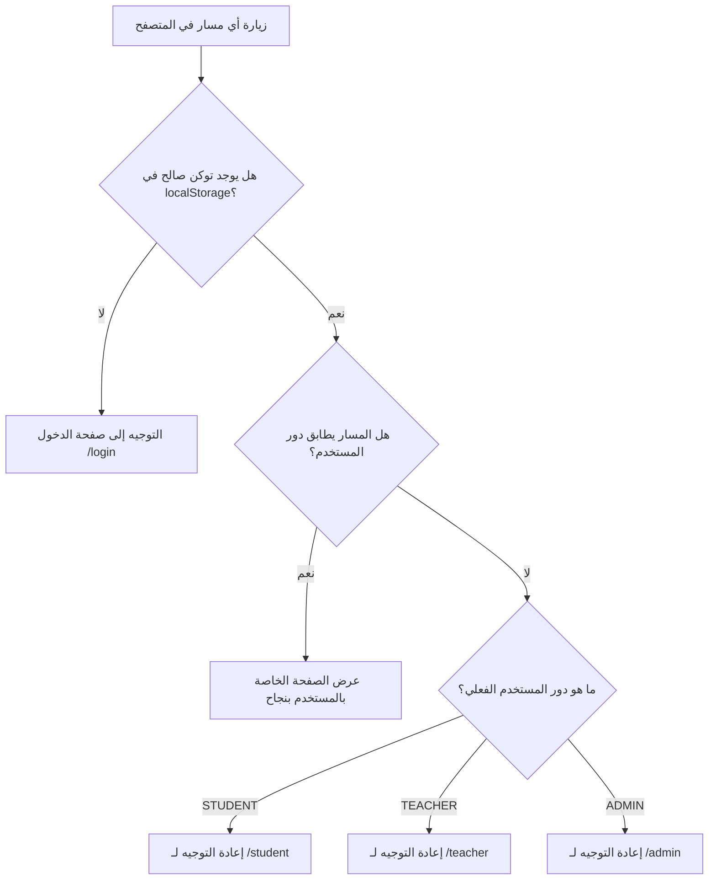

# الدليل الشامل والمعمارية البصرية للواجهة الأمامية (Frontend Master Architecture & Design System)

يوفر هذا الدليل المرجع البصري والهندسي الشامل لكافة واجهات وتطبيقات المستخدم في المنظومة، مع توضيح الفلسفة التصميمية المزدوجة، مصفوفة الصفحات، نظام التوجيه والتنقل، ولوحة الألوان والرموز البصرية.

---

## 1. الفلسفة البصرية المزدوجة (Dual Design Philosophy)

تتبنى المنظومة مفهوم **"التصميم الملائم للدور" (Role-Centric Aesthetics)** عبر هويتين بصريتين متكاملتين:

```
                                  هوية واجهات المنظومة
                                           │
         ┌─────────────────────────────────┴─────────────────────────────────┐
         ▼                                                                   ▼
┌──────────────────────────────────────┐           ┌──────────────────────────────────────┐
│  واجهة الطالب والمعلم (iOS Native)   │           │    واجهة الإدارة (macOS SaaS Desktop) │
│                                      │           │                                      │
│ • نمط تطبيقات Apple iOS الحديثة      │           │ • لوحة تحكم مكتبية واسعة وشاملة      │
│ • زجاج ضبابي (Glassmorphism)         │           │ • لون نيلي رصين (#4f46e5 / #4338ca) │
│ • بطاقات متراكبة (Overlapping Hero)  │           │ • بطاقات مجسمات ثلاثية الأبعاد (3D)  │
│ • أسلوب الكروت السهلة (Squircle Cards)│           │ • بحث فوري واختصارات لوحة المفاتيح   │
│ • شريط تنقل سفلي عائم (Bottom Dock)  │           │ • موديولات تفصيلية متدرجة ونوافذ     │
└──────────────────────────────────────┘           └──────────────────────────────────────┘
```

---

## 2. الدستور البصري ولوحة الألوان والخطوط (Design Tokens & Typography)

### أ. نظام الخطوط الرسمي (Typography Stack):
* **الخط المعتمد:** خط أبل العربي الرسمي **`SF Arabic`** (المرفق في مجلد `fonts/`) لتوفير أعلى درجات الفخامة والمقروئية.
* **التدرج الهرمي:** عناوين بارزة بوزن `Font-Weight: 800`، نصوص فرعية بوزن `600 - 700`، ونصوص الفقرات بوزن `400 - 500`.

### ب. لوحة الألوان الأساسية والتدرجات (Brand Colors & Gradients):
* **الهيدر البنفسجي المتدرج (Brand Header):** `linear-gradient(135deg, #7c3aed 0%, #6366f1 50%, #4f46e5 100%)`.
* **الخلفية العامة (Body Background):** `linear-gradient(180deg, #f8f5ff 0%, #f0f7ff 100%)`.
* **اللون الرئيسي للإدارة (Primary Indigo):** `#4f46e5` مع خلفيات فاتحة ناعمة `#f8fafc`.
* **الزجاج الضبابي (Glassmorphism Spec):** `rgba(255, 255, 255, 0.2)` مع `backdrop-filter: blur(12px) saturate(180%)` وحدود ملساء شبه شفافة.

### ج. ألوان شارات الحالات والمؤشرات (Semantic Status Colors):
* 🟡 **الواجبات المعلقة / التنبيه (Warning):** خلفية `#fef3c7` بنص بني `#b45309`.
* 🔴 **الامتحانات القادمة / الحذف الخطر (Danger):** خلفية `#fee2e2` بنص أحمر `#b91c1c`.
* 🔵 **المعلومات والمواد (Info):** خلفية `#e0e7ff` بنص أزرق داكن `#3730a3`.
* 🟢 **الحالات النشطة والمكتملة (Success):** خلفية `#d1fae5` بنص أخضر زمردي `#047857`.

---

## 3. خريطة الصفحات والمصفوفة الشاملة (Complete Sitemap & API Binding)

| المستخدم | الصفحة / المسار | الهدف الوظيفي | الـ APIs المستدعاة من الخادم | المرجع التفصيلي |
| :--- | :--- | :--- | :--- | :---: |
| **الجميع** | **بوابة الدخول (`/login`)** | تسجيل دخول موحد للطالب والمعلم والإدارة بتبديل كبسولي فوري | `POST /api/auth/login/*` | [AUTH_FRONTEND_SPEC.md](./AUTH_FRONTEND_SPEC.md) |
| **الطالب** | **الرئيسية (`/student`)** | بطاقة الهيرو، شريط تقويم الأيام، وشبكة البطاقات الـ 4 الكبرى | `GET /api/student/tasks` | [STUDENT_FRONTEND_SPEC.md](./STUDENT_FRONTEND_SPEC.md) |
| **الطالب** | **الواجبات (`/student/homeworks`)** | استعراض الواجبات المجمعة بالأيام، تحميل المرفقات، ودرج الحل النموذجي | `GET /api/student/tasks?task_type=HOMEWORK` | [STUDENT_FRONTEND_SPEC.md](./STUDENT_FRONTEND_SPEC.md) |
| **الطالب** | **الامتحانات (`/student/exams`)** | جدول الاختبارات الشهرية ومواعيدها والنماذج الاسترشادية | `GET /api/student/tasks?task_type=EXAM` | [STUDENT_FRONTEND_SPEC.md](./STUDENT_FRONTEND_SPEC.md) |
| **الطالب** | **الجدول الأسبوعي (`/student/schedule`)** | توزيع الحصص الـ 6 عبر أيام الأسبوع (الأحد-الخميس) والمواد والمعلمين | `GET /api/student/schedule` | [STUDENT_FRONTEND_SPEC.md](./STUDENT_FRONTEND_SPEC.md) |
| **الطالب** | **المواد الدراسية (`/student/subjects`)** | شبكة المواد المقررة مع أسماء المعلمين المخصصين لشعبة الطالب | `GET /api/student/subjects` | [STUDENT_FRONTEND_SPEC.md](./STUDENT_FRONTEND_SPEC.md) |
| **المعلم** | **الرئيسية (`/teacher`)** | ملخص نشاط المعلم، إحصائيات المهام، وشريط الفصول المسندة | `GET /api/teacher/assignments`<br>`GET /api/teacher/tasks` | [TEACHER_FRONTEND_SPEC.md](./TEACHER_FRONTEND_SPEC.md) |
| **المعلم** | **إدارة الواجبات (`/teacher/homeworks`)** | نشر وتعديل وحذف الواجبات، رفع الملفات، وإرفاق الحلول النموذجية | `GET /api/teacher/tasks`<br>`POST/PUT/DELETE /api/teacher/tasks` | [TEACHER_FRONTEND_SPEC.md](./TEACHER_FRONTEND_SPEC.md) |
| **المعلم** | **إدارة الامتحانات (`/teacher/exams`)** | جدولة مواعيد الاختبارات ورفع نماذج الأسئلة والإجابة | `GET /api/teacher/tasks?task_type=EXAM`<br>`POST/DELETE /api/teacher/tasks` | [TEACHER_FRONTEND_SPEC.md](./TEACHER_FRONTEND_SPEC.md) |
| **المعلم** | **جدول الحصص (`/teacher/schedule`)** | استعراض الحصص الخاصة بالمعلم فقط عبر أيام الأسبوع | `GET /api/admin/schedule` | [TEACHER_FRONTEND_SPEC.md](./TEACHER_FRONTEND_SPEC.md) |
| **المعلم** | **الفصول والمواد (`/teacher/subjects`)** | استعراض نصاب الحصص والشعب والطلاب المكلف بتدريسهم | `GET /api/teacher/assignments` | [TEACHER_FRONTEND_SPEC.md](./TEACHER_FRONTEND_SPEC.md) |
| **الإدارة** | **الإحصائيات و 3D KPI (`/admin`)** | 4 بطاقات تفاعلية بمجسمات ثلاثية الأبعاد لحضور الطلاب والمعلمين | `GET /api/admin/stats` | [ADMIN_FRONTEND_SPEC.md](./ADMIN_FRONTEND_SPEC.md) |
| **الإدارة** | **الهيكل والصفوف (`GradesPanel`)** | لوحة المستويات 1-9، لوحة تفاصيل الصف، وتفاصيل الشعبة والجدول | `GET/POST/DELETE /api/admin/grades`<br>`/sections`, `/subjects` | [ADMIN_FRONTEND_SPEC.md](./ADMIN_FRONTEND_SPEC.md) |
| **الإدارة** | **سجلات وملفات الطلاب (`StudentPanel`)** | السجل العام للطلاب، شاشة الملف التفصيلي للطالب، ونقل الطلاب | `GET/POST/PUT/DELETE /api/admin/students` | [ADMIN_FRONTEND_SPEC.md](./ADMIN_FRONTEND_SPEC.md) |
| **الإدارة** | **المعلمين والتكليفات (`TeacherPanel`)** | قائمة المعلمين، الملف الأكاديمي للمعلم، وإسناد وإزالة التكليفات | `GET/POST/DELETE /api/admin/teachers`<br>`/assignments` | [ADMIN_FRONTEND_SPEC.md](./ADMIN_FRONTEND_SPEC.md) |
| **الإدارة** | **الجدول الأسبوعي (`TimetableGrid`)** | شبكة تفاعلية (5 أيام × 6 حصص) لتخصيص وتحديث وتفريغ الحصص | `GET/POST/DELETE /api/admin/schedule` | [ADMIN_FRONTEND_SPEC.md](./ADMIN_FRONTEND_SPEC.md) |

---

## 4. نظام التوجيه وحماية المسارات (Navigation & Role Guards Architecture)



### القواعد الحاكمة للتنقل (Navigation Guard Rules):
1. **منع الوصول غير المصرح:** إذا حاول طالب فتح `/admin` أو `/teacher`، يعيده النظام تلقائياً لواجهته الرئيسية `/student`.
2. **منع الدخول المكرر لصفحة Login:** إذا كان المستخدم مسجل دخوله بالفعل وحاول فتح `/login`، يتم توجيهه مباشرة للوحة التحكم الخاصة بدوره.
3. **انتهاء الجلسة:** في حال استلام استجابة `401 Unauthorized` من أي API، يقوم عميل Axios بمسح التوكن وتحويل المتصفح فوراً لصفحة `/login`.

---

## 5. نظام الأدراج والنوافذ التفاعلية (Drawers & Modals Architecture)

تعتمد المنظومة نظامين متطورين للتفاعل مع البيانات دون مغادرة الشاشة:
1. **الأدراج المنزلقة السفلية والجانبية (Slide-in Drawers):**
   * تُستخدم في واجهتي الطالب والمعلم (`ShadcnDrawer`) لاستعراض تفاصيل الواجبات والامتحانات والحلول المعتمدة بحركة انزلاق سلسة.
2. **النوافذ المنبثقة المركزية (Central Dialog Modals):**
   * تُستخدم في لوحة تحكم الإدارة ونماذج إنشاء المهام (`ShadcnDialog`) مع خلفيات ضبابية معتمة (`backdrop-filter: blur(8px)`).

---

## 6. فهرس ملفات المواصفات التفصيلية:
* 🎒 [**`STUDENT_FRONTEND_SPEC.md`**](./STUDENT_FRONTEND_SPEC.md): الدليل التفصيلي لواجهات الطالب وسيناريوهات الكروت والحل النموذجي.
* 👨‍🏫 [**`TEACHER_FRONTEND_SPEC.md`**](./TEACHER_FRONTEND_SPEC.md): الدليل التفصيلي لواجهات المعلم وسيناريوهات النشر وإدارة الفصول.
* ⚙️ [**`ADMIN_FRONTEND_SPEC.md`**](./ADMIN_FRONTEND_SPEC.md): الدليل التفصيلي للوحة تحكم الإدارة وموديولات الهيكل والطلاب والمعلمين والجدول.
* 🔐 [**`AUTH_FRONTEND_SPEC.md`**](./AUTH_FRONTEND_SPEC.md): دليل بوابة تسجيل الدخول الموحدة والنماذج الخاصة بكل دور.
